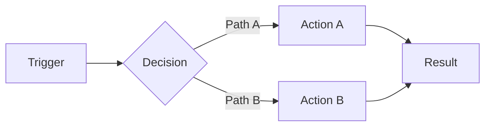

# Skill Structure Reference

Reference guide for creating new skills following the conventions of this repository.

## Directory Structure

```
skills/(category)/skill-name/
  SKILL.md              # Entry point: frontmatter + router
  README.md             # User-facing documentation
  CHANGELOG.md          # Change history
  references/           # Detailed documentation per phase/workflow
    phase-name.md
    auxiliary-ref.md
  guides/               # Optional: informational references (no write operations)
    syntax-ref.md
  templates/            # Optional: output templates
    output-type.md
```

### Categories

| Directory | Usage |
|-----------|-------|
| (design) | Design, UI, brand skills |
| (development) | Development, debugging, specs skills |
| (product) | Product, documentation, naming skills |
| (tooling) | Git, CI, workflow tooling skills |

### Naming Conventions

- **Directories**: `(category)/skill-name` -- kebab-case
- **Core files**: UPPERCASE.md -- `SKILL.md`, `README.md`, `CHANGELOG.md`
- **References**: lowercase.md -- descriptive kebab-case (`log-injection.md`, `evaluation.md`)
- **Templates**: named after the output type (`report.md`, `prd.md`, `copy.md`)

---

## SKILL.md

The main file. Acts as a router: detects the trigger and loads the right reference.

### Frontmatter

```yaml
---
name: skill-name
description: >-
  Short sentence of what it does. Use when: usage contexts.
  Triggers on "phrase 1", "phrase 2", "phrase 3".
license: MIT
allowed-tools: Read, Write, Bash
metadata:
  author: Adeonir Kohl
---
```

Frontmatter rules:

- `name`: kebab-case, matches the directory name
- `description`: folded block `>-` string, max 1024 characters (skills.sh spec limit)
  - Structure: what it does + when to use + specific triggers
  - Avoid internal mechanics (phases, loops, stages) -- focus on what and when
  - Include varied trigger phrases to improve matching
  - Use `>-` with 2-space indentation
  - Keep lines under 80 characters
- `license`: `MIT` for all skills in this repository
- `allowed-tools`: comma-separated list of tools the skill uses (experimental, per spec)
- `author`: full name under `metadata` (e.g. `Adeonir Kohl`)

### Section Order

All skills follow this exact order:

```
1. # Title              (H1, descriptive skill name)
2. ## Workflow           (flow diagram)
3. ## Context Loading    (reference loading strategy)
4. ## Triggers           (trigger -> reference table)
5. ## Cross-References   (ASCII dependency diagram)
6. ## Guidelines         (DO/DON'T)
7. ## Output             (output format and location, if applicable)
8. ## Error Handling     (edge case list)
```

### Workflow

Simple `-->` arrows. Optional loop on second line with `^` and `|___|`. No pipes or box-drawing. Keep lines under 70 chars.

```
phase-1 --> phase-2 --> phase-3 --> output
  ^_________________________|  (note about the loop)
```

One sentence explaining the flow right below.

### Context Loading Strategy

Documents which references to load and when:

```markdown
## Context Loading Strategy

Load only the reference matching the current trigger. Never load multiple
references simultaneously unless explicitly noted.
```

Specify:
- What to load per trigger
- Automatic dependencies (ref A loads ref B)
- What should never be loaded together

### Triggers

Table mapping natural language phrases to references:

```markdown
| Trigger Pattern | Reference |
|-----------------|-----------|
| Commit changes, create commit | [commit.md](references/commit.md) |
| Review code, check changes | [code-review.md](references/code-review.md) |
```

Followed by `Notes:` for auxiliary references (not direct triggers):

```markdown
Notes:

- `auxiliary.md` is not a direct trigger. It is loaded by `main.md` as part of its process.
```

### Cross-References

ASCII diagram showing dependencies between internal references and with other skills:

```markdown
## Cross-References

reference-a.md ----> reference-b.md (a loads b)
reference-a.md <---> reference-c.md (bidirectional)
skill-name --------> other-skill (output feeds into)
```

### Guidelines

Always DO/DON'T format. Never prose:

```markdown
## Guidelines

**DO:**
- Use confidence scoring: >= 80 to report findings
- Always validate before saving output
- Follow existing project conventions

**DON'T:**
- Skip validation for any output type
- Assume context not provided by user
- Add emojis to output
```

3-8 items per list. Concrete rules, not aspirational.

### Error Handling

List of conditions and actions:

```markdown
## Error Handling

- No context provided: ask user for details
- Ambiguous trigger: ask which workflow to use
- Output directory missing: create it
- Conflicting results: present options to user
```

---

## README.md

User-facing documentation. More visual, with examples.

### Structure

```
1. # Title
2. Descriptive sentence (one line)
3. ## Installation
   - npx skills add command
4. ## What It Does
   - Mermaid diagram (flowchart LR or TD)
   - Table with phases/outputs
5. ## Usage
   - Code block with natural language usage examples
6. ## Output (if applicable)
   - Output format or directory
7. ## Requirements (if applicable)
   - Dependencies and external tools
8. ## Integration (if applicable)
   - Table of connections with other skills
```

### Mermaid Diagram

Always `flowchart LR` or `flowchart TD` (never `graph`):



Decisions with `{}`, actions with `[]`, arrows with labels via `-->|label|`.

---

## CHANGELOG.md

### Frontmatter

```yaml
---
name: skill-name
---
```

### Format

```markdown
# Changelog

All notable changes to this skill will be documented in this file.

## YYYY-MM-DD

### Added

- Description of added feature

### Changed

- Description of change

### Fixed

- Description of fix

### Removed

- Description of removal
```

Rules:

- Date headers: `## YYYY-MM-DD` -- never versions
- Subsections: `### Added`, `### Changed`, `### Fixed`, `### Removed`
- Each item is one sentence (no paragraphs)
- Most recent first (descending chronological order)
- Reference filenames when relevant

---

## references/

Detailed documentation per phase or workflow. Each file is loaded on demand by SKILL.md.

### Internal Structure of a Reference

```
1. # Descriptive Title
2. Introductory sentence (one line)
3. ## When to Use
   - Conditions that trigger this reference
4. ## Workflow (or ## Discovery, ## Phases)
   - Numbered or bulleted steps
   - Subsections with ### for complex phases
5. ## Guidelines (optional)
   - DO/DON'T format
6. ## Error Handling (optional)
   - Edge cases specific to this phase
7. ## Next Steps (optional)
   - What to do after completing this phase
```

### Dependencies Between References

When a reference needs another, indicate at the top:

```markdown
> **LOAD FIRST:** [dependency.md](dependency.md) -- description of why
```

This dependency must also be documented in the SKILL.md Cross-References section.

### Internal Links

Always relative to the references directory:

```markdown
[evaluation.md](evaluation.md)
[../templates/report.md](../templates/report.md)
```

---

## templates/

Optional. Exist when the skill generates artifacts with a fixed structure.

### When to Create Templates

- The skill generates files as output (documents, reports, configs)
- The output has a repeatable structure across executions
- No template needed: skills that operate inline (debug-tools, git-helpers)

### Placeholder Format

Use `{{mustache}}` for dynamic values:

```yaml
---
name: {{project-name}}
source: {{url or description}}
created: {{YYYY-MM-DD}}
---

# {{Title}}

## Section

{{description of what goes here}}
```

For fill-in instructions (not value placeholders), use `{single braces}`:

```markdown
{For each item, one line:}
{Brief recommendation if one clearly dominates.}
```

### Naming

Templates named after the output type they generate:

| Template | Output |
|----------|--------|
| `report.md` | Naming report |
| `prd.md` | Product Requirements Document |
| `copy.yaml` | Copy extraction |

---

## New Skill Checklist

Before finalizing a new skill, verify:

- [ ] Directory at `skills/(category)/skill-name/`
- [ ] `SKILL.md` with complete frontmatter and all sections in correct order
- [ ] `README.md` with Installation, mermaid diagram, and usage examples
- [ ] `CHANGELOG.md` with creation date entry
- [ ] `references/` with one file per phase/workflow
- [ ] Each reference has a "When to Use" section
- [ ] Cross-references documented in SKILL.md
- [ ] Guidelines in DO/DON'T format
- [ ] `templates/` if the skill generates artifacts with fixed structure
- [ ] Skill added to the root README.md table (sorted by category)
