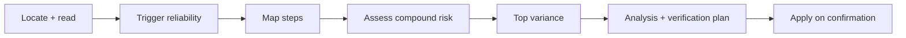

# Skill Reliability

Score a skill's end-to-end reliability and propose verifiable fixes.

## What It Does

Reads a skill's workflows and scores both factors of reliability — does it fire
on the right request, then does the workflow complete:



| Phase | Output |
|-------|--------|
| Trigger reliability | Verdict (Clean / Leaky / Narrow) plus a description fix |
| Map steps | Per-workflow step inventory with nature and baseline |
| Assess compound risk | End-to-end product and tier per workflow and full chain |
| Top variance points | The three highest-variance steps, each with failure mode, suggestion, and expected gain |
| Verification plan | How to confirm each proposed fix worked |
| Apply | Writes a confirmed description rewrite to the target; implements workflow fixes on request |

## Usage

```text
/skill-reliability git-helpers
analyze the reliability of spec-driven
which skill should I harden first?     (ranks all skills)
check whether epic-tracker fires on the right requests
```

## Output

A reliability analysis printed in the chat: the trigger verdict, per-workflow
step tables with baselines, the compound product and tier, the top variance
points with levers, and a verification plan. The report then offers to apply the
fixes — the target skill is edited only on your confirmation (Step 8).

## Requirements

- Python 3 — for the bundled `inventory.py` and `trigger_lint.py` helpers

## FAQ

**Q: Does it run the skill or any evals?**
A: No. The analysis is static — it reads the skill's files and reasons about
them. Trigger reliability is judged by probing the description, not by executing
it. That keeps it cheap and side-effect-free.

**Q: Where do the percentages come from?**
A: Each step nature has a heuristic baseline; the end-to-end number is their
product. It is a transparent calculation over visible inputs, not a measured hit
rate — the per-step baselines are always shown so the number stays auditable.

**Q: Will it change my skill?**
A: Only with your confirmation. It proposes changes and can apply a description
rewrite straight to the target on your OK; workflow fixes it implements on
explicit request. Nothing is applied silently.
