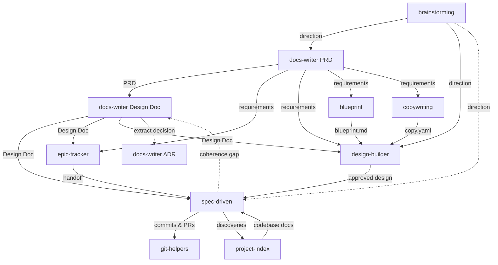

# Agent Skills

A personal collection of skills for AI coding agents. Each skill packages instructions, references, and workflows that extend agent capabilities beyond their defaults.

## What are Skills?

Skills are packaged instructions that teach AI agents new workflows and specialized knowledge. Think of them as plugins -- a `SKILL.md` file with YAML frontmatter tells the agent when to activate, and markdown content tells it what to do. Supporting files (references, templates, scripts) are loaded on demand to keep context usage minimal.

Skills follow the [Agent Skills](https://agentskills.io) open standard, which originated in Claude Code and has been adopted across all major AI coding agents.

## Installation

Install any skill with a single command using the [Skills CLI](https://skills.sh):

```bash
npx skills add adeonir/agent-skills
```

## Skills

| Skill | Category | Description |
|-------|----------|-------------|
| **[debug-tools](skills/engineering/debug-tools)** | Engineering | Iterative debugging: investigate, fix, verify loop with pattern comparison and escalation. Confidence scoring |
| **[git-helpers](skills/engineering/git-helpers)** | Engineering | Conventional commits, confidence-scored code review, pull request creation, and branch lifecycle |
| **[project-index](skills/engineering/project-index)** | Engineering | Generate project context and deep codebase documentation with code snippets. Creates `.agents/` with depth over brevity |
| **[rule-creator](skills/engineering/rule-creator)** | Engineering | Create and manage Claude Code rules in `.claude/rules/` with the Incorrect/Correct template. Classifies input, decides scope, supports list, edit, extract from CLAUDE.md, delete |
| **[spec-driven](skills/engineering/spec-driven)** | Engineering | Specification-driven development: Specify, Design, Tasks, Implement. Auto-sized by complexity, full traceability |
| **[notes](skills/personal/notes)** | Personal | Obsidian note creation for projects, companies, challenges, brags, daily logs, sessions, and conversations |
| **[handoff](skills/personal/handoff)** | Personal | Save and resume conversation state across sessions: snapshots focus, decisions, findings, open threads, next step, blockers, references |
| **[wrap-up](skills/personal/wrap-up)** | Personal | End-of-session context persistence to Obsidian session and daily notes |
| **[blueprint](skills/product/blueprint)** | Product | Plans `blueprint.md`, the design-blind layout payload a design consumes: information architecture, region layout, and screen flow from conversation or a brief |
| **[brainstorming](skills/product/brainstorming)** | Product | Structured idea exploration or plan stress-test: two-path discovery (standard/relentless), diverge with techniques, converge on direction. Feeds docs-writer, spec-driven, design-builder |
| **[copywriting](skills/product/copywriting)** | Product | Authors `copy.yaml`, the content payload a design consumes: write fresh copy from intent, or extract and structure existing content into a context-named tree |
| **[design-builder](skills/product/design-builder)** | Product | Greenfield design pipeline for any digital product: explore a visual direction when none exists, author DESIGN.md, preview, tune, sync, handoff |
| **[docs-writer](skills/product/docs-writer)** | Product | Structured document generation: PRD, Brief, Design Doc, ADR. Guided discovery per type |
| **[epic-tracker](skills/product/epic-tracker)** | Product | Delivery lifecycle management: plan epics, track stories, bugs, and issues, group releases. Tracker-first via MCP or CLI; markdown fallback when no tracker is configured. Feeds spec-driven |

## How They Connect



Dashed arrow: optional shortcut for small, well-scoped work.
**debug-tools**, **notes**, **handoff**, and **wrap-up** are independent — available at any point, not tied to the pipeline.

## Typical Greenfield Flow

```
1. brainstorming     --> explore ideas, choose direction
2. docs-writer       --> draft requirements, brief, technical doc
3. epic-tracker      --> plan epics, track stories, bugs, and issues
4. copywriting       --> extract or write copy.yaml content payload
5. blueprint         --> plan blueprint.md layout and screen flow
6. design-builder    --> design, preview, approve
7. spec-driven       --> specify, design, tasks, implement
8. git-helpers       --> commit, code-review, pull-request, finish branch
```

**Always available:**

```
debug-tools      --> investigate and fix issues
notes            --> document work in Obsidian
project-index    --> scan codebase and generate context (brownfield or re-index)
handoff          --> save/resume conversation state across sessions
wrap-up          --> persist session context to Obsidian
```

## Using the Flow

### Full product-first flow

Use all steps when building a new product or feature with non-trivial
business logic:

```
brainstorming    --> direction and constraints
docs-writer      --> PRD (what to build, for whom, why)
docs-writer      --> Design Doc (technical doc)
copywriting      --> content payload (copy.yaml)
blueprint        --> layout plan (blueprint.md)
design-builder   --> visual design, tokens
epic-tracker     --> epics, stories, acceptance criteria
spec-driven      --> per-story spec, design, tasks, implementation
git-helpers      --> commit, review, pull request
wrap-up          --> persist session context
```

`project-index` runs once at project start and re-indexes on demand.
`design-builder` can run in parallel with the Design Doc step.

### When to skip steps

| Skip | When |
|------|------|
| `brainstorming` | Direction is already clear |
| `docs-writer` | Bug fix or change with no architectural decisions OR feature is too small to warrant a PRD |
| `copywriting` | No content payload needed, or copy already exists |
| `blueprint` | No layout planning needed, or arrangement already exists |
| `design-builder` | No UI, or design already exists |

`spec-driven` and `git-helpers` are never optional for non-trivial work.

### Brownfield entry

Jump in at any step — each skill reads existing artifacts and adapts:

- Adding a feature to an existing product → start at `epic-tracker` or `spec-driven`
- Undocumented codebase → run `project-index` first, then `spec-driven`
- Design before requirements → run `design-builder`, then back-fill with `docs-writer`
- Architecture question mid-feature → update the project Design Doc via `docs-writer`, feed result to `spec-driven`

### Feedback loop

`spec-driven` discovers coherence gaps during implementation and signals back:

```
spec-driven discovers gap (missing entity, orphan flow, NFR drift)
    --> writes to knowledge.md ## Coherence Gaps
    --> user reruns docs-writer with update mode
    --> docs-writer re-enters the responsible phase scoped to the gap
    --> spec-driven resumes with updated technical doc
```

`project-index integrate feedback` handles codebase discoveries on the
same cycle — run both after a batch of stories lands.

## Output Structure

Skills write artifacts to `.artifacts/` and reference context to `.agents/`:

```
docs/
├── product/        # docs-writer: brainstorm, PRD, brief
├── tech/           # docs-writer: design-doc
├── adr/            # docs-writer: append-only decision log
└── design/         # design-builder: moodboard.md · DESIGN.md · blueprint: blueprint.md · copywriting: copy.yaml

.agents/
├── codebase/       # project-index: deep codebase analysis
└── project.md      # project-index: project context

.artifacts/
├── brainstorm/     # brainstorming: ideation artifacts
├── design/         # design-builder: preview variants
├── epics/          # epic-tracker: epics, stories, bugs, issues, releases
├── features/       # spec-driven: feature specs, designs, tasks
├── quick/          # spec-driven: quick mode tasks
└── research/       # spec-driven: research cache
```

This directory is gitignored by default but can be committed for team collaboration.

## License

MIT
