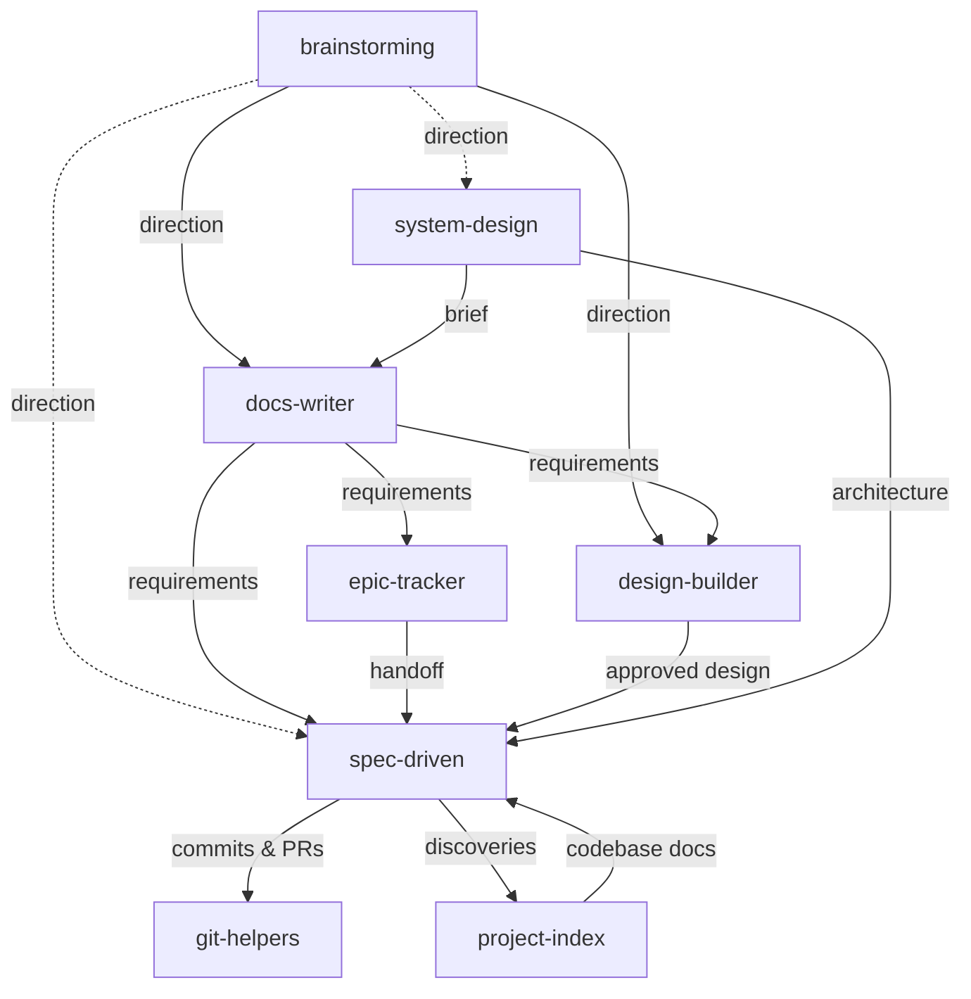

# Agent Skills

A personal collection of skills for AI coding agents. Each skill packages instructions, references, and workflows that extend agent capabilities beyond their defaults.

## What are Skills?

Skills are packaged instructions that teach AI agents new workflows and specialized knowledge. Think of them as plugins -- a `SKILL.md` file with YAML frontmatter tells the agent when to activate, and markdown content tells it what to do. Supporting files (references, templates, scripts) are loaded on demand to keep context usage minimal.

Skills follow the [Agent Skills](https://agentskills.io) open standard, which originated in Claude Code and has been adopted across all major AI coding agents.

## Installation

Install any skill with a single command using the [Skills CLI](https://skills.sh):

```bash
npx skills add adeonir/agent-skills
```

## Skills

| Skill | Category | Description |
|-------|----------|-------------|
| **[design-builder](skills/(design)/design-builder)** | Design | Greenfield design pipeline for any digital product: extract, structure, preview, tune, sync, handoff |
| **[debug-tools](skills/(development)/debug-tools)** | Development | Iterative debugging: investigate, fix, verify loop with pattern comparison and escalation. Confidence scoring |
| **[project-index](skills/(development)/project-index)** | Development | Generate project context and deep codebase documentation with code snippets. Creates `.agents/` with depth over brevity |
| **[spec-driven](skills/(development)/spec-driven)** | Development | Specification-driven development: Specify, Design, Tasks, Implement. Auto-sized by complexity, full traceability |
| **[system-design](skills/(development)/system-design)** | Development | Guided system design from problem to architecture: discovery, requirements, trade-offs, components, brief |
| **[brainstorming](skills/(product)/brainstorming)** | Product | Structured idea exploration or plan stress-test: two-path discovery (standard/relentless), diverge with techniques, converge on direction. Feeds docs-writer, spec-driven, design-builder |
| **[docs-writer](skills/(product)/docs-writer)** | Product | Structured document generation: PRD, Brief, Design Doc, TDD. Guided discovery per type |
| **[epic-tracker](skills/(product)/epic-tracker)** | Product | Delivery lifecycle management: plan epics, track stories, bugs, and issues, group releases. Tracker-first via MCP or CLI; markdown fallback when no tracker is configured. Feeds spec-driven |
| **[git-helpers](skills/(tooling)/git-helpers)** | Tooling | Conventional commits, confidence-scored code review, PR summaries, pull request creation, and branch lifecycle |
| **[session-notes](skills/(tooling)/session-notes)** | Tooling | Obsidian note creation for projects, companies, challenges, brags, daily logs, sessions, and conversations |
| **[wrap-up](skills/(tooling)/wrap-up)** | Tooling | End-of-session context persistence across auto-memory, Basic Memory, and Obsidian |

## How They Connect



Dashed arrow: optional shortcut for small, well-scoped work.
**debug-tools**, **session-notes**, and **wrap-up** are independent — available at any point, not tied to the pipeline.

## Typical Greenfield Flow

```
1. brainstorming     --> explore ideas, choose direction
2. docs-writer       --> generate requirements and technical docs
3. epic-tracker      --> plan epics, track stories, bugs, and issues
4. design-builder    --> extract, structure, preview, approve
5. spec-driven       --> specify, design, tasks, implement
6. git-helpers       --> commit, code-review, pull-request, finish branch
```

**Always available:**

```
debug-tools     --> investigate and fix issues
project-index   --> scan codebase and generate context (brownfield or re-index)
session-notes   --> document work in Obsidian
wrap-up         --> persist session context across memory systems
```

## Output Structure

Skills write artifacts to `.artifacts/` and reference context to `.agents/`:

```
.agents/
├── codebase/       # project-index: deep codebase analysis
└── project.md      # project-index: project context

.artifacts/
├── brainstorm/     # brainstorming: ideation artifacts
├── design/         # design-builder: copy.yaml, design.json, variants/
├── docs/           # docs-writer + system-design: PRD, Brief, Design Doc, TDD, system-brief.md
├── epics/          # epic-tracker: epics, stories, bugs, issues, releases
├── features/       # spec-driven: feature specs, designs, tasks
├── quick/          # spec-driven: quick mode tasks
└── research/       # spec-driven: research cache
```

This directory is gitignored by default but can be committed for team collaboration.

## License

MIT
