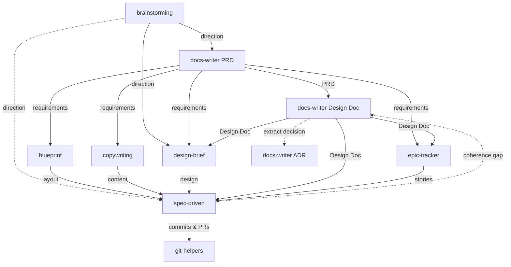

# Agent Skills

A personal collection of skills for AI coding agents. Each skill packages instructions, references, and workflows that extend agent capabilities beyond their defaults.

## What are Skills?

Skills are packaged instructions that teach AI agents new workflows and specialized knowledge. Think of them as plugins — a `SKILL.md` file with YAML frontmatter tells the agent when to activate, and markdown content tells it what to do. Supporting files (references, templates, scripts) are loaded on demand to keep context usage minimal.

Skills follow the [Agent Skills](https://agentskills.io) open standard, which originated in Claude Code and has been adopted across all major AI coding agents.

## Installation

Install any skill with a single command using the [Skills CLI](https://skills.sh):

```bash
npx skills add adeonir/agent-skills
```

Or install a single skill:

```bash
npx skills add adeonir/agent-skills/<skill-name>
```

## Skills

| Skill | Category | Description |
|-------|----------|-------------|
| **[debug-tools](skills/engineering/debug-tools)** | Engineering | Iterative investigate–fix–verify debugging with confidence scoring |
| **[git-helpers](skills/engineering/git-helpers)** | Engineering | Conventional commits, pull requests, and branch lifecycle |
| **[review-lens](skills/engineering/review-lens)** | Engineering | Confidence-scored pre-PR code review in quick and deep modes |
| **[rule-creator](skills/engineering/rule-creator)** | Engineering | Create and manage Claude Code rules in `.claude/rules/` |
| **[spec-driven](skills/engineering/spec-driven)** | Engineering | Spec-driven feature development with auto-sizing and full traceability |
| **[notes](skills/personal/notes)** | Personal | Obsidian notes for projects, meetings, challenges, and brag docs |
| **[handoff](skills/personal/handoff)** | Personal | Save and resume conversation state across sessions |
| **[wrap-up](skills/personal/wrap-up)** | Personal | End-of-session context persistence to Obsidian |
| **[blueprint](skills/product/blueprint)** | Product | Plans `blueprint.md` — information architecture, layout, and screen flow |
| **[brainstorming](skills/product/brainstorming)** | Product | Structured idea exploration and plan stress-testing, diverge to converge |
| **[copywriting](skills/product/copywriting)** | Product | Authors `copy.yaml` — fresh copy or structured existing content |
| **[design-brief](skills/product/design-brief)** | Product | Greenfield visual identity — explore a direction and author `DESIGN.md` |
| **[docs-writer](skills/product/docs-writer)** | Product | Structured docs: PRD, Brief, Design Doc, ADR |
| **[epic-tracker](skills/product/epic-tracker)** | Product | Epics, stories, bugs, and releases — tracker-first or markdown |

## How They Connect



Dashed arrow: optional shortcut for small, well-scoped work.
**debug-tools**, **review-lens**, **rule-creator**, **notes**, **handoff**, and **wrap-up** are available at any point — utilities and reviews used as needed, not mandatory pipeline stages.

## Using the Flow

The full flow when building a new product or feature with non-trivial
business logic:

```
1.  brainstorming --> direction and constraints
2.  docs-writer   --> PRD (what to build, for whom, why)
3.  docs-writer   --> Design Doc (technical decisions)
4.  blueprint     --> layout and screen flow
5.  design-brief  --> visual identity and design tokens
6.  copywriting   --> content and copy
7.  epic-tracker  --> epics, stories, acceptance criteria
8.  spec-driven   --> per-story spec, design, tasks, implementation
9.  review-lens   --> review changes before commit (quick or deep)
10. git-helpers   --> commit, pull request, finish branch
11. wrap-up       --> persist session context
```

`design-brief` can run in parallel with the Design Doc step. The
always-available skills (see [How They Connect](#how-they-connect)) slot in
at any point.

### When to skip steps

| Skip | When |
|------|------|
| `brainstorming` | Direction is already clear |
| `docs-writer` | Bug fix or change with no architectural decisions OR feature is too small to warrant a PRD |
| `copywriting` | No content payload needed, or copy already exists |
| `blueprint` | No layout planning needed, or arrangement already exists |
| `design-brief` | No UI, or design already exists |

`spec-driven` and `git-helpers` are never optional for non-trivial work.

### Brownfield entry

Jump in at any step — each skill reads existing artifacts and adapts:

- Adding a feature to an existing product → start at `epic-tracker` or `spec-driven`
- Undocumented codebase → `spec-driven` explores it on demand during specify and design
- Design before requirements → run `design-brief`, then back-fill with `docs-writer`
- Architecture question mid-feature → update the project Design Doc via `docs-writer`, feed result to `spec-driven`

### Feedback loop

`spec-driven` discovers coherence gaps during implementation and signals back:

```
spec-driven discovers gap (missing entity, orphan flow, NFR drift)
    --> writes to knowledge.md ## Coherence Gaps
    --> user reruns docs-writer with update mode
    --> docs-writer re-enters the responsible phase scoped to the gap
    --> spec-driven resumes with updated technical doc
```

## Output Structure

Skills write to `docs/` (committed, human-facing) and `.artifacts/` (gitignored agent workspace):

```
docs/
├── product/        # brainstorming: brainstorm · docs-writer: PRD, brief
├── tech/           # docs-writer: design-doc
├── adr/            # docs-writer: append-only decision log
└── design/         # design-brief: design tokens, moodboard

.artifacts/
├── knowledge.md    # spec-driven: cross-feature decisions, gotchas, conventions
├── codebase/       # spec-driven: area exploration cache (reusable)
├── epics/          # epic-tracker: epics, stories, bugs, issues, releases
├── features/       # spec-driven: feature specs, designs, tasks
├── quick/          # spec-driven: quick mode tasks
└── research/       # spec-driven: research cache
```

The `.artifacts` directory is gitignored by default but can be committed for team collaboration.

## License

MIT
