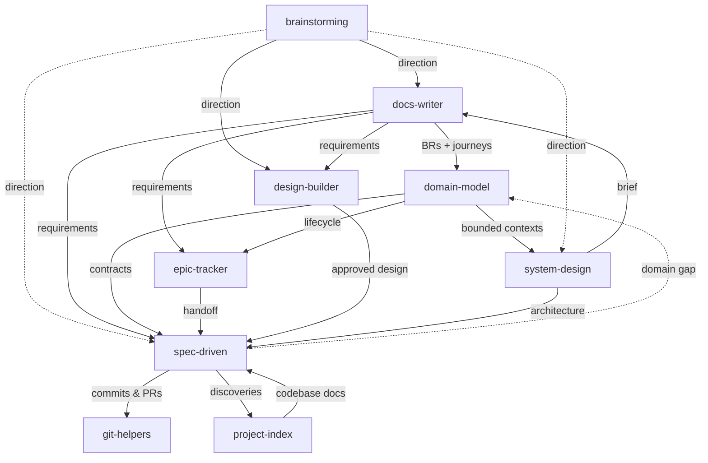

# Agent Skills

A personal collection of skills for AI coding agents. Each skill packages instructions, references, and workflows that extend agent capabilities beyond their defaults.

## What are Skills?

Skills are packaged instructions that teach AI agents new workflows and specialized knowledge. Think of them as plugins -- a `SKILL.md` file with YAML frontmatter tells the agent when to activate, and markdown content tells it what to do. Supporting files (references, templates, scripts) are loaded on demand to keep context usage minimal.

Skills follow the [Agent Skills](https://agentskills.io) open standard, which originated in Claude Code and has been adopted across all major AI coding agents.

## Installation

Install any skill with a single command using the [Skills CLI](https://skills.sh):

```bash
npx skills add adeonir/agent-skills
```

## Skills

| Skill | Category | Description |
|-------|----------|-------------|
| **[debug-tools](skills/engineering/debug-tools)** | Engineering | Iterative debugging: investigate, fix, verify loop with pattern comparison and escalation. Confidence scoring |
| **[git-helpers](skills/engineering/git-helpers)** | Engineering | Conventional commits, confidence-scored code review, PR summaries, pull request creation, and branch lifecycle |
| **[project-index](skills/engineering/project-index)** | Engineering | Generate project context and deep codebase documentation with code snippets. Creates `.agents/` with depth over brevity |
| **[spec-driven](skills/engineering/spec-driven)** | Engineering | Specification-driven development: Specify, Design, Tasks, Implement. Auto-sized by complexity, full traceability |
| **[system-design](skills/engineering/system-design)** | Engineering | Guided system design from problem to architecture: discovery, requirements, trade-offs, components, brief |
| **[notes](skills/personal/notes)** | Personal | Obsidian note creation for projects, companies, challenges, brags, daily logs, sessions, and conversations |
| **[session-handoff](skills/personal/session-handoff)** | Personal | Save and resume conversation state across sessions: snapshots focus, decisions, findings, open threads, next step, blockers, references |
| **[wrap-up](skills/personal/wrap-up)** | Personal | End-of-session context persistence across auto-memory, Basic Memory, and Obsidian |
| **[brainstorming](skills/product/brainstorming)** | Product | Structured idea exploration or plan stress-test: two-path discovery (standard/relentless), diverge with techniques, converge on direction. Feeds docs-writer, spec-driven, design-builder |
| **[design-builder](skills/product/design-builder)** | Product | Greenfield design pipeline for any digital product: extract, structure, preview, tune, sync, handoff |
| **[docs-writer](skills/product/docs-writer)** | Product | Structured document generation: PRD, Brief, Design Doc, TDD. Guided discovery per type |
| **[domain-model](skills/product/domain-model)** | Product | Translate PRD business rules and journeys into domain entities, invariants, bounded contexts, and a living contract for system-design and spec-driven |
| **[epic-tracker](skills/product/epic-tracker)** | Product | Delivery lifecycle management: plan epics, track stories, bugs, and issues, group releases. Tracker-first via MCP or CLI; markdown fallback when no tracker is configured. Feeds spec-driven |

## How They Connect



Dashed arrow: optional shortcut for small, well-scoped work.
**debug-tools**, **notes**, **session-handoff**, and **wrap-up** are independent — available at any point, not tied to the pipeline.

## Typical Greenfield Flow

```
1. brainstorming     --> explore ideas, choose direction
2. docs-writer       --> generate requirements and technical docs
3. domain-model      --> define entities, invariants, bounded contexts
4. epic-tracker      --> plan epics, track stories, bugs, and issues
5. design-builder    --> extract, structure, preview, approve
6. spec-driven       --> specify, design, tasks, implement
7. git-helpers       --> commit, code-review, pull-request, finish branch
```

**Always available:**

```
debug-tools      --> investigate and fix issues
notes            --> document work in Obsidian
project-index    --> scan codebase and generate context (brownfield or re-index)
session-handoff  --> save/resume conversation state across sessions
wrap-up          --> persist session context across memory systems
```

## Using the Flow

### Full product-first flow

Use all steps when building a new product or feature with non-trivial
business logic:

```
brainstorming    --> direction and constraints
docs-writer      --> PRD (what to build, for whom, why)
domain-model     --> entities, rules, bounded contexts
system-design    --> architecture, trade-offs, component brief
design-builder   --> visual design, tokens, layout
epic-tracker     --> epics, stories, acceptance criteria
spec-driven      --> per-story spec, design, tasks, implementation
git-helpers      --> commit, review, pull request
wrap-up          --> persist session context
```

`project-index` runs once at project start and re-indexes on demand.
`system-design` and `design-builder` run in parallel after `domain-model`.

### When to skip steps

| Skip | When |
|------|------|
| `brainstorming` | Direction is already clear |
| `domain-model` | No business rules or complex entity lifecycle |
| `system-design` | Frontend-only or trivial backend |
| `design-builder` | No UI, or design already exists |
| `docs-writer` | Feature is too small to warrant a PRD |

`spec-driven` and `git-helpers` are never optional for non-trivial work.

### Brownfield entry

Jump in at any step — each skill reads existing artifacts and adapts:

- Adding a feature to an existing product → start at `epic-tracker` or `spec-driven`
- Undocumented codebase → run `project-index` first, then `spec-driven`
- Design before requirements → run `design-builder`, then back-fill with `docs-writer`
- Architecture question mid-feature → run `system-design`, feed result to `spec-driven`

### Feedback loop

`spec-driven` discovers domain gaps during implementation and signals back:

```
spec-driven discovers gap
    --> writes to knowledge.md ## Domain Gaps
    --> user runs domain-model (update mode)
    --> domain-model refines entities or rules
    --> spec-driven resumes with updated contracts
```

`project-index integrate feedback` handles codebase discoveries on the
same cycle — run both after a batch of stories lands.

## Output Structure

Skills write artifacts to `.artifacts/` and reference context to `.agents/`:

```
.agents/
├── codebase/       # project-index: deep codebase analysis
└── project.md      # project-index: project context

.artifacts/
├── brainstorm/     # brainstorming: ideation artifacts
├── design/         # design-builder: copy.yaml, design.json, variants/
├── docs/           # docs-writer + system-design + domain-model: PRD, Brief, Design Doc, TDD, system-brief.md, domain.md
├── epics/          # epic-tracker: epics, stories, bugs, issues, releases
├── features/       # spec-driven: feature specs, designs, tasks
├── quick/          # spec-driven: quick mode tasks
└── research/       # spec-driven: research cache
```

This directory is gitignored by default but can be committed for team collaboration.

## License

MIT
