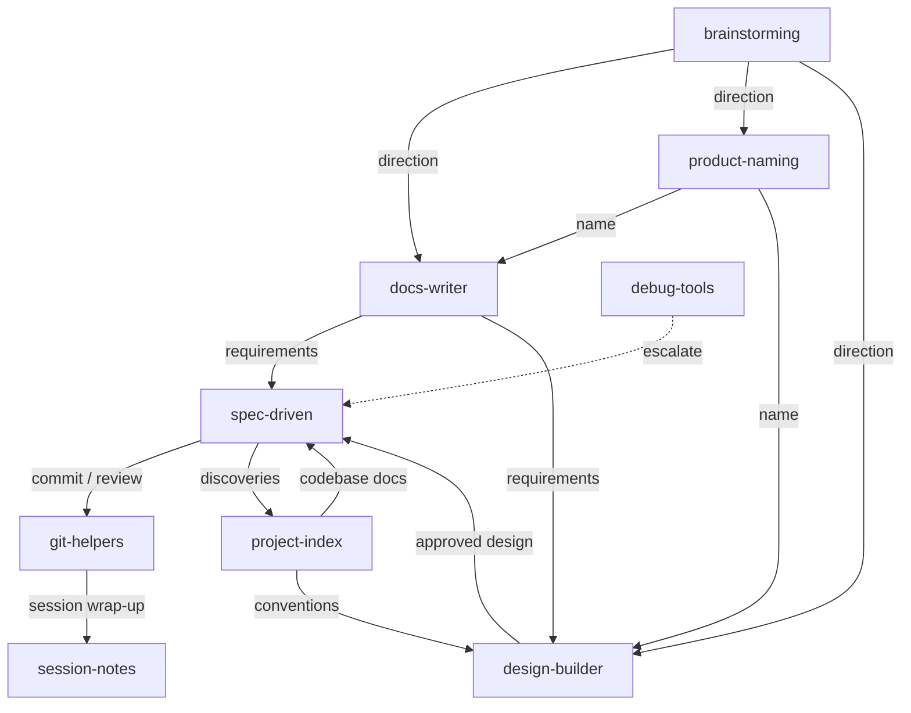

# Agent Skills

A personal collection of skills for AI coding agents. Each skill packages instructions, references, and workflows that extend agent capabilities beyond their defaults.

## What are Skills?

Skills are packaged instructions that teach AI agents new workflows and specialized knowledge. Think of them as plugins -- a `SKILL.md` file with YAML frontmatter tells the agent when to activate, and markdown content tells it what to do. Supporting files (references, templates, scripts) are loaded on demand to keep context usage minimal.

```
skill-name/
  SKILL.md              # Entry point: frontmatter + instructions
  references/           # On-demand detailed documentation
  CHANGELOG.md
  README.md
```

Skills follow the [Agent Skills](https://agentskills.io) open standard, which originated in Claude Code and has been adopted across all major AI coding agents.

## Skills

| Skill | Category | Description |
|-------|----------|-------------|
| **[design-builder](skills/(design)/design-builder)** | Design | Product-engineer design pipeline: extract copy and tokens, define structure, preview and approve designs |
| **[debug-tools](skills/(development)/debug-tools)** | Development | Iterative debugging: investigate, fix, verify loop with pattern comparison and escalation. Confidence scoring |
| **[project-index](skills/(development)/project-index)** | Development | Generate project context and deep codebase documentation with code snippets. Creates `.agents/` with depth over brevity |
| **[spec-driven](skills/(development)/spec-driven)** | Development | Specification-driven development: Specify, Design, Tasks, Implement. Auto-sized by complexity, full traceability |
| **[brainstorming](skills/(product)/brainstorming)** | Product | Structured idea exploration: discover context, diverge with techniques, converge on direction. Feeds docs-writer, spec-driven, design-builder |
| **[docs-writer](skills/(product)/docs-writer)** | Product | Structured document generation: PRD, Brief, Design Doc, TDD, Epic, Issue, Bug, RFC, ADR. Guided discovery per type |
| **[product-naming](skills/(product)/product-naming)** | Product | Research and validate product names with domain/social availability checks and quality scoring |
| **[git-helpers](skills/(tooling)/git-helpers)** | Tooling | Conventional commits, confidence-scored code review, PR summaries, pull request creation, and branch lifecycle |
| **[session-notes](skills/(tooling)/session-notes)** | Tooling | Obsidian note creation for projects, companies, challenges, brags, daily logs, sessions, decisions, and conversations |

## How They Connect



## Full Project Flow

```
1. brainstorming     --> explore ideas, choose direction
2. product-naming    --> research and validate name
3. docs-writer       --> generate requirements (PRD, Brief)
4. project-index     --> scan codebase (if brownfield)
5. design-builder    --> extract, structure, preview, approve
6. spec-driven       --> specify, design, tasks, implement
7. git-helpers       --> commit, review, PR, finish
8. session-notes     --> document what was done
9. debug-tools       --> when something breaks
```

## Output Structure

Skills write artifacts to `.artifacts/` organized by domain:

```
.artifacts/
├── features/       # spec-driven: feature specs, designs, tasks
├── quick/          # spec-driven: quick mode tasks
├── research/       # spec-driven: research cache
├── brainstorm/     # brainstorming: ideation artifacts
├── docs/           # docs-writer + product-naming
└── design/         # design-builder: copy.yaml, design.json, variants/
```

This directory is gitignored by default but can be committed for team collaboration.

## Installation

Install any skill with a single command using the [Skills CLI](https://skills.sh):

```bash
npx skills add adeonir/agent-skills
```

## License

MIT
