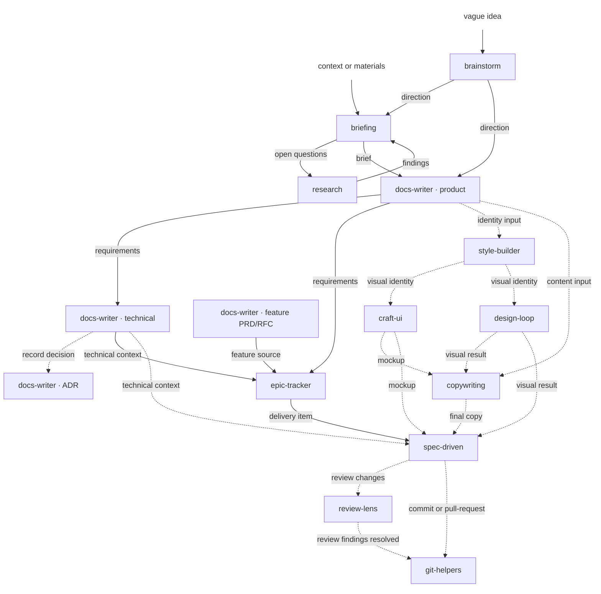

# Agent Skills

A personal collection of skills for AI coding agents. Each skill packages instructions, references, and workflows that extend agent capabilities beyond their defaults.

## What are Skills?

Skills are packaged instructions that teach AI agents new workflows and specialized knowledge. Think of them as plugins — a `SKILL.md` file with YAML frontmatter tells the agent when to activate, and markdown content tells it what to do. Supporting files (references, templates, scripts) are loaded on demand to keep context usage minimal.

Skills follow the [Agent Skills](https://agentskills.io) open standard, which originated in Claude Code and has been adopted across all major AI coding agents.

## Installation

Install any skill with a single command using the [Skills CLI](https://skills.sh):

```bash
npx skills add adeonir/agent-skills
```

Or install a single skill:

```bash
npx skills add adeonir/agent-skills/<skill-name>
```

## Skills

### Engineering

| Skill | Description |
| ----- | ----------- |
| **[debug-tools](skills/engineering/debug-tools)** | Iterative investigate–fix–verify debugging with confidence scoring |
| **[git-helpers](skills/engineering/git-helpers)** | Conventional commits, pull requests, and branch lifecycle |
| **[review-lens](skills/engineering/review-lens)** | Confidence-scored pre-PR code review in quick and deep modes |
| **[spec-driven](skills/engineering/spec-driven)** | Spec-driven feature development from spec to delivery, with requirements traceability |

### Product

| Skill | Description |
| ----- | ----------- |
| **[brainstorm](skills/product/brainstorm)** | Structured idea exploration from a blank space or an existing plan, diverge to converge |
| **[briefing](skills/product/briefing)** | Work brief: background, objectives, audience, budget, timing, constraints, and gaps in `briefing.md` |
| **[copywriting](skills/product/copywriting)** | Authors `copy.yaml` — write, extract, refresh, plus critique and audit |
| **[craft-ui](skills/product/craft-ui)** | Wireframe the arrangement, then mockup the visual direction, and deliver the chosen one |
| **[design-loop](skills/product/design-loop)** | Create or improve a visual artifact against a reference through construction and independent critique |
| **[docs-writer](skills/product/docs-writer)** | Structured docs: project PRD, feature PRD/RFC, Design Doc, ADR |
| **[domain-modeling](skills/product/domain-modeling)** | Canonical domain vocabulary kept in `GLOSSARY.md`: challenge, sharpen, and record terms as they resolve |
| **[epic-tracker](skills/product/epic-tracker)** | Epics, stories, bugs, and tasks — tracked in Linear or GitHub |
| **[research](skills/product/research)** | Sourced evidence on a product or code question: findings, implications, unknowns, and open questions in `.artifacts/research/` |
| **[storytelling](skills/product/storytelling)** | Story and experience direction for a site: thesis, tension, arc, pacing, and the role of interaction and movement in `storytelling.md` |
| **[style-builder](skills/product/style-builder)** | Visual identity — explore a direction, assess or evolve an existing one, and author `DESIGN.md` |

### Productivity

| Skill | Description |
| ----- | ----------- |
| **[anti-slop](skills/productivity/anti-slop)** | Edit drafts into sharper, more human prose, or detect AI tells without rewriting |
| **[grill-me](skills/productivity/grill-me)** | Round-by-round interview of a plan until every decision is settled, then reports terms and decisions to record |
| **[handoff](skills/productivity/handoff)** | Save and resume conversation state across sessions |
| **[notes](skills/productivity/notes)** | Obsidian notes for projects, meetings, challenges, and brag docs |
| **[plain-spoken](skills/productivity/plain-spoken)** | STE-inspired technical prose with less jargon and preserved precision |
| **[rule-creator](skills/productivity/rule-creator)** | Create and manage Claude Code rules in `.claude/rules/` |
| **[wrap-up](skills/productivity/wrap-up)** | End-of-session context persistence to Obsidian |

## How They Connect


```mermaid
flowchart TD
    CTX["context or materials"]:::plain --> BF[briefing]
    IDEA["vague idea"]:::plain --> BR[brainstorm]
    BR -->|direction| BF
    BF -->|open questions| RS[research]
    RS -->|findings| BF
    BF -->|brief| DW_P[docs-writer · product]
    BR -->|direction| DW_P
    DW_P -->|requirements| DW_T[docs-writer · technical]
    DW_T -.->|record decision| DW_A[docs-writer · ADR]
    DW_P -->|requirements| ET[epic-tracker]
    DW_F[docs-writer · feature PRD/RFC] -->|feature source| ET
    DW_T -->|technical context| ET

    DW_P -.->|identity input| SB[style-builder]
    SB -.->|visual identity| CU[craft-ui]
    SB -.->|visual identity| DL[design-loop]
    DW_P -.->|content input| CW[copywriting]
    CU -.->|mockup| CW
    DL -.->|visual result| CW

    ET -->|delivery item| SD[spec-driven]
    DW_T -.->|technical context| SD
    CU -.->|mockup| SD
    DL -.->|visual result| SD
    CW -.->|final copy| SD

    SD -.->|review changes| RL[review-lens]
    SD -.->|commit or pull-request| GH[git-helpers]
    RL -.->|review findings resolved| GH
    classDef plain fill:transparent,stroke:transparent
```

Dotted arrows show optional handoffs. The visual paths go through `style-builder`: `craft-ui` and `design-loop` are separate paths, and neither requires the other. `copywriting` can supply final copy after either visual path. `review-lens` and `git-helpers` act after implementation when needed.

**debug-tools**, **rule-creator**, **domain-modeling**, **grill-me**, **notes**, **handoff**, and **wrap-up** run when their own jobs are needed.
**storytelling** runs at any phase and reads whatever materials exist.

## Using the Flow

For a feature, a common route is:

1. `brainstorm` -> direction and constraints from a vague idea.
2. `briefing` -> context, objectives, audience, constraints, and gaps.
3. `research` -> evidence for open questions when needed.
4. `docs-writer` -> product or feature requirements.
5. `docs-writer` -> technical decisions and trade-offs when needed.
6. `epic-tracker` -> delivery work in the tracker.
7. `style-builder` -> visual identity when a visual path is needed.
8. `craft-ui` -> wireframes and mockups when this visual path is used.
9. `design-loop` -> visual result refined against a reference when this visual path is used.
10. `copywriting` -> final copy when needed, including after either visual path.
11. `spec-driven` -> feature specification and implementation.
12. `review-lens` -> review of the changes when needed.
13. `git-helpers` -> commits and pull requests when needed.

### Feedback loop

`spec-driven` discovers coherence gaps during implementation and signals back:

```
spec-driven discovers gap (missing entity, orphan flow, NFR drift)
    --> records the gap in PROJECT.md ## Gotchas
    --> user reruns docs-writer with update mode
    --> docs-writer re-enters the responsible phase scoped to the gap
    --> spec-driven resumes with updated technical doc
```

## Output Structure

```
docs/
├── product/        # briefing: briefing.md · brainstorm: brainstorm.md · docs-writer: project PRD · copywriting: copy.yaml
├── tech/           # docs-writer: design-doc
├── adr/            # docs-writer: append-only decision log
└── design/         # style-builder: locked direction (moodboard.md) · craft-ui: chosen mockup · storytelling: storytelling.md

PROJECT.md          # spec-driven: committed project memory
GLOSSARY.md         # domain-modeling: canonical domain terms
.artifacts/
├── specs/          # spec-driven: per-feature artifacts and state
├── archive/
│   ├── specs/       # spec-driven: specs archived manually, in any state
│   └── features/    # docs-writer: feature PRD/RFC folders archived manually
├── research/       # research: <topic>.md reports · spec-driven: research cache
└── design/         # style-builder: tune session events · craft-ui: structure.yaml + VARIANTS.md + wireframes/ + mockups/ · design-loop: <slug>/STATE.md + reference-criteria.md
```

`epic-tracker` writes no artifacts here — its epics, stories, bugs, and tasks
live in the tracker (Linear or GitHub), and an `## Issue tracker` block in
`AGENTS.md` or `CLAUDE.md` records which tracker is configured.

Skills write to `docs/` (committed, human-facing) and `.artifacts/` (gitignored agent workspace).

## License

MIT
