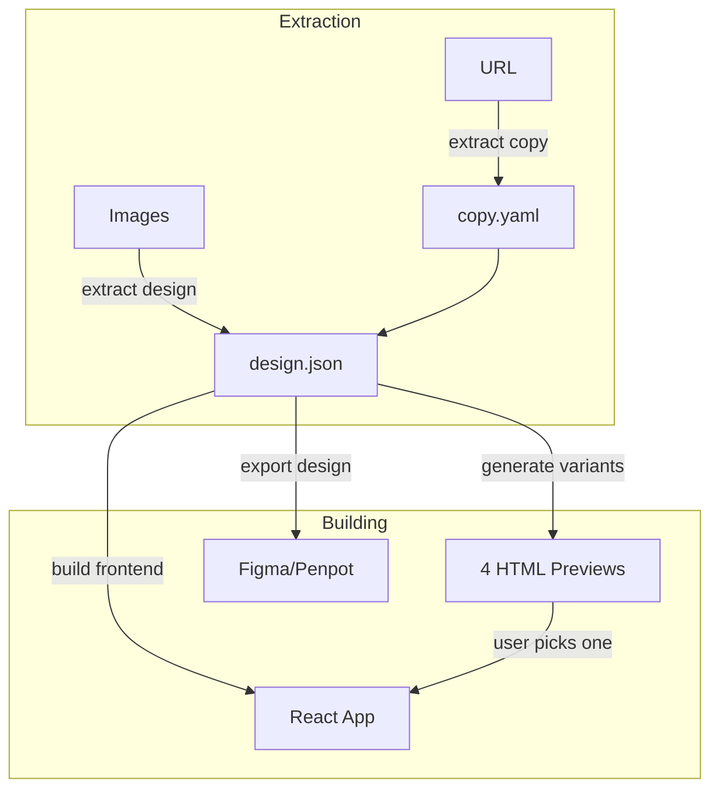

# Design Builder

Design-to-code pipeline: extract copy from URLs, extract design tokens from images, build React components, preview design variants, or export to Figma/Penpot.

## What It Does



| Step | Trigger | Output |
| ---- | ------- | ------ |
| **Copy Extraction** | Extract copy from URL | `.specs/docs/{project}/copy.yaml` |
| **Design Extraction** | Extract design from images | `.specs/docs/{project}/design.json` |
| **Frontend Building** | Build frontend / use {variant} | `./src/` (React components) |
| **Variant Generation** | Generate variants | `.specs/docs/{project}/variants/` |
| **Design Export** | Export to Figma | `.specs/docs/{project}/export/index.html` |

## Usage

### Extract Content from URL

```
extract copy from https://example.com
```

Fetches the URL, identifies project type, and generates structured `copy.yaml`.

### Extract Design from Images

```
extract design from this screenshot
extract design tokens
```

Paste images or provide URLs. Extracts colors (exact HEX), typography, spacing, components, animations.

If no images are available, describe the style direction and tokens will be generated from the description.

### Build Frontend

```
build frontend
create React components from design tokens
```

Detects existing project stack or scaffolds new. Maps design.json tokens to CSS variables.

### Preview Variants

```
generate variants
preview design layouts
```

Generates 4 HTML+CSS presets for comparison:

| Preset | Style | Hero | Cards |
| ------ | ----- | ---- | ----- |
| **minimal** | Ultra clean | Text only | None |
| **editorial** | Magazine feel | Split 50/50 | Flat |
| **startup** | SaaS modern | Centered CTA | Shadows |
| **bold** | High impact | Fullscreen | Bordered |

Opens http://localhost:8080 for side-by-side comparison. Choose a variant and build React from it.

Custom presets are also supported -- describe what you want.

### Export to Design Tools

```
export to Figma
export design
```

Generates clean HTML with inline CSS at http://localhost:8081, optimized for import via YashiTech (Figma) or Penpot.

## Artifacts

```
.specs/docs/
├── prd-{project}.md           # Optional PRD
└── {project}/
    ├── copy.yaml              # Structured content
    ├── design.json            # Design tokens
    ├── variants/              # HTML preview variants
    │   ├── minimal/
    │   ├── editorial/
    │   ├── startup/
    │   ├── bold/
    │   └── index.html         # Comparison page
    └── export/
        └── index.html         # Design tool import

src/                           # Generated React components
```

## Pipeline Examples

### Full Pipeline

```
1. extract copy from https://competitor.com
2. extract design from [paste screenshots]
3. generate variants
4. use editorial
```

### From Scratch (with docs-writer)

```
1. create PRD for my project          # docs-writer skill
2. extract design                     # describe style, no images needed
3. build frontend
```

### Quick Build

```
1. extract design from [paste image]
2. build frontend
```

## Integration

| Skill | Relationship |
| ----- | ------------ |
| **docs-writer** | PRD provides product context for copy and design extraction |
| **spec-driven** | Use after design-builder to plan implementation of complex features |
| **frontend-design** | Optional skill for enhanced design quality guidelines |

## Requirements

- Node.js (for `npx http-server` in variants and export)
- For Figma export: YashiTech Chrome Extension + Figma Plugin

Works with any agent supporting standard skill format.
