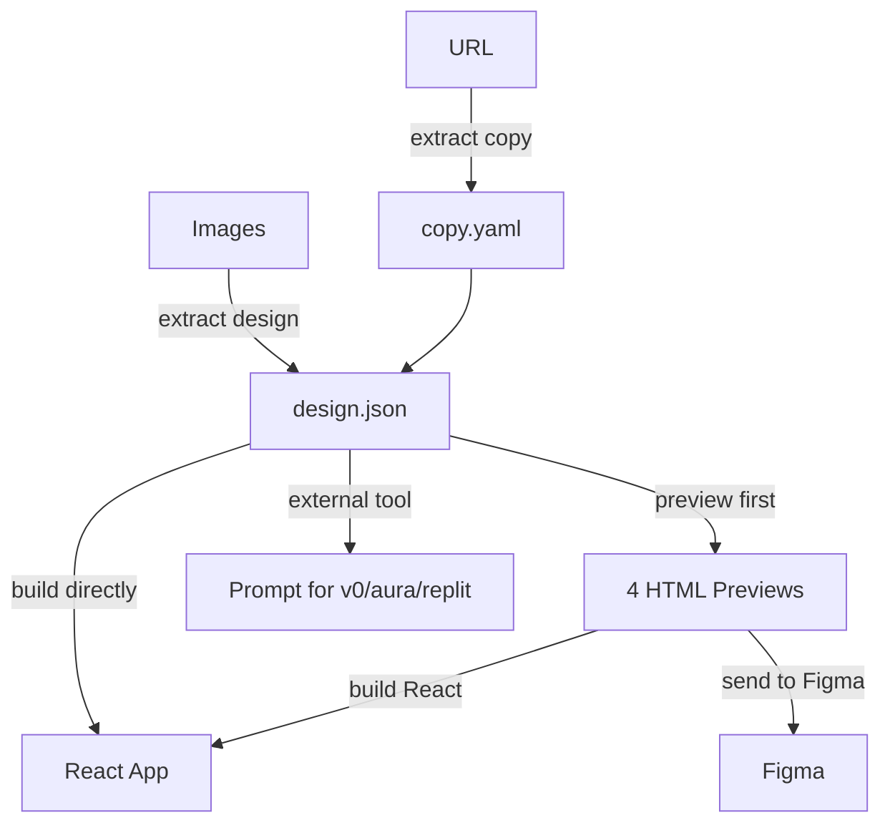

# Design Builder

Design-to-code pipeline: extract copy from URLs, extract design tokens from images, build React components, preview design variants, or export to Figma.

## Installation

```bash
npx skills add adeonir/agent-skills --skill design-builder
```

## What It Does


```mermaid
flowchart TD
    A[URL] -->|extract copy| B[copy.yaml]
    C[Images] -->|extract design| D[design.json]
    B --> D
    D -->|build directly| E[React App]
    D -->|preview first| F[4 HTML Previews]
    D -->|external tool| H[Prompt for v0/aura/replit]
    F -->|build React| E
    F -->|send to Figma| G[Figma]
```

| Step | Trigger | Output |
| ---- | ------- | ------ |
| **Copy Extraction** | Extract copy from URL | `.artifacts/design/copy.yaml` |
| **Design Extraction** | Extract design from images | `.artifacts/design/design.json` |
| **Frontend Building** | Build frontend / use {variant} | `./src/` (React components) |
| **Variant Generation** | Generate variants | `.artifacts/design/variants/` |
| **Design Export** | Send to Figma | Figma editable frame |

## Usage

```
# Extract content from URL
extract copy from https://example.com

# Extract design from images
extract design from this screenshot
extract design tokens

# Build frontend
build frontend
create React components from design tokens

# Preview variants
generate variants
preview design layouts

# Export to Figma
export to Figma
send to Figma
```

### Full Pipeline

```
1. extract copy from https://competitor.com
2. extract design from [paste screenshots]
3. generate variants
4. use editorial
```

### From Scratch (with docs-writer)

```
1. create PRD for my project          # docs-writer skill
2. extract design                     # describe style, no images needed
3. build frontend
```

### Quick Build

```
1. extract design from [paste image]
2. build frontend
```

## Output

```
.artifacts/
├── docs/
│   └── prd.md                 # Optional PRD
└── design/
    ├── copy.yaml              # Structured content
    ├── design.json            # Design tokens
    └── variants/              # HTML preview variants
        ├── minimal/
        ├── editorial/
        ├── startup/
        ├── bold/
        └── index.html         # Comparison page
src/                           # Generated React components
```

## Requirements

- Node.js (for `npx http-server` in variants and export)
- For Figma export: Figma Desktop with Dev Mode + Figma MCP server

## Integration

| Skill | Connection |
| ----- | ---------- |
| **docs-writer** | PRD provides product context for copy and design extraction |
| **spec-driven** | Use after design-builder to plan implementation of complex features |
