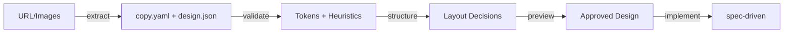

# Design Builder

Product-engineer design pipeline: extract content and tokens, define structure, preview and approve designs.

## Installation

```bash
npx skills add adeonir/agent-skills --skill design-builder
```

## What It Does


```mermaid
flowchart LR
    A[URL/Images] -->|extract| B[copy.yaml + design.json]
    B -->|validate| C[Tokens + Heuristics]
    C -->|structure| D[Layout Decisions]
    D -->|preview| E[Approved Design]
    E -->|implement| F[spec-driven]
```

| Step | Trigger | Output |
| ---- | ------- | ------ |
| **Copy Extraction** | Extract copy from URL | `.artifacts/design/copy.yaml` |
| **Design Extraction** | Extract design from images | `.artifacts/design/design.json` (validated) |
| **Structure** | Define layout, wireframe, organize content | `.artifacts/design/structure.md` |
| **Preview** | Preview design, generate variants, mockup | `.artifacts/design/preview/` |

## Usage

```
# Extract content from URL
extract copy from https://example.com

# Extract design from images
extract design from this screenshot

# Define page structure
define the layout for this landing page
check this wireframe

# Preview (two modes)
preview design          # guided: per-question visual decisions
generate variants       # exploratory: 4 complete HTML variants
```

### Full Pipeline

```
1. extract copy from https://competitor.com
2. extract design from [paste screenshots]
3. define the structure
4. preview design
5. implement with spec-driven
```

### With Existing Wireframe

```
1. extract design from [paste screenshots]
2. check this wireframe [paste image]
3. preview design
```

### From Scratch (with docs-writer)

```
1. create PRD for my project          # docs-writer skill
2. extract design                     # describe style, no images needed
3. define the structure
4. preview design
```

## Output

```
.artifacts/design/
├── copy.yaml              # Structured content
├── design.json            # Design tokens (validated against heuristics)
├── structure.md           # Layout decisions
└── preview/               # Preview session output
    ├── guided/            # Per-question decisions
    └── variants/          # 4 HTML variants
```

## Requirements

- Bun (for preview server)
- For design MCPs: Paper, Pencil, or Figma MCP configured

## Integration

| Skill | Connection |
| ----- | ---------- |
| **brainstorming** | Direction feeds discovery context |
| **product-naming** | Name feeds discovery context |
| **docs-writer** | PRD/Brief provides product context for extraction |
| **spec-driven** | Approved design feeds implementation |

## FAQ

**Q: Does it generate React code?**
A: No. Design-builder stops at approved design. Implementation is delegated to spec-driven, which follows project conventions.

**Q: What are the two preview modes?**
A: Guided mode presents one visual decision at a time (color, typography, hero style). Exploratory mode generates 4 complete HTML variants for side-by-side comparison.

**Q: Can I use Figma/Paper/Pencil?**
A: Yes. Structure phase can generate wireframes via design MCPs. Preview phase can export approved designs to them.
