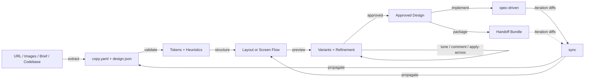

# Design Builder

Greenfield design pipeline for any digital product: extract content and tokens, define structure or screen flow, preview and refine designs, sync iterations, package handoff.

## Installation

```bash
npx skills add adeonir/agent-skills --skill design-builder
```

## What It Does


```mermaid
flowchart LR
    A[URL / Images / Brief / Codebase] -->|extract| B[copy.yaml + design.json]
    B -->|validate| C[Tokens + Heuristics]
    C -->|structure| D[Layout or Screen Flow]
    D -->|preview| E[Variants + Refinement]
    E -->|tune / comment / apply-across| E
    E -->|approved| F[Approved Design]
    F -->|implement| G[spec-driven]
    F -->|package| H[Handoff Bundle]
    G -->|iteration diffs| I[sync]
    H -.->|iteration diffs| I
    I -->|propagate| B
    I -->|propagate| D
```

| Step | Trigger | Output |
| ---- | ------- | ------ |
| **Copy Extraction** | Extract copy from URL, web capture, brief document | `.artifacts/design/copy.yaml` |
| **Design Extraction** | Extract design from images or from an existing codebase | `.artifacts/design/design.json` (validated) |
| **Structure** | Define layout, wireframe, organize content, screen flow | `.artifacts/design/structure.md` |
| **Preview** | Preview design, generate variants, tune tokens, comment, apply-across | `.artifacts/design/preview/` |
| **Sync** | Propagate Pencil or implementation changes back to tokens and structure | `.artifacts/design/{design.json, structure.md}` updated |
| **Handoff** | Package artifacts plus intent for another agent or developer | `.artifacts/design/handoff.md` |

## Usage

### Core Pipeline

```
# Extract content
extract copy from https://example.com
extract copy from this brief (PDF/DOCX)
web capture the hero section of https://competitor.com

# Extract design tokens
extract design from this screenshot
extract design from this codebase (redesigns)

# Define structure (routes by project type)
define the layout for this landing page         # page-based
define the screen flow for this app             # screen-based
check this wireframe                            # validate existing

# Preview (two base modes)
preview design          # guided: per-question visual decisions
generate variants       # exploratory: complete variants per preset

# Refinement on chosen variant
tune the design         # sliders for spacing, saturation, contrast, radius
# Alt+click any element in preview to comment
# Comments on repeated elements propagate via apply-across
```

### Sync and Handoff

```
sync design             # propagate pen or implementation changes back
handoff design          # package artifacts plus intent
```

### Full Greenfield Pipeline

```
1. extract copy from https://competitor.com
2. extract design from [paste screenshots]
3. define the structure (or screen flow)
4. preview design
5. tune and refine
6. implement with spec-driven
```

### Redesign from Existing Codebase

```
1. extract copy from the current site
2. extract design from the existing codebase
3. define the new structure
4. preview design
5. sync design   (after implementation iterations)
```

### From Scratch (with docs-writer)

```
1. create PRD for my project          # docs-writer skill
2. extract design                     # describe style, no images needed
3. define the structure or screen flow
4. preview design
```

## Project Types

design-builder adapts behavior to project type:

| Type | Flow |
| ---- | ---- |
| `landing-page` | Page-based: hero, sections, CTA placement, landing-oriented presets |
| `website` | Page-based: per-page sections with navigation |
| `web-app` | Screen-based: screens, navigation pattern, primary actions, app presets |
| `mobile-app` | Screen-based: screens, tabs/stack/drawer, native patterns, mobile presets |

## Output

```
.artifacts/design/
├── copy.yaml              # Structured content (sections or screens)
├── design.json            # Design tokens (validated against heuristics)
├── structure.md           # Layout or screen-flow decisions
├── design.pen             # Pencil iteration surface (optional)
├── handoff.md             # Handoff bundle (optional)
└── preview/
    ├── guided/            # Per-question decisions
    ├── variants/          # Complete variants per preset
    └── components/        # Isolated component previews (optional)
```

## Requirements

- Bun (for preview server)
- For design MCPs: Paper, Pencil, or Figma MCP configured
- Claude Chrome extension (optional, enables region web capture)

## Integration

| Skill | Connection |
| ----- | ---------- |
| **brainstorming** | Direction feeds discovery context |
| **product-naming** | Name feeds discovery context |
| **docs-writer** | PRD/Brief provides product context for extraction |
| **spec-driven** | Approved design feeds implementation; implementation diffs return via sync |

## FAQ

**Q: Is this for landing pages only?**
A: No. design-builder adapts to any digital product — landing pages, websites, web apps, and mobile apps. Project type routes the questions asked and the presets offered in preview.

**Q: Greenfield or brownfield?**
A: Greenfield-first. The primary use case is starting from zero with no existing codebase. A brownfield path exists in design extraction ("extract from codebase") for redesign or migration work.

**Q: What are the two preview modes?**
A: Guided mode presents one visual decision at a time (color, typography, primary surface). Exploratory mode generates complete variants — one per preset — for side-by-side comparison. After a variant is picked, three refinement tools apply: tune (sliders for tokens), comment (Alt+click any element), and apply-across (changes propagate to repeated elements).

**Q: What is sync for?**
A: `design.json` and `structure.md` are the source of truth. When you iterate in Pencil (`design.pen`) or during implementation, derivatives drift from source. Sync reconciles them back, asking you per-conflict when derivatives disagree.

**Q: When do I need handoff?**
A: Only when an external agent or developer — without access to this repo — will implement the design. `spec-driven` reads `.artifacts/design/` directly and does not need a handoff.

**Q: Can I use Figma/Paper/Pencil?**
A: Yes. Structure phase can generate wireframes via design MCPs. Preview phase can export approved designs to them. Pencil iterations flow back via sync.

**Q: Does it generate React code?**
A: No. design-builder stops at approved design. Implementation is delegated to `spec-driven`, which follows project conventions.
