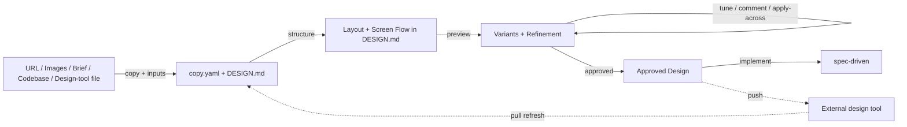

# Design Builder

Greenfield design pipeline for any digital product: extract content, author `DESIGN.md` (visual identity tokens plus rationale), define layout or screen flow, preview and refine designs, push to an external design tool when available.

## Installation

```bash
npx skills add adeonir/agent-skills --skill design-builder
```

## What It Does


```mermaid
flowchart LR
    A[URL / Images / Brief / Codebase / Design-tool file] -->|copy + inputs| B[copy.yaml + DESIGN.md]
    B -->|structure| C[Layout + Screen Flow in DESIGN.md]
    C -->|preview| D[Variants + Refinement]
    D -->|tune / comment / apply-across| D
    D -->|approved| E[Approved Design]
    E -->|implement| F[spec-driven]
    E -.->|push| G[External design tool]
    G -.->|pull refresh| B
```

| Step | Trigger | Output |
| ---- | ------- | ------ |
| **Copy** | Extract copy from URL, web capture, brief document | `.artifacts/design/copy.yaml` |
| **Inputs** | Extract design from images, codebase, text description, or design-tool file; author or refresh `DESIGN.md` | `<project-root>/DESIGN.md` (frontmatter tokens + rationale prose) |
| **Structure** | Define layout, wireframe, organize content, screen flow | `<project-root>/DESIGN.md` `## Layout` and `## Screen Flow` sections |
| **Preview** | Preview design, generate variants, tune tokens, comment, apply-across, push to external design tool | `.artifacts/design/preview/` (HTML), or write to a user-owned design-tool file |

## Project Types

design-builder adapts behavior to project type:

| Type | Flow |
| ---- | ---- |
| `landing-page` | Page-based: hero, sections, CTA placement, landing-oriented presets |
| `website` | Page-based: per-page sections with navigation |
| `web-app` | Screen-based: screens, navigation pattern, primary actions, app presets |
| `mobile-app` | Screen-based: screens, tabs/stack/drawer, native patterns, mobile presets |

## Usage

### Core Pipeline

```
# Extract content
extract copy from https://example.com
extract copy from this brief (PDF/DOCX)
web capture the hero section of https://competitor.com

# Author DESIGN.md (visual identity tokens + rationale)
extract design from this screenshot
extract design from this codebase
refresh design tokens from this design-tool file

# Define structure (routes by project type)
define the layout for this landing page         # page-based
define the screen flow for this app             # screen-based
check this wireframe                            # validate existing

# Preview (two base modes)
preview design          # guided: per-question visual decisions
generate variants       # exploratory: complete variants per preset

# Refinement on chosen variant
tune the design         # sliders for spacing, saturation, contrast, radius
# Alt+click any element in preview to comment
# Comments on repeated elements propagate via apply-across

# Push to an external design tool (optional, MCP-gated)
push the design to my design-tool file
```

### Full Greenfield Pipeline

```
1. extract copy from https://competitor.com
2. extract design from [paste screenshots]
3. define the structure (or screen flow)
4. preview design (guided or exploratory)
5. tune / comment / apply-across until approved
6. hand off to spec-driven for implementation
```

## Output

```
<project-root>/
└── DESIGN.md             # Visual identity: tokens (frontmatter) + rationale (prose)

.artifacts/design/
├── copy.yaml             # Structured content (sections or screens), optional
└── preview/
    ├── guided/           # Per-question decisions (guided mode)
    ├── variants/         # Complete variants (exploratory mode)
    └── components/       # Isolated component previews (optional)
```

External design-tool files (when used) live at the user's path and are user-owned. Skill never creates them.

## Requirements

- Bun (for preview server)
- Optional: any design-tool MCP for push or pull operations
- Optional: Claude Chrome extension (enables region web capture)

## Integration

| Skill | Connection |
| ----- | ---------- |
| **brainstorming** | Direction feeds discovery context |
| **product-naming** | Name feeds discovery context |
| **docs-writer** | PRD/Brief provides product context for extraction |
| **spec-driven** | Approved design feeds implementation |

## FAQ

**Q: Is this for landing pages only?**

A: No. design-builder adapts to any digital product — landing pages, websites, web apps, and mobile apps. Project type routes the questions asked and the presets offered in preview.

**Q: Greenfield or brownfield?**

A: Greenfield-first. The primary use case is starting from zero with no existing codebase. A brownfield path exists in `inputs.md` ("extract from codebase") for redesign or migration work.

**Q: What is `DESIGN.md`?**

A: A single file at the project root holding the visual identity. YAML frontmatter carries machine-readable design tokens (colors, typography, spacing, components, motion, variants). Markdown body carries human-readable rationale across sections (Overview, Colors, Typography, Layout, Screen Flow, Elevation & Depth, Shapes, Motion, Components, Variants, Do's and Don'ts). Agents and humans read the same file.

**Q: Why not keep design tokens in JSON?**

A: A single human-and-machine readable file is easier to share, review in pull requests, and consume across agents. Section-scoped patches let multiple workflow phases write into the same file without clobbering each other.

**Q: Do I need a design-tool MCP?**

A: No. Default preview is HTML via a local Bun server. Design-tool MCPs are optional inputs (pull tokens) and outputs (push the design) when the user has them configured.

## Compact Instructions

Preserve:

- Current phase and loaded reference file
- Project type (page-based or screen-based), name, purpose, audience
- Path to `DESIGN.md` and which sections were patched in the current session
- Open user decisions or pending approvals

Drop:

- Raw tool outputs and intermediate extraction results
- Scratch reasoning and discarded design directions
