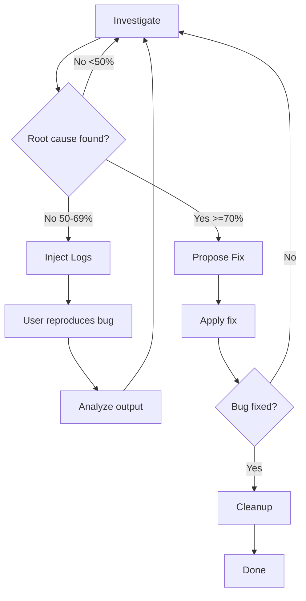

# Debug Tools

Iterative debugging workflow with confidence scoring and targeted log injection.

## What It Does

Five-phase debugging workflow that helps find and fix bugs systematically:



**Phase 1: Investigate** - Analyze code to find root cause with confidence scoring  
**Phase 2: Inject Logs** - Add targeted `[DEBUG]` logs to capture runtime data  
**Phase 3: Propose Fix** - Suggest minimal fix based on evidence  
**Phase 4: Verify** - Confirm the fix resolves the issue  
**Phase 5: Cleanup** - Automatically remove all debug logs

## Usage

### Start Debugging

```
debug this issue
investigate why the login is failing
trace this error
```

### Add Debug Logs

```
add debug logs to trace the data flow
inject logs to see what's happening
```

### Cleanup Logs

```
remove debug logs
cleanup debug statements
```

## How It Works

### Investigation Phase

The tool analyzes your code looking for:

- Error sources (stack traces, error messages)
- Data flow issues
- State mutations and race conditions
- API contract violations
- Timing problems in async code

Findings are scored 0-100:

- **>= 70**: Reported as probable cause
- **50-69**: Suggests logs to confirm
- **< 50**: Not reported (avoid speculation)

### Log Injection Phase

If runtime data is needed, targeted logs are added:

```javascript
console.log("[DEBUG] [auth.ts:15] login called", { email });
```

Strategic placement at:

- Function entry points
- Before/after async operations
- Conditional branches
- Catch blocks

### Fix and Verify

Once root cause is confirmed:

- Minimal fix proposed in diff format
- User approval required
- Verification that bug is resolved
- Loop back if not fixed

### Automatic Cleanup

All `[DEBUG]` logs are removed after verification:

```bash
grep -rn '\[DEBUG\]' . --include='*.ts' --include='*.tsx' --include='*.js' --include='*.jsx'
```

## Details

### Investigation

Code analysis with confidence scoring. Uses available MCPs (console-ninja, chrome-devtools, serena) or falls back to native tools.

### Log Injection

Adds 3-5 strategic debug logs. Never logs sensitive data (passwords, tokens, PII).

### Log Cleanup

Removes all `[DEBUG]` logs automatically after fix is verified.

## Requirements

- Git (for code analysis)
- MCP tools are optional (console-ninja, chrome-devtools, serena, context7)

Works with any agent that supports the standard skill format.

## FAQ

**Q: When should I use debug-tools vs code review?**
A: Use debug-tools for runtime issues and unexpected behavior. Use code review for static analysis of code changes.

**Q: What if the first fix doesn't work?**
A: The workflow loops back to investigation. New logs may be added, or a different root cause is explored.

**Q: Are debug logs left in my code?**
A: No. Cleanup is automatic after fix verification. You can also request cleanup anytime.

**Q: Do I need MCP tools for this to work?**
A: No. MCP tools enhance the experience (runtime values, network inspection), but the skill works with native tools only.

**Q: What confidence score is considered "good enough" to propose a fix?**
A: >= 70 confidence with clear evidence. Lower scores suggest adding logs to gather more data.
