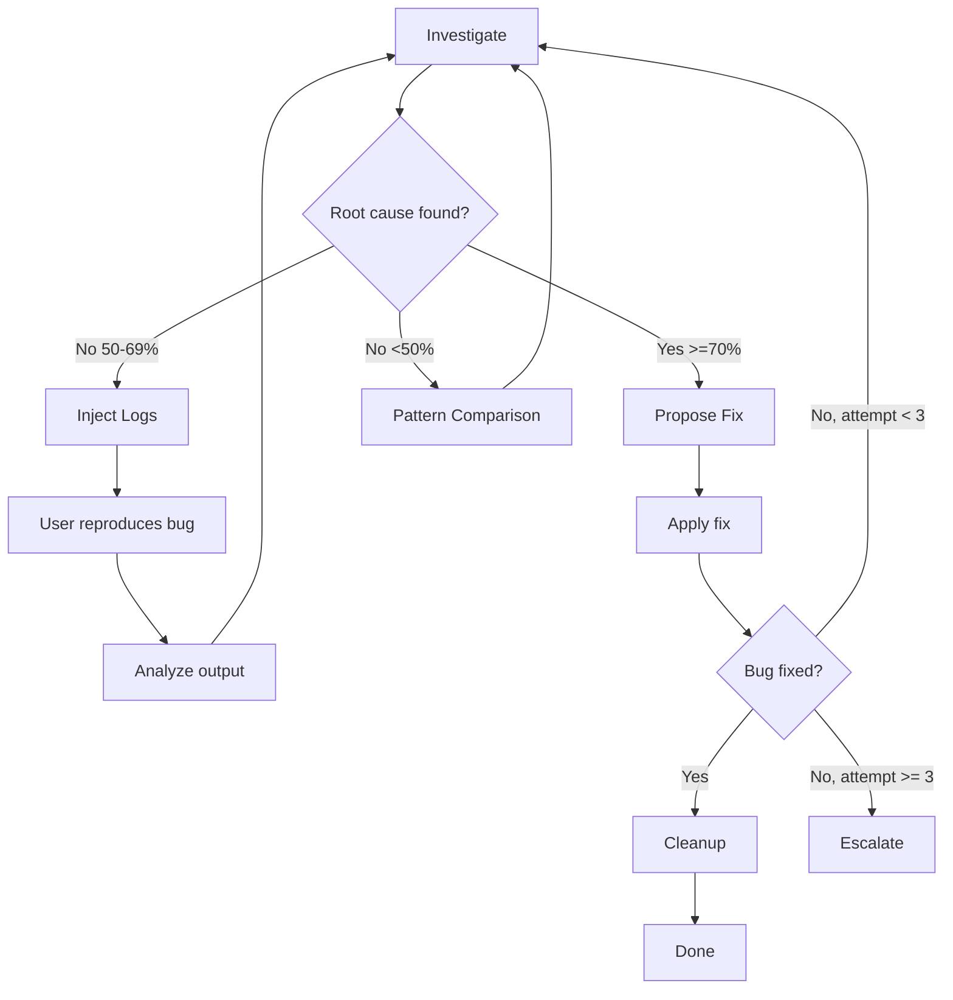

# Debug Tools

Iterative debugging workflow with confidence scoring, pattern comparison, and targeted log injection.

## Installation

```bash
npx skills add adeonir/agent-skills --skill debug-tools
```

## What It Does

Flexible debugging workflow that helps find and fix bugs systematically:


```mermaid
flowchart TD
    A[Investigate] --> B{Root cause found?}
    B -->|Yes >=70%| C[Propose Fix]
    B -->|No 50-69%| D[Inject Logs]
    B -->|No <50%| E[Pattern Comparison]
    D --> F[User reproduces bug]
    F --> G[Analyze output]
    G --> A
    E --> A
    C --> H[Apply fix]
    H --> I{Bug fixed?}
    I -->|Yes| J[Cleanup]
    I -->|No, attempt < 3| A
    I -->|No, attempt >= 3| K[Escalate]
    J --> L[Done]
```

Core loop: investigate, fix, verify. Techniques are selected based on context:

- **Investigate** - Analyze code to find root cause with confidence scoring
- **Pattern Comparison** - Diff broken code against working examples
- **Inject Logs** - Add targeted `[DEBUG]` logs to capture runtime data
- **Propose Fix** - Suggest minimal fix based on evidence
- **Verify** - Confirm the fix resolves the issue
- **Cleanup** - Automatically remove all debug logs
- **Escalate** - After 3 failed fixes, review architecture

## Usage

```
# Start debugging
debug this issue
investigate why the login is failing
trace this error

# Add debug logs
add debug logs to trace the data flow
inject logs to see what's happening

# Cleanup logs
remove debug logs
cleanup debug statements
```

### How It Works

**Investigation** analyzes code looking for error sources, data flow issues, state mutations, race conditions, API contract violations, and timing problems. Findings are scored 0-100: >= 70 is reported as probable cause, 50-69 suggests logs to confirm, < 50 is not reported.

**Pattern Comparison** finds similar working code in the project and diffs it against the broken code. Effective when the root cause is unclear or the bug appeared after a change to previously working code.

**Log Injection** adds 3-5 strategic `[DEBUG]` logs at function entry points, before/after async operations, conditional branches, and catch blocks. Never logs sensitive data. Supports JS/TS, Python, Go, Rust, Ruby, Vue, Svelte, and more.

**Fix and Verify** proposes a minimal fix in diff format, requires user approval, and loops back if the fix doesn't resolve the issue. After 3 failed attempts, escalates to architectural review.

**Cleanup** automatically removes all `[DEBUG]` logs after verification.

## Requirements

- Git (for code analysis)

## FAQ

**Q: When should I use debug-tools vs code review?**
A: Use debug-tools for runtime issues and unexpected behavior. Use code review for static analysis of code changes.

**Q: What if the first fix doesn't work?**
A: The workflow loops back to investigation with new evidence. After 3 failed attempts, it escalates to architectural review instead of retrying the same approach.

**Q: Are debug logs left in my code?**
A: No. Cleanup is automatic after fix verification. You can also request cleanup anytime.

**Q: Do I need specific tools for this to work?**
A: No. The skill adapts to whatever tools are available. Runtime inspection and browser debugging tools enhance the experience, but are not required.

**Q: What confidence score is considered "good enough" to propose a fix?**
A: >= 70 confidence with clear evidence. Lower scores suggest adding logs to gather more data.
