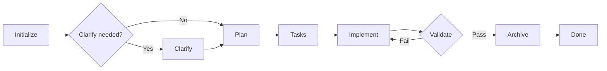

# Spec-Driven Development

Structured development workflow with specification, planning, task breakdown, and implementation.

## What It Does

Structured workflow for building software with clarity and traceability:



| Phase | Purpose |
| ----- | ------- |
| **Initialize** | Create feature spec (greenfield or brownfield), detect ambiguities |
| **Clarify** | Resolve `[NEEDS CLARIFICATION]` markers from initialize |
| **Plan** | Technical architecture, codebase exploration, research |
| **Tasks** | Granular, atomic tasks with dependencies |
| **Implement** | Execute tasks against the spec |
| **Validate** | Verify implementation against acceptance criteria |
| **Archive** | Consolidate documentation for future reference

## Project Structure

```
.specs/                          # Working directory
├── project/
│   ├── PROJECT.md               # Vision, goals
│   ├── ROADMAP.md               # Planned features
│   ├── CHANGELOG.md             # Completed features
│   └── STATE.md                 # Session memory
├── codebase/                    # Code analysis (optional)
├── research/                    # Research cache (optional)
└── features/                    # Active features
    └── 001-feature/
        ├── spec.md              # Requirements
        ├── plan.md              # Architecture
        └── tasks.md             # Implementation tasks

docs/features/                   # Archived features
└── feature.md                   # Consolidated docs
```

## Usage

### Start a Project

```
initialize project
setup project for my app
```

Creates `.specs/project/` with PROJECT.md, ROADMAP.md, CHANGELOG.md, STATE.md.

### Create a Feature (Greenfield)

```
create new feature for user authentication
new feature: payment processing
```

**Greenfield** = new feature not related to existing code, or a completely new project. Creates `.specs/features/001-auth/` with spec.md (type: greenfield, status: draft).

### Create a Feature (Brownfield)

```
modify existing auth flow
improve cache performance
refactor user registration
```

**Brownfield** = new feature that modifies existing code, or refactoring an existing feature. Creates feature with baseline analysis documenting current behavior and gaps.

### Development Workflow

```
# Clarify - resolve ambiguities marked in spec
clarify requirements for auth

# Create technical plan (includes codebase exploration + research)
create technical plan

# Break into tasks
create tasks for auth

# Implement
implement auth feature

# Validate
validate auth implementation

# Archive
archive auth feature
```

## Examples

### Example 1: New Feature (Greenfield)

```
# Greenfield = new functionality (no existing code to modify)
# Can be in a new OR existing project

create new feature for user authentication

# Agent asks for requirements, creates:
# .specs/features/001-user-auth/spec.md (status: draft)
# Type: greenfield

# Clarify - only if initialize marked items with [NEEDS CLARIFICATION]
clarify requirements for auth

# Create technical plan
create technical plan

# For greenfield: focuses on architecture design
# For brownfield: explores existing similar features
# Creates: .specs/features/001-user-auth/plan.md
# Status: ready

# Break into tasks
create tasks for auth

# Creates: .specs/features/001-user-auth/tasks.md
# With: T001 [P] Create auth types, T002 [B:T001] Implement login...

# Implement
implement auth feature

# Validate
validate auth implementation

# Archive
archive auth feature

# Creates: docs/features/user-auth.md
```

### Example 2: Brownfield Feature (Existing Codebase)

```
# Map existing codebase (first time)
map codebase

# Creates .specs/codebase/ with STACK.md, ARCHITECTURE.md, etc.

# Create feature that modifies existing code
modify existing auth flow to add 2FA

# Creates .specs/features/002-add-2fa/spec.md
# Includes Baseline section with current auth behavior

# Continue with clarify → plan → tasks → implement → validate → archive
```

### Example 3: Feature with Research

```
# Create feature requiring new technology
create new feature for stripe payments

# During plan phase, agent detects "stripe" is new
# Checks .specs/research/stripe.md (doesn't exist)
# Researches Stripe API, creates research cache

# Research is now cached for future features using Stripe
```

### Example 4: Using PRD/TDD

```
# Initialize with PRD document
initialize feature @docs/prd-auth.md

# Agent reads PRD, extracts requirements
# Creates spec.md with mapped FRs and ACs
```

### Example 5: Partial Workflow

```
# Just planning, no implementation yet
create new feature for notifications
clarify requirements
create technical plan
create tasks

# Later...
implement notifications
validate
archive
```

## Details

### Initialize
Creates the feature specification. Detects greenfield vs brownfield, generates spec.md with:
- User stories
- Functional requirements
- Acceptance criteria
- `[NEEDS CLARIFICATION]` markers for ambiguities (if any)

### Clarify
Resolves ambiguities marked with `[NEEDS CLARIFICATION]` during initialize. Only needed if initialize detected unclear requirements. Updates spec.md with resolved answers.

### Plan
Defines HOW to build. Creates plan.md with:
- Architecture decisions
- Codebase exploration (similar features, patterns)
- Research for new technologies (cached in .specs/research/)
- Component breakdown

### Tasks
Defines WHEN to build. Creates tasks.md with:
- Atomic tasks (T001, T002...)
- Dependencies [P] or [B:T001]
- Requirements coverage table

### Implement
Executes tasks from tasks.md:
- Implements each task following the spec
- Updates task checkboxes
- Status: in-progress → to-review

### Validate
Verifies implementation against spec:
- Checks acceptance criteria are met
- Validates code quality
- Status: to-review → done

### Archive
Generates consolidated documentation:
- Creates docs/features/{name}.md
- Updates CHANGELOG.md
- Optionally removes .specs/features/{ID}-{name}/

## State Management

Features track status in spec.md frontmatter:
- **draft**: Created, needs clarification
- **ready**: Spec complete, ready for plan
- **in-progress**: Implementation started
- **to-review**: All tasks done, needs validation
- **done**: Validated and complete
- **archived**: Moved to docs/

STATE.md persists decisions and blockers across sessions.

## Requirements

- Git (for branch association)
- MCP memory bank (optional, enhances STATE.md)

Works with any agent supporting standard skill format.

## FAQ

**Q: What's the difference between .specs/ and docs/?**
A: .specs/ is working directory (temporary), docs/ is permanent documentation.

**Q: Can I delete .specs/ after archive?**
A: Yes, but you'll lose ability to modify archived features.

**Q: How does research caching work?**
A: Research about new technologies is saved to .specs/research/{topic}.md and reused across features.

**Q: What's the difference between greenfield and brownfield?**
A: Greenfield is new functionality. Brownfield modifies existing code and includes baseline analysis.

**Q: Can I use this with existing git-helpers skill?**
A: Yes. Git-helpers handles commits and PRs, spec-driven handles planning and implementation.
