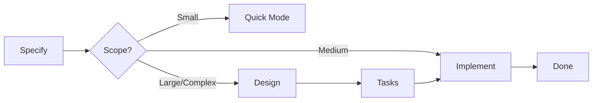

# Spec-Driven Development

Structured development workflow with adaptive depth. Right ceremony for the right scope.

## Installation

```bash
npx skills add adeonir/agent-skills --skill spec-driven
```

## What It Does

Adaptive workflow for building software with clarity and traceability. Complexity determines depth -- small changes skip ceremony, large features get full planning.


```mermaid
flowchart LR
    A[Specify] --> B{Scope?}
    B -->|Small| C[Quick Mode]
    B -->|Medium| F[Implement]
    B -->|Large/Complex| D[Design]
    D --> E[Tasks]
    E --> F
    F --> G[Done]
```

| Phase | Purpose | Required |
| ----- | ------- | -------- |
| **Specify** | Define requirements (greenfield or brownfield) | Always |
| **Discuss** | Resolve gray areas and ambiguities | When triggered |
| **Design** | Technical architecture, codebase exploration, research | Large/Complex |
| **Tasks** | Granular, atomic tasks with dependencies | Large/Complex |
| **Implement** | Implement + verify per task, interactive UAT for Complex | Always |
| **Quick Mode** | Express lane for small fixes | Small scope |

### Auto-Sizing

| Scope | Pipeline |
|-------|----------|
| **Small** (≤3 files) | Quick mode -- no pipeline |
| **Medium** (<10 tasks) | Specify -> Implement |
| **Large** (multi-component) | Specify -> Design -> Tasks -> Implement |
| **Complex** (ambiguity) | Specify (+ Discuss) -> Design -> Tasks -> Implement (+ UAT) |

## Usage

```
# Create a feature (greenfield)
create new feature for user authentication
new feature: payment processing

# Create a feature (brownfield)
modify existing auth flow
improve cache performance

# Development workflow
create technical design
create tasks
implement

# Quick mode
quick fix: update env variable
quick task: fix login redirect

# Discuss gray areas
discuss auth feature
how should session timeout work?

```

### New Feature (Greenfield)

```
create new feature for user authentication
# Agent assesses scope, asks for requirements
# Creates: .artifacts/features/001-user-auth/spec.md

create technical design             # Large/Complex only
create tasks                       # Large/Complex only
implement
```

### Brownfield Feature

```
# First, run project-index to map the codebase (optional)
initialize project

# Then create feature that modifies existing code
modify existing auth flow to add 2FA
# Creates .artifacts/features/001-add-2fa/spec.md with Baseline section

# Continue with adaptive workflow (depth based on scope)
```

## Output

```
.artifacts/
├── features/
│   └── 001-feature/
│       ├── spec.md                # Requirements (WHAT)
│       ├── decisions.md           # Gray area decisions (WHY, optional)
│       ├── design.md              # Architecture (HOW, Large/Complex only)
│       ├── tasks.md               # Implementation tasks (WHEN, Large/Complex only)
│       └── designs/               # Screenshots, mockups (optional)
├── quick/
│   └── 001-fix-redirect/
│       ├── task.md                # Quick mode task record
│       └── summary.md             # Post-execution summary
└── research/
    └── {topic}.md                 # Research cache (reusable)
```

### Status Tracking

Features track status in spec.md frontmatter:
- **draft**: Created, may have open questions
- **ready**: Spec complete, design done (or skipped for Medium)
- **in-progress**: Execution started
- **done**: Complete

## Requirements

- Existing project directory
- No external dependencies

## Integration

| Skill | Connection |
|-------|------------|
| **project-index** | Provides `.agents/` context consumed during planning |
| **git-helpers** | Handles commits and PRs |

## FAQ

**Q: What's the difference between .artifacts/ and .agents/?**
A: .artifacts/ is spec-driven's working directory for features. .agents/ is project-level context generated by project-index.

**Q: Do I need project-index to use spec-driven?**
A: No, but brownfield features benefit from having `.agents/codebase/` available for context.

**Q: How does research caching work?**
A: Research is saved to .artifacts/research/{topic}.md and reused across features.

**Q: What happens to artifacts after the feature is done?**
A: Artifacts are disposable -- they exist during development and can be safely deleted when the feature is complete.

**Q: When should I use quick mode vs full pipeline?**
A: Quick mode for ≤3 file changes with no ambiguity (bug fixes, config changes). The agent auto-detects scope and suggests the right mode.
