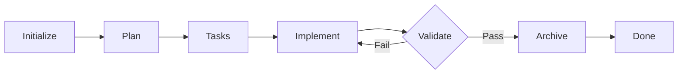

# Spec-Driven Development

Structured development workflow with specification, planning, task breakdown, and implementation.

## What It Does

Structured workflow for building software with clarity and traceability:


```mermaid
flowchart LR
    A[Initialize] --> D[Plan]
    D --> E[Tasks]
    E --> F[Implement]
    F --> G{Validate}
    G -->|Pass| H[Archive]
    G -->|Fail| F
    H --> I[Done]
```

| Phase | Purpose |
| ----- | ------- |
| **Initialize** | Create feature spec (greenfield or brownfield), resolve ambiguities inline |
| **Plan** | Technical architecture, codebase exploration, research |
| **Tasks** | Granular, atomic tasks with dependencies |
| **Implement** | Execute tasks against the spec |
| **Validate** | Verify implementation against acceptance criteria |
| **Archive** | Consolidate documentation for future reference

## Project Structure

```
.artifacts/                          # Working directory (spec-driven)
├── features/                    # Active features
│   └── 001-feature/
│       ├── spec.md              # Requirements
│       ├── plan.md              # Architecture
│       └── tasks.md             # Implementation tasks
└── research/                    # Research cache (optional)
    └── {topic}.md

.agents/                             # Project context (project-index)
├── project.md                   # What the project is
└── codebase/                    # How the code works

docs/features/                       # Archived features
└── feature.md                   # Consolidated docs
```

## Usage

### Create a Feature (Greenfield)

```
create new feature for user authentication
new feature: payment processing
```

**Greenfield** = new feature not related to existing code. Creates `.artifacts/features/001-auth/` with spec.md (type: greenfield, status: draft).

### Create a Feature (Brownfield)

```
modify existing auth flow
improve cache performance
refactor user registration
```

**Brownfield** = modifies existing code. Creates feature with baseline analysis documenting current behavior and gaps.

### Development Workflow

```
# Create technical plan (includes codebase exploration + research)
create technical plan

# Break into tasks
create tasks for auth

# Implement
implement auth feature

# Validate
validate auth implementation

# Archive
archive auth feature
```

## Examples

### Example 1: New Feature

```
create new feature for user authentication

# Agent asks for requirements, resolves ambiguities inline
# Creates: .artifacts/features/001-user-auth/spec.md

create technical plan
# Creates: .artifacts/features/001-user-auth/plan.md

create tasks for auth
# Creates: .artifacts/features/001-user-auth/tasks.md

implement auth feature
validate auth implementation
archive auth feature
# Creates: docs/features/user-auth.md
```

### Example 2: Brownfield Feature

```
# First, run project-index to map the codebase:
# initialize project (or: summary / map codebase)

# Then create feature that modifies existing code
modify existing auth flow to add 2FA

# Creates .artifacts/features/001-add-2fa/spec.md
# Includes Baseline section with current auth behavior
# Plan phase reads .agents/codebase/ for context

# Continue with plan -> tasks -> implement -> validate -> archive
```

### Example 3: Feature with Research

```
create new feature for stripe payments

# During plan phase, agent detects "stripe" is new
# Researches Stripe API, creates .artifacts/research/stripe.md
# Research is cached for future features using Stripe
```

## Details

### Initialize
Creates the feature specification. Detects greenfield vs brownfield, resolves ambiguities through inline Q&A.
Generates spec.md with user stories (P1/P2/P3), functional requirements, acceptance criteria, and open questions.

### Plan
Defines HOW to build. Creates plan.md with architecture decisions, codebase exploration, data model, research, and component breakdown. If `.agents/codebase/` exists, updates it with new discoveries.

### Tasks
Defines WHEN to build. Creates tasks.md with atomic tasks (T001, T002...), dependencies, and requirements coverage.

### Implement
Executes tasks from tasks.md. Loads coding principles before writing code.

### Validate
Verifies implementation against spec. Checks acceptance criteria and edge cases.

### Archive
Generates consolidated documentation at docs/features/{name}.md. Optionally removes working directory.

## State Management

Features track status in spec.md frontmatter:
- **draft**: Created, may have open questions
- **ready**: Spec complete, ready for plan
- **in-progress**: Implementation started
- **to-review**: All tasks done, needs validation
- **done**: Validated and complete
- **archived**: Moved to docs/

## Works With

- **project-index** -- provides `.agents/` context consumed during planning
- **git-helpers** -- handles commits and PRs

## Installation

```bash
npx skills add adeonir/agent-skills --skill spec-driven
```

## FAQ

**Q: What's the difference between .artifacts/ and .agents/?**
A: .artifacts/ is spec-driven's working directory for features. .agents/ is project-level context generated by project-index.

**Q: Do I need project-index to use spec-driven?**
A: No, but brownfield features benefit from having `.agents/codebase/` available for context.

**Q: How does research caching work?**
A: Research is saved to .artifacts/research/{topic}.md and reused across features.
