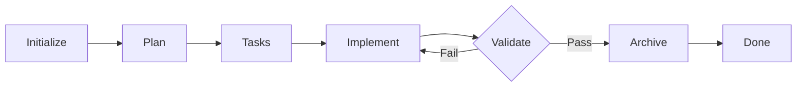

# Spec-Driven Development

Structured development workflow with specification, planning, task breakdown, and implementation.

## Installation

```bash
npx skills add adeonir/agent-skills --skill spec-driven
```

## What It Does

Structured workflow for building software with clarity and traceability:


```mermaid
flowchart LR
    A[Initialize] --> D[Plan]
    D --> E[Tasks]
    E --> F[Implement]
    F --> G{Validate}
    G -->|Pass| H[Archive]
    G -->|Fail| F
    H --> I[Done]
```

| Phase | Purpose |
| ----- | ------- |
| **Initialize** | Create feature spec (greenfield or brownfield), resolve ambiguities inline |
| **Plan** | Technical architecture, codebase exploration, research |
| **Tasks** | Granular, atomic tasks with dependencies |
| **Implement** | Execute tasks against the spec |
| **Validate** | Verify implementation against acceptance criteria |
| **Archive** | Consolidate documentation for future reference |

## Usage

```
# Create a feature (greenfield)
create new feature for user authentication
new feature: payment processing

# Create a feature (brownfield)
modify existing auth flow
improve cache performance
refactor user registration

# Development workflow
create technical plan
create tasks for auth
implement auth feature
validate auth implementation
archive auth feature
```

### New Feature (Greenfield)

```
create new feature for user authentication
# Agent asks for requirements, resolves ambiguities inline
# Creates: .artifacts/features/001-user-auth/spec.md

create technical plan
# Creates: .artifacts/features/001-user-auth/plan.md

create tasks for auth
# Creates: .artifacts/features/001-user-auth/tasks.md

implement auth feature
validate auth implementation
archive auth feature
# Creates: docs/features/user-auth.md
```

### Brownfield Feature

```
# First, run project-index to map the codebase
initialize project

# Then create feature that modifies existing code
modify existing auth flow to add 2FA
# Creates .artifacts/features/001-add-2fa/spec.md
# Includes Baseline section with current auth behavior

# Continue with plan -> tasks -> implement -> validate -> archive
```

## Output

```
.artifacts/
├── features/
│   └── 001-feature/
│       ├── spec.md              # Requirements (WHAT)
│       ├── plan.md              # Architecture (HOW)
│       ├── tasks.md             # Implementation tasks (WHEN)
│       └── designs/             # Screenshots, mockups, wireframes (optional)
└── research/
    └── {topic}.md               # Research cache (optional)

docs/features/
└── feature.md                   # Archived documentation
```

### State Management

Features track status in spec.md frontmatter:
- **draft**: Created, may have open questions
- **ready**: Spec complete, ready for plan
- **in-progress**: Implementation started
- **to-review**: All tasks done, needs validation
- **done**: Validated and complete
- **archived**: Moved to docs/

## Requirements

- Existing project directory
- No external dependencies

## Integration

| Skill | Connection |
|-------|------------|
| **project-index** | Provides `.agents/` context consumed during planning |
| **git-helpers** | Handles commits and PRs |

## FAQ

**Q: What's the difference between .artifacts/ and .agents/?**
A: .artifacts/ is spec-driven's working directory for features. .agents/ is project-level context generated by project-index.

**Q: Do I need project-index to use spec-driven?**
A: No, but brownfield features benefit from having `.agents/codebase/` available for context.

**Q: How does research caching work?**
A: Research is saved to .artifacts/research/{topic}.md and reused across features.
