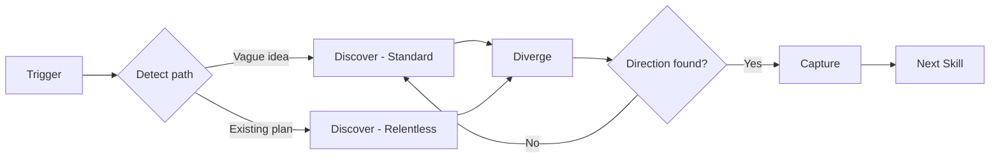

# Brainstorming

Structured idea exploration from vague to direction, or stress-test of an existing plan.

## Installation

```bash
npx skills add adeonir/agent-skills --skill brainstorming
```

## What It Does

Explore ideas systematically before committing to a formal document or implementation,
or stress-test an existing plan before building:



| Phase | What Happens | Output |
|-------|-------------|--------|
| Detect path | Classify entry state: standard (vague idea) or relentless (existing plan) | Path selected |
| Discover | Map context, constraints, success criteria via decision tree | Understanding of the space |
| Diverge | Generate 4-8 alternatives using structured techniques | Named alternatives |
| Converge | Evaluate trade-offs, compare, recommend | Chosen direction |
| Capture | Produce structured artifact | `brainstorm-{topic}.md` |

## Usage

```
brainstorm ideas for the notification system
explore options for user onboarding
what should we build for the dashboard
think through the authentication approach
compare approaches for real-time updates
stress-test my plan for the new API design
grill me on this architecture before we build it
/brainstorming deep
```

### How It Works

**Discovery** first detects the entry state and selects a path. Standard path (vague idea): adaptive deepening, TBDs acceptable on success criteria. Relentless path (existing plan): pushes harder on motivation and constraint branches before accepting unknowns. Both paths use decision tree traversal — answers drive the next branch rather than a fixed question list. The model proposes its interpretation of each answer and lets the user confirm or redirect. When current-state questions can be answered by reading the codebase, it explores instead of asking. A quality gate ensures the space is understood before generating alternatives.

**Diverge** applies structured techniques (constraint removal, analogy exploration, inversion, decomposition, extreme positions, status quo plus) to generate at least 4 distinct alternatives. Generation and evaluation are strictly separated.

**Converge** screens alternatives against hard constraints, evaluates survivors against success criteria, analyzes trade-offs explicitly, and presents a recommendation. The user picks the direction.

**Capture** produces a structured artifact with the chosen direction, rejected alternatives with rationale, key trade-offs accepted, and suggested next step.

## Output

```
.artifacts/brainstorm/{topic}.md
```

## Integration

| Skill | How brainstorming connects |
|-------|---------------------------|
| **docs-writer** | Chosen direction feeds PRD discovery, epic, or design doc |
| **spec-driven** | Chosen direction feeds feature specification |
| **design-builder** | Chosen direction feeds visual exploration |

## FAQ

**Q: When should I use brainstorming vs docs-writer?**
A: Use brainstorming when ideas are vague and you need to explore directions. Use docs-writer when you already have a direction and need to formalize it into a document.

**Q: How many alternatives does it generate?**
A: At least 4, aiming for 6-8. The skill pushes past obvious options using structured techniques like inversion and constraint removal.

**Q: Can I skip diverge if I already have a direction?**
A: If you have a direction and want to formalize it, use docs-writer. If you want to stress-test it before committing, use brainstorming — it will detect the entry state and run relentless discovery to pressure-test the plan, then explore alternatives in diverge.

**Q: What happens if no direction emerges?**
A: The workflow loops back to discovery with refined understanding. Constraints may need revisiting, or the problem may need reframing.
