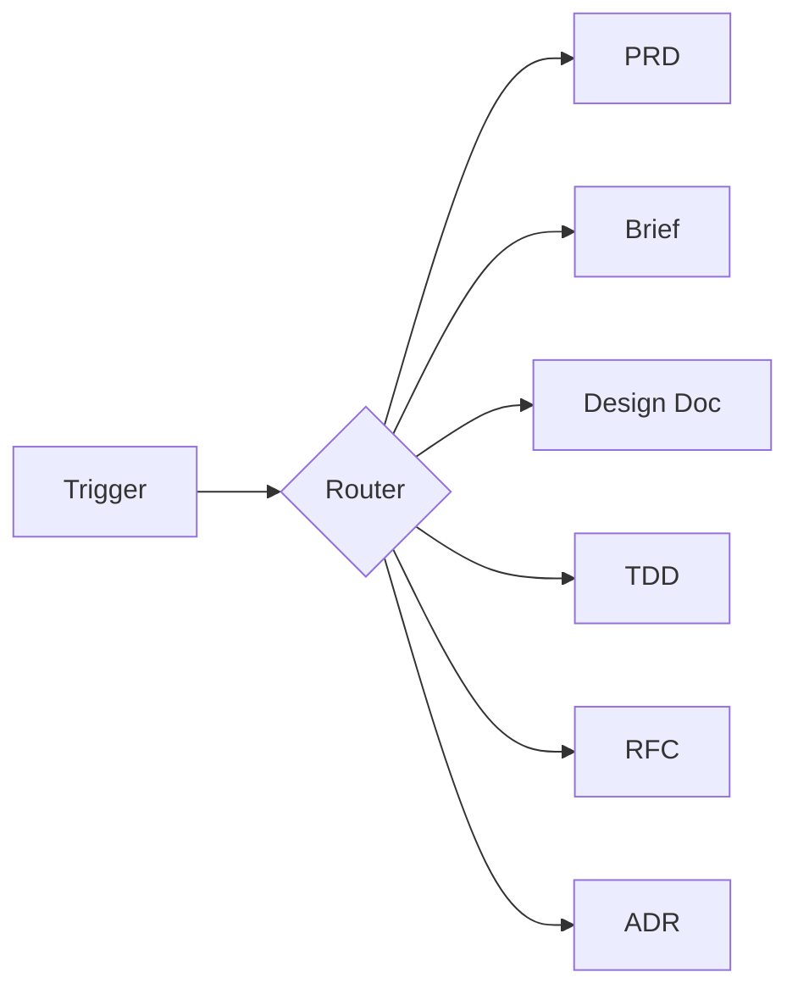

# Docs Writer

Generate structured product and technical documents through guided discovery.

## Installation

```bash
npx skills add adeonir/agent-skills --skill docs-writer
```

## What It Does

Routes document creation requests to type-specific workflows, each with appropriate discovery depth:


```mermaid
flowchart LR
    T[Trigger] --> R{Router}
    R --> PRD[PRD]
    R --> B[Brief]
    R --> DD[Design Doc]
    R --> TDD[TDD]
    R --> RFC[RFC]
    R --> ADR[ADR]
```

### Google-style (product & technical strategy)

| Type | Workflow | Output |
|------|----------|--------|
| **PRD** | discovery -> validation -> synthesis -> drafting | `prd.md` |
| **Brief** | generated with PRD | `brief.md` |
| **Design Doc** | discovery -> analysis -> drafting | `design.md` |
| **TDD** | discovery -> analysis -> drafting | `tdd.md` |

### Industry standard (decisions & proposals)

| Type | Workflow | Output |
|------|----------|--------|
| **RFC** | [clarification] -> analysis -> drafting | `rfc/{number}-{name}.md` |
| **ADR** | [clarification] -> drafting | `adr/{number}-{name}.md` |

## Usage

```
create PRD for my project
create design doc for API gateway
create TDD for payment service
create RFC for new auth system
record architecture decision about database choice
```

The agent detects the document type from the trigger and loads the appropriate workflow.

## Output

All documents are saved to:

```
.artifacts/docs/{type}.md
```

## Requirements

Works with any agent supporting standard skill format.

## Integration

| Skill | How docs-writer connects |
|-------|-------------------------|
| **epic-tracker** | PRD milestones and requirements feed epic planning |
| **spec-driven** | Any document can feed into feature initialization |
| **design-builder** | PRD sections inform copy and design extraction |
