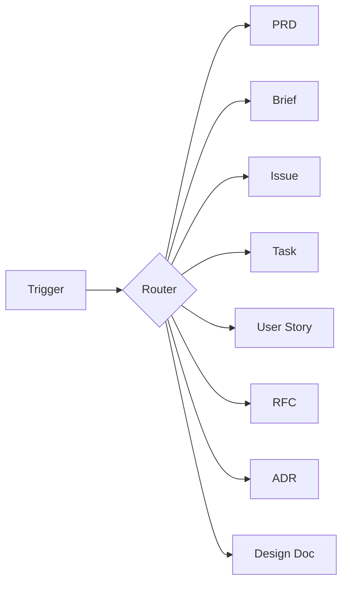

# Docs Writer

Generate structured product and technical documents through guided discovery.

## Installation

```bash
npx skills add adeonir/agent-skills --skill docs-writer
```

## What It Does

Routes document creation requests to type-specific workflows, each with appropriate discovery depth:


```mermaid
flowchart LR
    T[Trigger] --> R{Router}
    R --> PRD[PRD]
    R --> B[Brief]
    R --> I[Issue]
    R --> TK[Task]
    R --> US[User Story]
    R --> RFC[RFC]
    R --> ADR[ADR]
    R --> DD[Design Doc]
```

| Type | Workflow | Output |
|------|----------|--------|
| **PRD** | discovery -> validation -> synthesis -> drafting | `prd.md` |
| **Brief** | generated with PRD | `brief.md` |
| **Design Doc** | discovery -> analysis -> drafting | `design.md` |
| **Issue** | classification -> [clarification] -> drafting | `issue.md` |
| **Task** | direct drafting | `task.md` |
| **User Story** | [clarification] -> drafting | `story.md` |
| **RFC** | [clarification] -> analysis -> drafting | `rfc.md` |
| **ADR** | [clarification] -> drafting | `adr-{number}-{name}.md` |

## Usage

```
create PRD for my project
report bug in the login flow
create task to update dependencies
write user story for checkout
create RFC for new auth system
record architecture decision about database choice
create design doc for API gateway
```

The agent detects the document type from the trigger and loads the appropriate workflow.

## Output

All documents are saved to:

```
.artifacts/docs/{type}.md
```

## Requirements

Works with any agent supporting standard skill format.

## Integration

| Skill | How docs-writer connects |
|-------|-------------------------|
| **spec-driven** | Any document can feed into feature initialization |
| **design-builder** | PRD sections inform copy and design extraction |
