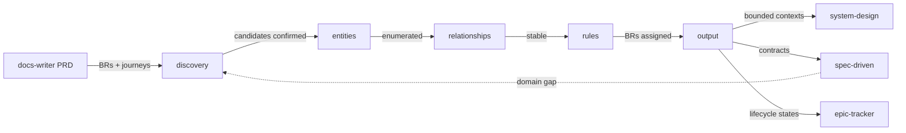

# Domain Model

Translate product requirements into a formal domain language for the whole team.

## Installation

```bash
npx skills add adeonir/agent-skills --skill domain-model
```

## What It Does



Dashed arrow: update mode triggered when spec-driven surfaces a domain gap.

| Phase | Output |
|-------|--------|
| Discovery | Candidate entities with PRD source references |
| Entities | Attributes, invariants, lifecycle per entity |
| Relationships | Cardinalities, aggregate roots, bounded contexts, context map |
| Rules | All BR-xxx assigned to entity lifecycle |
| Output | `domain.md` in `.artifacts/docs/` |

## Usage

```
build the domain model for this product
define entities from the PRD
map domain bounded contexts
what are the entities in this domain
update domain model — spec found a domain gap
```

## Output

```
.artifacts/docs/domain.md
```

## Integration

| Skill | Connection |
|-------|-----------|
| **docs-writer** | PRD business rules, journeys, and edge cases are the primary input |
| **system-design** | Bounded contexts inform service boundaries and component grouping |
| **spec-driven** | Entities and rules become implementation contracts; domain gaps feed back via update mode |
| **epic-tracker** | Entity lifecycle states can scope story definition |
