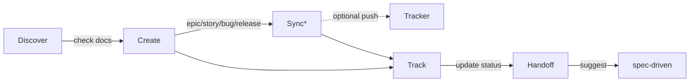

# Epic Tracker

Manage the delivery lifecycle from epic planning through story tracking to implementation handoff.

## Installation

```bash
npx skills add adeonir/agent-skills --skill epic-tracker
```

## What It Does



`*` Sync is optional and gated by `.artifacts/epics/.config.yml`. When a tracker is configured and its MCP is available, push happens after the user confirms (asked once per session). When no tracker is configured, markdown stays source of truth.

| Phase | What Happens | Output |
|-------|-------------|--------|
| Discover | Check for existing PRD, brief, or context | Context for artifact creation |
| Create | Generate epic, story, bug, or release | Markdown artifact in `.artifacts/epics/` |
| Sync (optional) | Push to or pull from configured tracker | Tracker entity + frontmatter `tracker` block |
| Track | Update status -- in tracker when configured, in markdown otherwise | Updated state |
| Handoff | Suggest spec-driven, surface tracker URLs | User chooses next step |

## Tracker Integration

| Artifact | Linear | GitHub Issues | GitHub Projects | Jira |
|----------|--------|---------------|-----------------|------|
| Epic     | Project | Milestone | Issue parent (sub-issues) | Epic |
| Story    | Issue | Issue | Sub-issue | Story |
| Bug      | Issue + label `bug` | Issue + label `bug` | Sub-issue + label `bug` | Bug |
| Release  | Cycle | Release tag | Release tag | Fix Version |

Release uses each tracker's closest native primitive instead of forcing one concept.

Configure via `configure tracker` (runs bootstrap once) or by editing `.artifacts/epics/.config.yml` directly. When no MCP is detected, the skill stays in markdown-only mode.

## Usage

```
"create epic" -- plan a new epic with stories, scope, and acceptance criteria
"create story" -- add a story to an existing epic
"report bug" -- document a defect with reproduction steps and severity
"create release" -- group stories across epics for delivery
"show roadmap" -- display delivery status overview
"mark done" -- update artifact status
"sync to tracker" -- push current artifact to configured tracker
"pull from tracker" -- refresh markdown with latest tracker state
"configure tracker" -- run bootstrap to set or change tracker config
"handoff" -- prepare story for spec-driven implementation
```

## Output

```
.artifacts/epics/
├── .config.yml          # tracker config (created by bootstrap)
├── epic-name/
│   ├── epic.md
│   ├── story-name.md
│   └── bug-name.md
├── standalone/
│   └── bug-name.md
└── releases/
    └── release-name.md
```

## Requirements

- Optional: a tracker MCP for push/pull operations (Linear, GitHub, Jira)
- Falls back to markdown-only when no MCP is available

## Integration

| Skill | Connection |
|-------|-----------|
| docs-writer | PRD and brief feed epic discovery |
| spec-driven | Stories and bugs feed implementation specs; tracker URLs surfaced during handoff |
| brainstorming | Direction artifacts inform epic planning |
