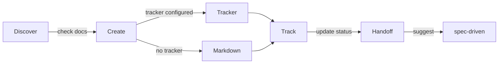

# Epic Tracker

Manage the delivery lifecycle from epic planning through story tracking to implementation handoff.

## Installation

```bash
npx skills add adeonir/agent-skills --skill epic-tracker
```

## What It Does



When a tracker is configured (via MCP or CLI), artifacts go directly to the tracker — no local files created. When no tracker is configured, markdown in `.artifacts/epics/` is the source of truth.

| Phase | What Happens | Output |
|-------|-------------|--------|
| Discover | Check for existing PRD, brief, or context | Context for artifact creation |
| Create | Generate epic, story, bug, issue, or release | Tracker entity or markdown artifact |
| Track | Update status in tracker when configured, in markdown otherwise | Updated state |
| Handoff | Suggest spec-driven, surface tracker URLs | User chooses next step |

## Tracker Integration

| Artifact | Linear | GitHub Issues | GitHub Projects | Jira |
|----------|--------|---------------|-----------------|------|
| Epic     | Project | Milestone | Issue parent (sub-issues) | Epic |
| Story    | Issue | Issue | Sub-issue | Story |
| Bug      | Issue + label `bug` | Issue + label `bug` | Sub-issue + label `bug` | Bug |
| Issue    | Issue + label `task` | Issue + label `task` | Sub-issue + label `task` | Task |
| Release  | Cycle | Release tag | Release tag | Fix Version |

Release uses each tracker's closest native primitive instead of forcing one concept.

Configure via `configure tracker` (runs bootstrap once) or by editing `.artifacts/epics/.config.yml` directly. Bootstrap detects available MCPs and CLIs; both are supported. When no integration is detected, the skill stays in markdown-only mode.

## Usage

```
"create epic"    -- plan a new epic with stories, scope, and acceptance criteria
"create story"   -- add a user-facing story to an existing epic
"report bug"     -- document a defect with reproduction steps and severity
"create issue"   -- file an internal work item (infra, refactor, tooling, research)
"create release" -- group stories across epics for delivery
"show roadmap"   -- display delivery status overview
"mark done"      -- update artifact status
"sync to tracker"    -- push current artifact to configured tracker
"pull from tracker"  -- refresh markdown with latest tracker state
"configure tracker"  -- run bootstrap to set or change tracker config
"handoff"        -- prepare story for spec-driven implementation
```

## Output

Markdown files created only when no tracker is configured (or user declines push).

```
.artifacts/epics/
├── .config.yml          # tracker config (created by bootstrap)
├── epic-name/
│   ├── epic.md
│   ├── 001-story-name.md
│   ├── bug-name.md
│   └── issue-name.md
├── standalone/
│   ├── bug-name.md
│   └── issue-name.md
└── releases/
    └── release-name.md
```

## Requirements

- Optional: tracker MCP or CLI for push/pull operations (Linear, GitHub, Jira)
- Falls back to markdown-only when no integration is available

## Integration

| Skill | Connection |
|-------|-----------|
| docs-writer | PRD and brief feed epic discovery |
| spec-driven | Stories and bugs feed implementation specs; tracker URLs surfaced during handoff |
| brainstorming | Direction artifacts inform epic planning |
