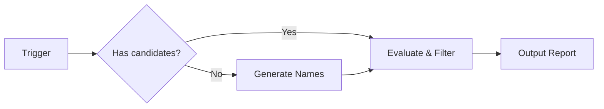

# Product Naming

Research, evaluate, and validate product/startup/app names with domain and social media availability checks.

## What It Does

Helps users find and validate names through a two-phase workflow:



| Phase | What happens |
|-------|-------------|
| **Generate** | Discovery questions, then 10-20 diverse candidates across multiple naming styles |
| **Evaluate** | Domain checks, social media checks, name quality scoring |
| **Report** | Shortlist with availability status + eliminated names with reasons |

## Usage

```
suggest names for my project management app
check if "nuvio" is available as a product name
evaluate these names: Flowly, Cario, Velto, Stacko
find a name for my AI coding assistant
what should I call my startup?
is the domain flowly.com available?
```

The agent detects whether to generate candidates or skip to evaluation based on the trigger.

## Output

Reports are saved as `.md` files in `.artifacts/docs/`:

- **Name Research** (Template A): `{product}-research.md` -- candidates with etymology, full evaluation with availability table, comparison, and eliminated names
- **Name Validation** (Template B): `{product}-validation.md` -- per-name quality scoring, availability, risk assessment with context/impact, and verdict

Availability uses traffic light indicators: 🟢 disponivel  🔴 indisponivel  🟡 incerto

## Integration

| Skill | How product-naming connects |
|-------|-----------------------------|
| **docs-writer** | Validated name feeds into PRD/Brief |
| **design-builder** | Chosen name informs brand/logo direction |

## Requirements

Works with any agent supporting standard skill format. Requires web search capability for domain and social media checks.
