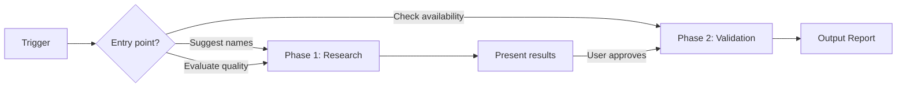

# Product Naming

Research, evaluate, and validate product/startup/app names with domain, social media, and trademark checks.

## Installation

```bash
npx skills add adeonir/agent-skills --skill product-naming
```

## What It Does

Helps users find and validate names through a two-phase workflow:



| Phase | What happens |
|-------|-------------|
| **Research** | Competitor analysis, 10-20 diverse candidates, quality scoring, name variations |
| **Validation** | Domain checks with pricing, social media checks, trademark search |
| **Reports** | Research report (shortlist + scoring) and/or validation report (availability + recommendation) |

## Usage

```
suggest names for my project management app
find a name for my AI coding assistant
what should I call my startup?
evaluate these names: Flowly, Cario, Velto, Stacko
check if "nuvio" is available as a product name
check availability of Flowly, Nuvio, Velto
is the domain flowly.com available?
```

The agent detects the entry point and loads the appropriate phase:
- Name suggestions trigger Phase 1 (research) then Phase 2 (validation)
- Quality evaluation triggers Phase 1 only (scoring)
- Availability checks trigger Phase 2 only (validation)

## Output

Reports are saved as `.md` files in `.artifacts/docs/`:

- **Research report** (`templates/research-report.md`): `{product}-research.md` -- competitor landscape, candidates with quality scoring, variations, eliminated names
- **Validation report** (`templates/validation-report.md`): `{product}-validation.md` -- domain availability with prices, social media status, trademark search, recommendation with next steps

Availability uses traffic light indicators: 🟢 available  🔴 unavailable  🟡 uncertain

## Requirements

Works with any agent supporting standard skill format. Requires web search capability for domain, social media, and trademark checks.

## Integration

| Skill | How product-naming connects |
|-------|-----------------------------|
| **brainstorming** | Direction from brainstorm feeds name generation context |
| **docs-writer** | Validated name feeds into PRD/Brief |
| **design-builder** | Chosen name informs brand/logo direction |
