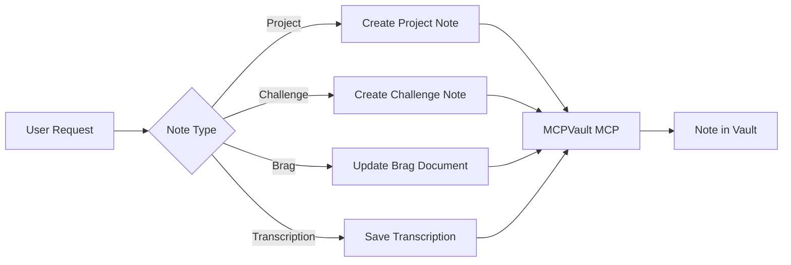

# Session Notes

Structured note creation for Obsidian using MCPVault MCP.

## Installation

```bash
npx skills add adeonir/agent-skills --skill session-notes
```

## What It Does

Creates and manages documentation in your Obsidian vault with consistent structure:

- **Projects** - Full project documentation (overview, goals, architecture)
- **Challenges** - Technical interview challenges (take-homes, system design)
- **Brags** - Achievement tracking for performance reviews
- **Transcriptions** - Meeting, course, lecture, and standup notes preserved verbatim



## Usage

```bash
# Create a new project note
"Criar documentacao do projeto checkout-refactor"

# Record a technical challenge
"Registrar desafio tecnico da Figma"

# Update brag document
"Adicionar conquista: reduzi latency em 40%"

# Save a meeting or course transcription
"Salvar transcricao da aula de testes automatizados"
```

## Output

Notes are created in your Obsidian vault following this structure:

```
Vault/
├── {VaultFolder}/
│   └── {Project}/
│       └── {Project Name} Overview.md
├── Challenges/        # Technical challenges
├── Brags/             # Achievement records
└── Meetings/          # Transcription notes
```

## Requirements

- MCPVault MCP server configured and connected
- At least one Obsidian vault configured
- `.notes/wrap-up.yml` registry configured (for project path resolution)

## Integration

| Skill | Connection |
|-------|------------|
| `wrap-up` | Shares `.notes/wrap-up.yml` registry for project path resolution |
| `spec-driven` | Project notes can reference specs created by spec-driven |
| `docs-writer` | PRD/Design Doc/ADR created by docs-writer can be linked in project notes |
