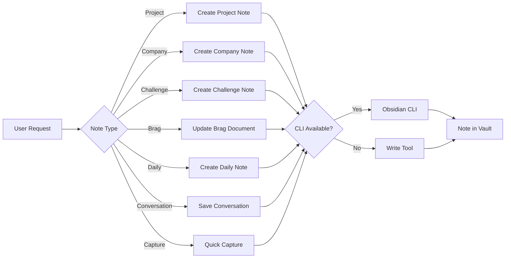

# Session Notes

Structured note creation for Obsidian using the official CLI with Write tool fallback.

## Installation

```bash
npx skills add adeonir/agent-skills --skill session-notes
```

## What It Does

Creates and manages documentation in your Obsidian vault with consistent structure:

- **Projects** - Full project documentation (PRD, Design Doc, ADR, architecture)
- **Companies** - Job application tracking (status, interviews, decisions)
- **Challenges** - Technical interview challenges (take-homes, system design)
- **Brags** - Achievement tracking for performance reviews
- **Daily** - Quick daily logs and journal entries
- **Conversations** - AI chat summaries and key decisions
- **Captures** - Quick notes, links, ideas, and snippets



## Usage

```bash
# Create a new project note
"Criar documentacao do projeto checkout-refactor"

# Track a job application
"Documentar que apliquei na Stripe"

# Record a technical challenge
"Registrar desafio tecnico da Figma"

# Update brag document
"Adicionar conquista: reduzi latency em 40%"

# Create daily note
"Criar nota de hoje"

# Save an AI conversation
"Salvar conversa sobre refatoracao do auth"

# Quick capture
"Salvar este link para depois"
```

## Output

Notes are created in your Obsidian vault following this structure:

```
Vault/
├── Projects/          # Project documentation
├── Companies/         # Job application tracking
├── Challenges/        # Technical challenges
├── Brags/            # Achievement records
├── Conversations/    # AI conversation summaries
├── Daily/            # Daily notes
└── Templates/        # Templates for manual note creation
```

## Requirements

- Obsidian CLI installed and available in PATH (optional - falls back to Write tool)
- At least one Obsidian vault configured
- Templates in `Templates/` for manual use via Obsidian's Templates plugin

## Integration

| Skill | Connection |
|-------|------------|
| `spec-driven` | Project notes can reference specs created by spec-driven |
| `docs-writer` | PRD/Design Doc/ADR created by docs-writer can be linked in project notes |
