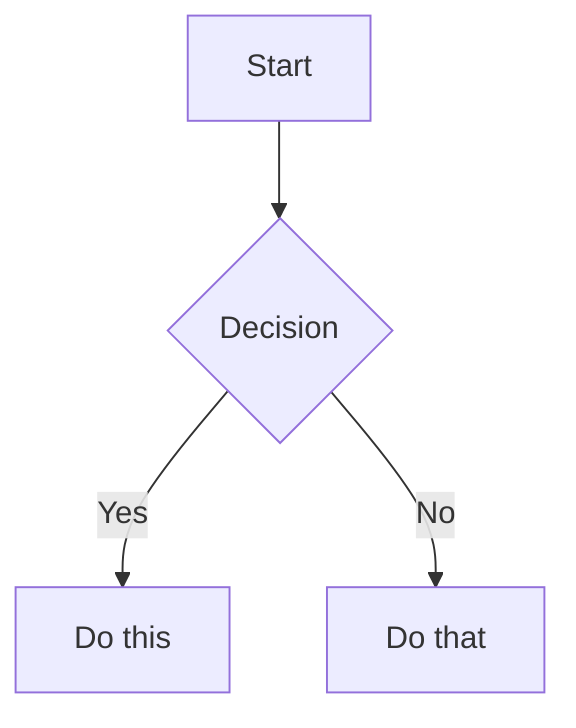

# Obsidian Flavored Markdown

Obsidian extends CommonMark and GFM with wikilinks, embeds, callouts,
properties, and other syntax. This reference covers only Obsidian-specific
extensions -- standard Markdown is assumed knowledge.

## When to Use

- Composing any note content for Obsidian
- User asks about wikilinks, callouts, embeds, or Obsidian syntax
- Formatting notes with Obsidian-specific features

## Internal Links (Wikilinks)

```markdown
[[Note Name]]                          Link to note
[[Note Name|Display Text]]             Custom display text
[[Note Name#Heading]]                  Link to heading
[[Note Name#^block-id]]                Link to block
[[#Heading in same note]]              Same-note heading link
```

Use wikilinks for notes within the vault (Obsidian tracks renames automatically)
and standard Markdown links `[text](url)` for external URLs only.

## Block References

Define a block ID by appending `^block-id` to any paragraph:

```markdown
This paragraph can be linked to. ^my-block-id
```

For lists and quotes, place the block ID on a separate line after the block:

```markdown
> A quote block

^quote-id
```

## Embeds

Prefix any wikilink with `!` to embed its content inline:

```markdown
![[Note Name]]                         Embed full note
![[Note Name#Heading]]                 Embed section
![[image.png]]                         Embed image
![[image.png|300]]                     Embed image with width
![[document.pdf#page=3]]               Embed PDF page
```

## Callouts

```markdown
> [!note]
> Basic callout.

> [!warning] Custom Title
> Callout with a custom title.

> [!faq]- Collapsed by default
> Foldable callout (- collapsed, + expanded).
```

Common types: `note`, `tip`, `warning`, `info`, `example`, `quote`, `bug`,
`danger`, `success`, `failure`, `question`, `abstract`, `todo`.

Callouts can be nested by adding deeper quote levels.

## Properties (Frontmatter)

```yaml
---
title: My Note
date: 2024-01-15
tags:
  - project
  - active
aliases:
  - Alternative Name
cssclasses:
  - custom-class
---
```

Default properties:
- `tags` - searchable labels
- `aliases` - alternative note names for link suggestions
- `cssclasses` - CSS classes for styling

## Tags

```markdown
#tag                    Inline tag
#nested/tag             Nested tag with hierarchy
```

Tags can contain letters, numbers (not as first character), underscores,
hyphens, and forward slashes. Tags can also be defined in frontmatter
under the `tags` property.

## Comments

```markdown
This is visible %%but this is hidden%% text.

%%
This entire block is hidden in reading view.
%%
```

## Highlights

```markdown
==Highlighted text==
```

## Math (LaTeX)

```markdown
Inline: $e^{i\pi} + 1 = 0$

Block:
$$
\frac{a}{b} = c
$$
```

## Diagrams (Mermaid)

````markdown

````

## Footnotes

```markdown
Text with a footnote[^1].

[^1]: Footnote content.

Inline footnote.^[This is inline.]
```

## Tasks

```markdown
- [ ] Incomplete task
- [x] Completed task
- [-] Cancelled task
- [?] Question
```

## Guidelines

**DO:**
- Use `[[wikilinks]]` for vault-internal links
- Use standard `[text](url)` for external URLs
- Use callouts for important information
- Use tags in frontmatter for consistency

**DON'T:**
- Use standard Markdown links for vault-internal notes
- Mix frontmatter tags and inline tags for the same concept
- Use spaces in tags (use hyphens or nested tags instead)

## Reference

Full documentation: https://help.obsidian.md/obsidian-flavored-markdown
