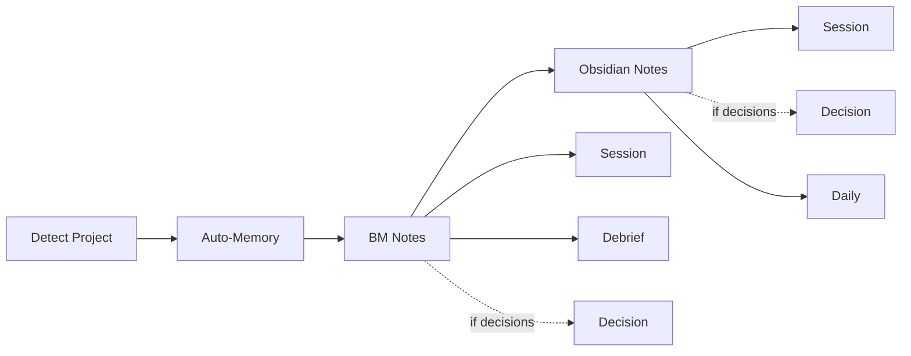

# Wrap Up Session

End-of-session documentation across auto-memory, Basic Memory, and Obsidian.

## Installation

```
npx skills add . --skill wrap-up
```

## What It Does



| Step | System | Output | Audience |
|------|--------|--------|----------|
| Detect Project | -- | category, project, mappings | Internal |
| Auto-Memory | Claude Code | Updated memory files | Agents |
| BM Session | Basic Memory | Session note (facts) | Agents |
| BM Debrief | Basic Memory | Debrief note (reasoning) | Agents |
| BM Decision (conditional) | Basic Memory | Decision notes (thematic) | Agents |
| Obsidian Session | Obsidian | Session note (work details) | Humans |
| Obsidian Decision (conditional) | Obsidian | Decision notes (thematic) | Humans |
| Obsidian Daily | Obsidian | Daily note (day summary) | Humans |

## Usage

```
wrap up
end session
finish up
close session
```

## Output

- Auto-memory files in `.claude/projects/.../memory/`
- BM notes in the `main` project (prefixed by category)
- Obsidian session note in `{Vault}/{Folder}/{Project}/`
- Obsidian daily note in `{Vault}/Daily/`

## Requirements

- Basic Memory MCP server (for BM notes)
- MCPVault MCP server (for Obsidian notes)
- Auto-memory configured in Claude Code

## Integration

| Skill | Relationship |
|-------|-------------|
| memory-notes | BM session and debrief use write_note |
| session-notes | Obsidian notes use MCPVault write/patch |
