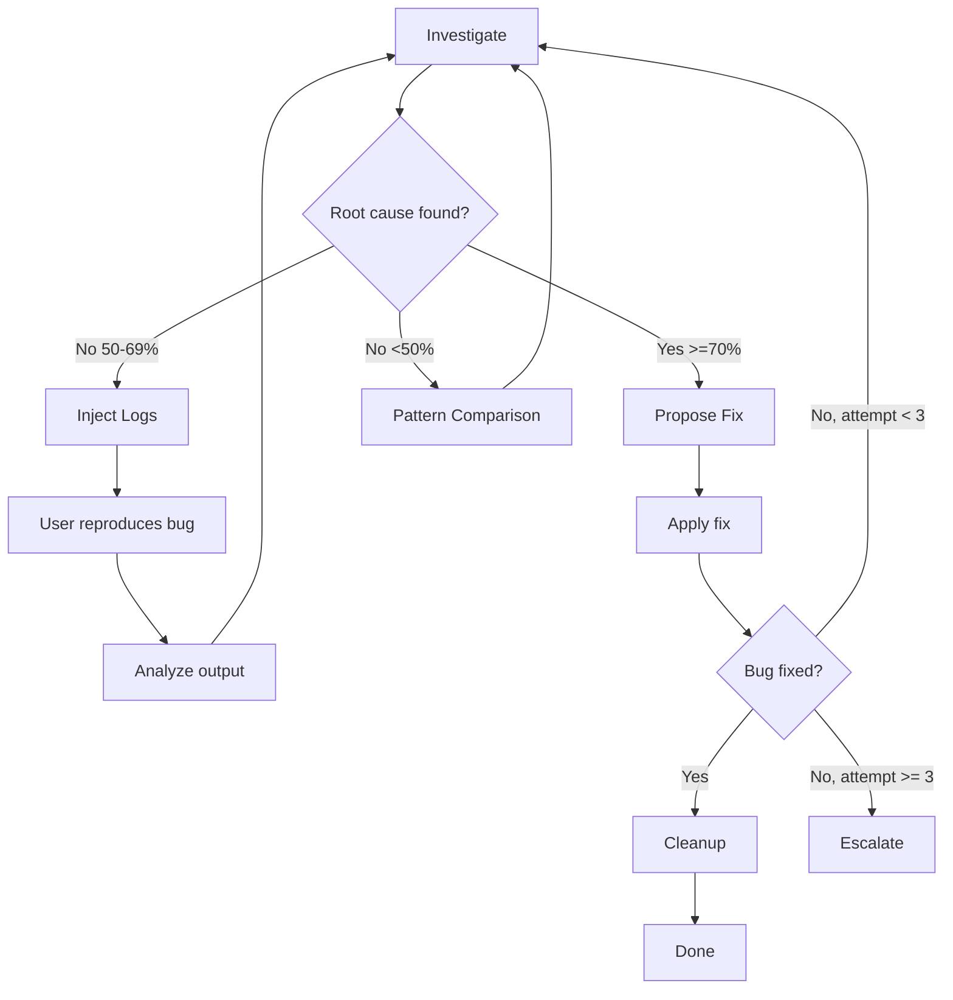

# Debug Tools

Iterative debugging workflow with confidence scoring, pattern comparison, and targeted log injection.

## What It Does

Flexible debugging workflow that helps find and fix bugs systematically:



Core loop: investigate, fix, verify. Techniques are selected based on context:

- **Investigate** — Analyze code to find root cause with confidence scoring
- **Pattern Comparison** — Diff broken code against working examples
- **Inject Logs** — Add targeted `[DEBUG]` logs to capture runtime data
- **Propose Fix** — Suggest minimal fix based on evidence
- **Verify** — Confirm the fix resolves the issue
- **Cleanup** — Automatically remove all debug logs
- **Escalate** — After 3 failed fixes, review architecture

## Usage

```
debug this issue
investigate why the login is failing
trace this error
add debug logs to trace the data flow
inject logs to see what's happening
remove debug logs
cleanup debug statements
```

## Requirements

- Git (for regression tracing)

## FAQ

**Q: When should I use debug-tools vs static code review?** A: Use debug-tools for runtime issues and unexpected behavior. Use code review for static analysis of code changes.

**Q: What if the first fix doesn't work?** A: The workflow loops back to investigation with new evidence. After 3 failed attempts, it escalates to architectural review instead of retrying the same approach.

**Q: Are debug logs left in my code?** A: No. Cleanup is automatic after fix verification. You can also request cleanup anytime.

**Q: Do I need specific tools for this to work?** A: No. The skill adapts to whatever tools are available. Runtime inspection and browser debugging tools enhance the experience but are not required.

**Q: What confidence score is considered "good enough" to propose a fix?** A: ≥70 with clear evidence. Lower scores suggest adding logs to gather more data.
