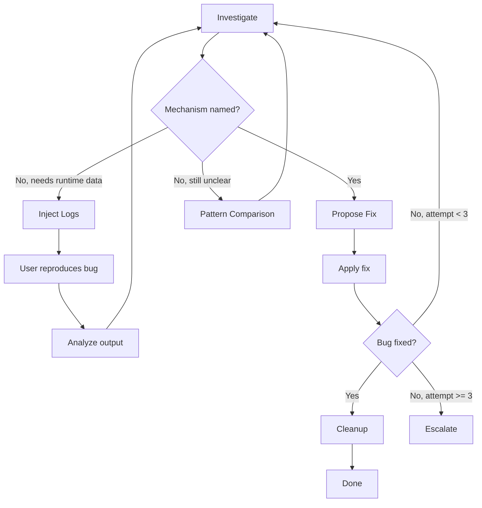

# Debug Tools

Iterative debugging workflow that gates a fix on evidence, not on a hunch.

## What It Does

Flexible debugging workflow that helps find and fix bugs systematically:


```mermaid
flowchart TD
    A[Investigate] --> B{Mechanism named?}
    B -->|Yes| C[Propose Fix]
    B -->|No, needs runtime data| D[Inject Logs]
    B -->|No, still unclear| E[Pattern Comparison]
    D --> F[User reproduces bug]
    F --> G[Analyze output]
    G --> A
    E --> A
    C --> H[Apply fix]
    H --> I{Bug fixed?}
    I -->|Yes| J[Cleanup]
    I -->|No, attempt < 3| A
    I -->|No, attempt >= 3| K[Escalate]
    J --> L[Done]
```

Core loop: investigate, fix, verify. Techniques are selected based on context:

| Phase | Output |
|---|---|
| Investigate | Root cause with a confidence score |
| Pattern Comparison | Diff of broken code against working examples |
| Inject Logs | Targeted `[DEBUG]` logs that capture runtime data |
| Propose Fix | Minimal fix based on evidence |
| Verify | Confirmation the fix resolves the issue |
| Cleanup | Debug logs removed automatically |
| Escalate | Architecture review after 3 failed fixes |

## Usage

```
debug this issue
investigate why the login is failing
trace this error
add debug logs to trace the data flow
inject logs to see what's happening
remove debug logs
cleanup debug statements
```

## Requirements

- Git (for regression tracing)

## FAQ

**Q: When should I use debug-tools vs static code review?** A: Use debug-tools for runtime issues and unexpected behavior. Use code review for static analysis of code changes.

**Q: What if the first fix doesn't work?** A: The workflow loops back to investigation with new evidence. After 3 failed attempts, it escalates to architectural review instead of retrying the same approach.

**Q: Are debug logs left in my code?** A: No. Cleanup is automatic after fix verification. You can also request cleanup anytime.

**Q: Do I need specific tools for this to work?** A: No. The skill adapts to whatever tools are available. Runtime inspection and browser debugging tools enhance the experience but are not required.

**Q: What does the confidence score decide?** A: Nothing on its own — it tells you how far the evidence reaches, so you can weigh a finding. A fix is proposed only when the evidence names the mechanism: the code that produces the symptom, and how. Short of that, the workflow gathers runtime data instead.
