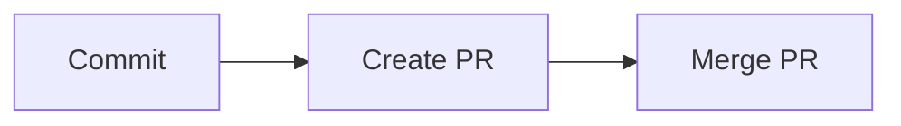

# Git Helpers

Git workflow skill for conventional commits, pull request creation, and pull request merging.

## What It Does

Runs the git workflow from local changes to merged PR:



| Phase | Output |
|-------|--------|
| Commit | Conventional commit message based on staged diff |
| Create PR | Opened pull request via GitHub MCP or `gh` CLI |
| Merge PR | Merged pull request via GitHub MCP or `gh` CLI and completed local cleanup with Git |

## Usage

Use any workflow independently or chain them:

```text
commit these changes
commit only staged files

push and create PR
create pull request against main

merge PR
merge pull request
```

### Quick bug fix

```text
commit these changes
push and create PR
```

### Feature flow

```text
commit these changes
push and create PR
merge pull request
```

## Requirements

- Git
- GitHub MCP or `gh` CLI (for PR operations)

## FAQ

**Q: Do I need to stage files before committing?** A: No. By default, the skill stages modified and untracked files by name. If you already staged something before asking, the skill flags it so nothing lands silently. Use "commit only staged files" if you prefer to stage manually and skip the auto-stage step.

**Q: What base branch is used for pull requests?** A: The repo's default branch, with `main` as fallback. The base is shown for confirmation before the PR opens, so you can point the PR at another branch then — or name it upfront: "create PR against develop".

**Q: Can I use this without `gh` CLI?** A: Yes, when a GitHub MCP tool is available. Otherwise, `gh` CLI is required for PR creation and merge operations.

**Q: Does "merge pull request" run start to finish on its own?** A: No. It asks for confirmation before merging the pull request and before deleting the merged branch.

**Q: Does the skill delete branches?** A: Yes, as part of completing a merged pull request. After confirmation, it switches to the base branch, pulls the merge, and deletes the local and remote feature branch.
