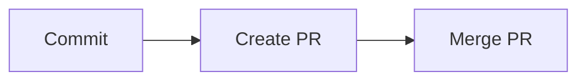

# Git Helpers

Git workflow skill for conventional commits, pull request creation, and pull request merging.

## What It Does


```mermaid
flowchart LR
    A[Commit] --> B[Create PR]
    B --> C[Merge PR]
```

| Operation | Output |
|-----------|--------|
| Commit | Conventional commit message based on staged diff |
| Create PR | Opened pull request via GitHub MCP or `gh` CLI |
| Merge PR | Merged pull request via GitHub MCP or `gh` CLI, with its branch marked for deletion when `gh` merges, and completed local cleanup with Git |

## Usage

```text
commit these changes
commit only staged files
push and create PR
create pull request against main
merge PR
merge pull request
```

## Requirements

- Git
- GitHub MCP or `gh` CLI (for PR operations)

## FAQ

**Q: Do I need to stage files before committing?** A: No. By default, the skill stages modified and untracked files by name. If you already staged something before asking, the skill flags it so nothing lands silently. Use "commit only staged files" if you prefer to stage manually and skip the auto-stage step.

**Q: How does the skill decide whether a commit is breaking?** A: It checks whether the diff makes an existing consumer incompatible with an established contract. If so, it explains the impact and asks whether to use a breaking marker or another classification. A changed format alone is not enough; ordinary commit types and scopes need no confirmation.

**Q: What base branch is used for pull requests?** A: The repo's default branch, with `main` as fallback. Name another base upfront to override it: "create PR against develop".

**Q: Can I use this without `gh` CLI?** A: Yes. The skill uses the channel the project's AGENTS.md or CLAUDE.md records as primary, GitHub MCP or `gh`, and falls back to the other when it fails. With none recorded, it uses whichever is available.

**Q: Does "merge pull request" run start to finish on its own?** A: Yes. It merges once the pull request is approved with CI green, with no confirmation, and deletes the merged branch. It stops and asks only when the merge state is not clean.

**Q: Does the skill delete branches?** A: Yes, as part of completing a merged pull request, with no confirmation. When `gh` merges, the merge marks the branch for deletion, which removes the remote branch; the MCP merge tool leaves the remote branch as it is. In both cases the skill then switches to the base branch, pulls the merge, and deletes the local branch.
