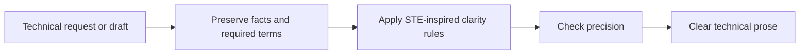

# Plain Spoken

Makes technical prose easier to understand without removing necessary precision.

## What It Does



| Phase | Output |
| ----- | ------ |
| Preserve | Requirements, limits, code, identifiers, and domain terms remain accurate |
| Simplify | Familiar words, stable terminology, direct sentences, and clear conditions |
| Verify | A final check for ambiguity, lost meaning, and unclear references |

The method adapts principles from [ASD-STE100 Simplified Technical English](https://www.asd-ste100.org/) to everyday agent responses. It does not reproduce the controlled dictionary and does not claim formal compliance.

The principles apply in any language. The controlled dictionary is defined in English and stays the reference for word choice; in another language, the same test runs against the equivalent word pair.

## Usage

The agent can select this skill automatically for substantial technical prose written for people, such as explanations, runbooks, specifications, incident reports, architecture notes, procedures, and documentation. Brief factual replies, code-only output, and raw logs remain unchanged.

Explicit requests also activate it:

```text
explain this architecture in plain technical English
rewrite this runbook with less jargon
make this API error explanation easier for a global team to understand
use an ASD-STE100 style for this maintenance procedure
audit this technical note for complex words and ambiguous sentences
```

The default result is the improved text only. Ask for an audit to receive findings and a rewritten version.

## Requirements

None for STE-inspired writing.

Formal ASD-STE100 conformance requires the official standard and the approved terminology for the applicable company, industry, or subject field. Without both sources, the skill labels the result as best effort rather than compliant.

## FAQ

**Does it remove every technical term?** No. It keeps terms that carry necessary meaning and defines unfamiliar terms when the reader needs the definition.

**Does it work for Portuguese output?** Yes. The structural rules and the word-choice test apply the same way; only English text can be called Simplified Technical English, because formal conformance is defined for English.

**Does simple mean childish?** No. The target is direct, precise language for readers with different levels of proficiency in the language of the text.
