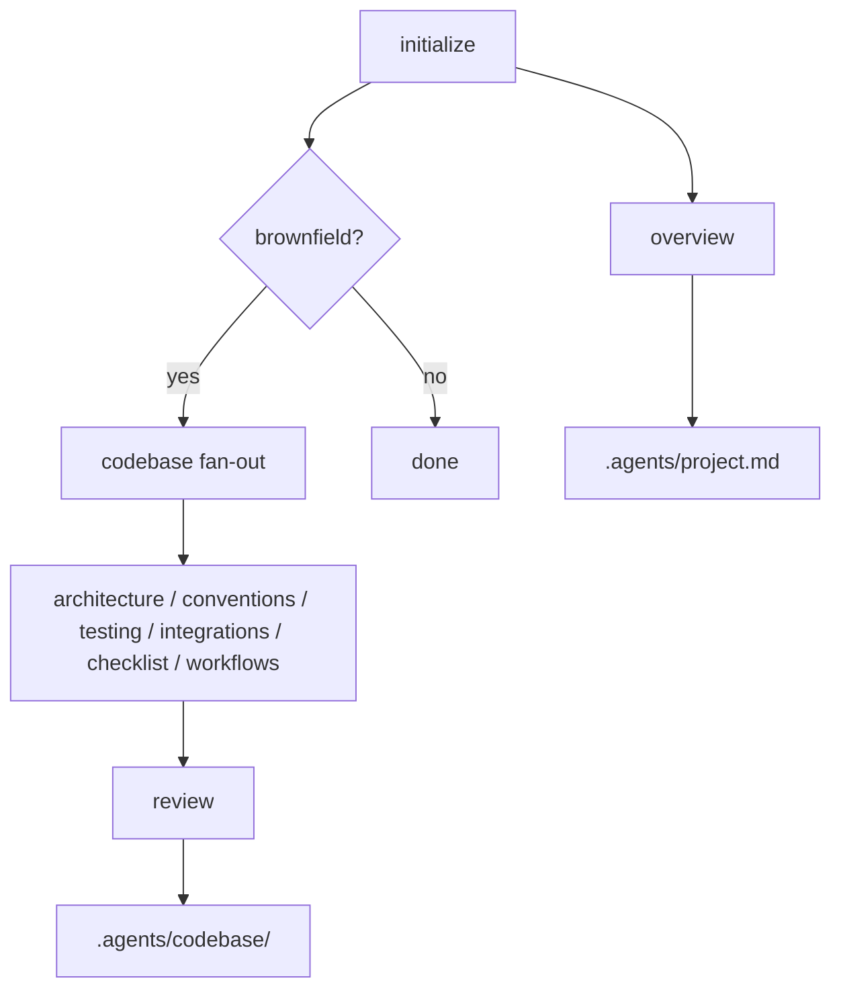

# Project Index

Generates project context and codebase documentation for AI agents.

## What It Does

Creates an `.agents/` directory with structured documentation that any
AI agent can consume to understand the project.



| Command | What It Generates |
|---------|-------------------|
| **initialize** | Everything (overview + fan-out + review when brownfield) |
| **overview** | `.agents/project.md` — project context, users, features |
| **summary** | `.agents/codebase/` — 7 docs covering stack, architecture, conventions, testing, integrations, checklist, workflows, and self-assessment |
| **integrate feedback** | Merges queued items from `.agents/knowledge.md ## Codebase Feedback` into `.agents/codebase/*.md` |

## Usage

```
initialize project
overview
map codebase
summary
integrate feedback
```

## Output

```
.agents/
├── project.md              # Project context, purpose, stack
└── codebase/               # How the code works
    ├── architecture.md     # Patterns, layers, structure, data flow
    ├── conventions.md      # Naming, imports, types, error handling, project abstractions
    ├── testing.md          # Test infra, patterns, reference tests
    ├── integrations.md     # External services and APIs
    ├── checklist.md        # Post-task validation steps
    ├── workflows.md        # User and development flows
    └── review.md           # Self-assessment: consistency, completeness, concerns
```

## Requirements

- Existing project with source code (for the codebase summary fan-out)
- No external dependencies

## FAQ

**Q: When should I run initialize vs map codebase?**
A: Run `initialize` once per project. After that, re-run individual
parts (`overview`, `architecture`, `conventions`, etc.) when the
project changes in that specific area.

**Q: Does it overwrite my existing docs?**
A: No. Re-runs merge new findings into existing files. Manual edits
are preserved unless they're clearly outdated.

**Q: How does the codebase fan-out work?**
A: Six sub-agents run in parallel during one turn, each generating one
output file (architecture, conventions, testing, integrations,
checklist, workflows). After the fan-out, the main agent reads all 6
outputs together and produces `review.md` (self-assessment).

**Q: What's the difference between summary and integrate feedback?**
A: `summary` regenerates the codebase docs from source code. `integrate
feedback` merges queued items from `knowledge.md ## Codebase Feedback`
into the existing docs — used when implementations discover patterns
worth recording without doing a full re-scan.
