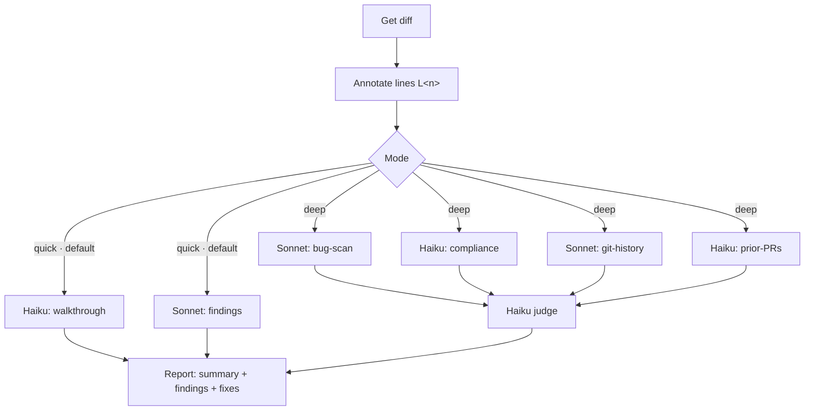

# Review Lens

Confidence-scored code review in two modes — a fast walkthrough-plus-findings pass by default, a multi-material fan-out on demand. Runs before a pull request.

## What It Does

Annotates the diff with line markers, then reviews it in one of two modes and reports a change summary plus severity-sorted findings with suggested fixes:



| Phase | Output |
|-------|--------|
| Annotate | Diff with `[L<n>]` post-image markers (anti-hallucination allowlist) |
| Quick (default) | Change walkthrough (Haiku) + generalist findings (Sonnet), in parallel |
| Deep (on demand) | Fan-out by material (diff, guideline files, git history, prior PRs) + an independent confidence judge |
| Report | Summary + severity-sorted findings with suggested fixes; chat output, optional `CODE_REVIEW.md` |

## Usage

```text
review my changes          # quick (default)
review against main        # quick
deep review my changes     # multi-material fan-out
full review                # deep
apply the suggested fixes  # opt-in, with confirmation
re-review (check if the issues are fixed)
```

## Output

The report prints to the chat by default. On request it can be saved to `CODE_REVIEW.md`, and the suggested fixes can be applied to the working tree (opt-in, with confirmation). The review runs before a pull request exists, so it never posts to a PR.

## Requirements

- Git
- `gh` CLI — optional, only for the deep review's prior-PRs pass; it is skipped gracefully when `gh` or a GitHub remote is absent

## FAQ

**Q: Quick vs deep — when do I use which?** A: Quick is the default: two cheap agents (a walkthrough and a generalist findings pass) over the diff — fast, good for everyday changes. Deep fans out across different materials — the diff, your guideline files, git history, and prior PRs — with a separate judge, and costs more. Use it on risky or wide-reaching changes, or say "deep review".

**Q: How does it keep cost down?** A: Model tiering. Quick runs a Haiku walkthrough and a Sonnet findings pass. Deep uses the stronger model only for the two reasoning passes (bug-scan and git-history); compliance, prior-PRs, and the batched judge run on Haiku, and the history/PR passes are skipped when there is nothing to read.

**Q: Will it change my code?** A: It suggests fixes as code blocks in the report. It only edits the working tree if you explicitly confirm.

**Q: What guideline files does it read?** A: `CLAUDE.md`, `AGENTS.md`, `CONTRIBUTING.md`, `.editorconfig`, and `.claude/rules/*.md` inside the repository root. Personal global settings (e.g. `~/.claude/`) are excluded.

**Q: Why are some issues not reported?** A: Conservative confidence scoring (≥ 80) in both modes, plus a separate judge in deep. Style preferences, hypotheticals, and "could be simplified" suggestions are intentionally skipped.

**Q: What's the size limit?** A: 3000 lines or 40 files. Above that, the review stops and suggests splitting the branch.
