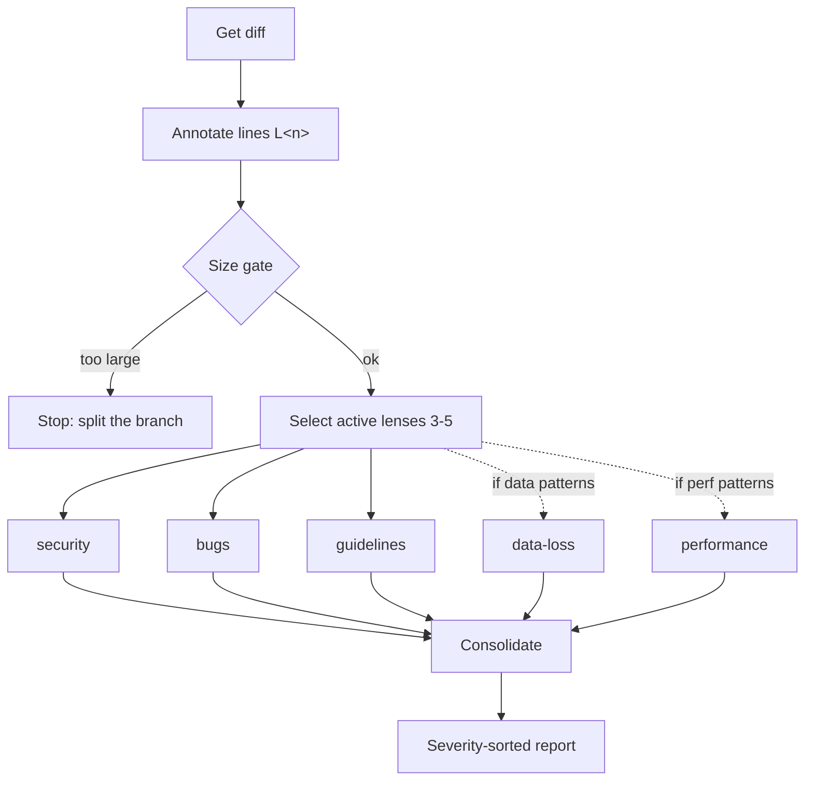

# Review Lens

Confidence-scored code review via parallel lens fan-out.

## What It Does

Reviews a diff by fanning out to focused lens sub-agents that each read the
same line-annotated diff in parallel, then consolidates their findings into
a single severity-sorted report:



| Phase | Output |
|-------|--------|
| Annotate | Diff with `[L<n>]` post-image line markers (anti-hallucination allowlist) |
| Select lenses | Active lenses chosen from changed files (min 3, max 5) |
| Fan out | Parallel lens findings: security, bugs, data-loss, performance, guidelines |
| Consolidate | Deduped, severity-sorted report with highlights and coverage gaps |

## Usage

```text
review my changes
review against main
review and post as PR comment
re-review (check if the issues are fixed)
```

## Output

| Workflow | Artifact |
|----------|----------|
| Review | `CODE_REVIEW.md` (findings with confidence scores) — optional, only when user asks to save |

Otherwise the report is printed to the terminal, or posted to the PR when
requested.

## Requirements

- Git
- `gh` CLI (only for posting the review as a PR comment)

## FAQ

**Q: What base branch is used for comparisons?**
A: Defaults to `main`. Override by specifying explicitly: "review against
develop".

**Q: Why are some issues not reported?**
A: Conservative confidence scoring (≥ 80). Style preferences, hypothetical
issues, and "could be simplified" suggestions are intentionally skipped.

**Q: What's the size limit?**
A: 3000 lines or 40 files. Above that, the review stops and suggests
splitting the branch — beyond those limits, fan-out lenses can no longer
reliably hold the full diff in context.

**Q: How does the guidelines audit work?**
A: It searches for `CLAUDE.md`, `AGENTS.md`, `CONTRIBUTING.md`, and
`.editorconfig` files inside the repository root and checks if changes
comply with documented rules. Personal global settings (e.g.,
`~/.claude/CLAUDE.md`) are excluded.

**Q: Do I need `gh` CLI?**
A: Only to post the review as a PR comment. Terminal output and
`CODE_REVIEW.md` work without it.
