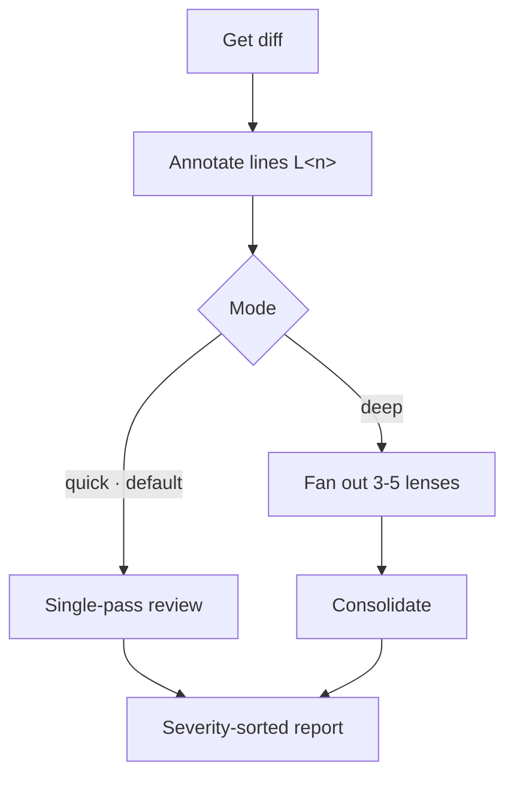

# Review Lens

Confidence-scored code review — quick single-pass by default, deep lens fan-out on demand.

## What It Does

Annotates the diff with line markers, then reviews it in one of two modes
and reports severity-sorted findings:



| Phase | Output |
|-------|--------|
| Annotate | Diff with `[L<n>]` post-image markers (anti-hallucination allowlist) |
| Quick (default) | One-pass findings across every scope, confidence ≥ 80 |
| Deep (on demand) | Parallel lens findings (security, bugs, data-loss, performance, guidelines), consolidated |
| Report | Severity-sorted findings + highlights + coverage gaps; terminal or PR comment |

## Usage

```text
review my changes          # quick (default)
review against main        # quick
deep review my changes     # lens fan-out
full review                # lens fan-out
review and post as PR comment
re-review (check if the issues are fixed)
```

## Output

| Workflow | Artifact |
|----------|----------|
| Review | `CODE_REVIEW.md` (findings with confidence scores) — optional, only when user asks to save |

Otherwise the report is printed to the terminal, or posted to the PR when
requested.

## Requirements

- Git
- `gh` CLI (only for posting the review as a PR comment)

## FAQ

**Q: Quick vs deep — when do I use which?**
A: Quick is the default: a single agent reviews the whole diff in one pass
across every scope — fast, good for everyday changes. Deep fans out to 3–5
lens sub-agents in parallel and consolidates — use it on risky or
wide-reaching diffs, or say "deep review" / "full review".

**Q: What base branch is used for comparisons?**
A: Defaults to `main`. Override by specifying explicitly: "review against
develop".

**Q: Why are some issues not reported?**
A: Conservative confidence scoring (≥ 80) in both modes. Style preferences,
hypothetical issues, and "could be simplified" suggestions are
intentionally skipped.

**Q: What's the size limit?**
A: 3000 lines or 40 files. Above that, the review stops and suggests
splitting the branch — beyond those limits a single pass (or a lens) can no
longer reliably hold the full diff in context.

**Q: How does the guidelines audit work?**
A: Both modes search for `CLAUDE.md`, `AGENTS.md`, `CONTRIBUTING.md`, and
`.editorconfig` inside the repository root and check whether changes comply
with documented rules. Personal global settings (e.g., `~/.claude/CLAUDE.md`)
are excluded.

**Q: Do I need `gh` CLI?**
A: Only to post the review as a PR comment. Terminal output and
`CODE_REVIEW.md` work without it.
