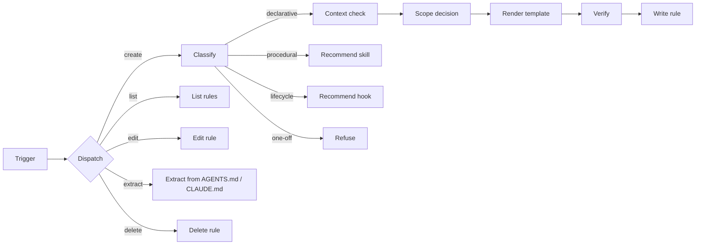

# Rule Creator

Create and manage Claude Code rules in `.claude/rules/` with classification, scope decisions, and an Incorrect/Correct template.

## What It Does

Rules in `.claude/rules/` auto-load into every session (global) or trigger when Claude reads matching files (path-scoped). This skill classifies the input, picks scope and topic, renders the template, and writes the file. It also manages existing rules: list, edit, extract from oversized AGENTS.md / CLAUDE.md, and delete.



| Mode | What Happens | Output |
|------|--------------|--------|
| create | Classify, context check, scope decision, render template, verify, write | `.claude/rules/<topic>.md` |
| list | Read every rule, summarize by file, scope, impact | Table + expanded list |
| edit | Resolve target by name, apply change, re-verify | Updated rule file |
| extract | Walk oversized AGENTS.md / CLAUDE.md, propose verdicts, extract approved | New rule files + trimmed AGENTS.md / CLAUDE.md |
| delete | Show full content, confirm, remove | Removed file |
| refuse | Classifier rejected input, recommend a skill, hook, or direct action | No write |

## Usage

```
create a rule that always uses type instead of interface in TypeScript files
add a rule for API handlers under src/api: validate body with Zod before db calls
new rule: never commit secrets in plain text
list rules
edit rule testing
extract rules from AGENTS.md / CLAUDE.md
delete rule typescript
```

## Output

```
.claude/rules/<topic>.md
```

Rules auto-load via Claude Code (no manual `@` import). Path-scoped rules load only when Claude reads files matching the glob.

## Requirements

None. Works with any project that uses Claude Code. Scope is project only (`.claude/rules/` in the current working directory). User-level rules (`~/.claude/rules/`) are out of scope.

## FAQ

**Q: Why does the skill classify input before writing?** A: A procedural workflow forced into a rule reads as broken instructions ("first do A, then B" does not behave like a constraint). The classifier routes procedural input toward skill authoring and lifecycle input toward hooks, so each artifact carries the content it can actually enforce.

**Q: When should a rule be path-scoped vs global?** A: Path-scoped when the input names an extension, directory, or framework — those rules only load when Claude touches matching files, saving context. Global only for universal conventions (security, formatting that crosses stacks).

**Q: What if a rule already exists for the same topic?** A: The context check detects the duplicate. If the new rule is the same as the existing one, the skill exits. If complementary, it proposes appending an H2 section to the existing file. If contradictory, it asks the user which wins.

**Q: How does extract decide what to pull from AGENTS.md / CLAUDE.md?** A: It walks each H2/H3 section and proposes a verdict: keep (cross-cutting), extract (declarative and self-contained), or reject (procedural or lifecycle). The user confirms each verdict before anything is moved.

**Q: Why no user-level rules?** A: User-level rules (`~/.claude/rules/`) are a different lifecycle: they carry personal preferences across all projects. This skill stays project-scoped to keep the classifier and context check focused on the active codebase. User-level authoring can happen by hand.
