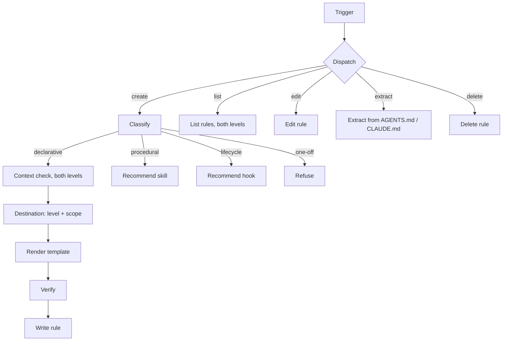

# Rule Creator

Create and manage Claude Code rules at project and user level, with classification, destination decisions, and a flexible rule template.

## What It Does

Rules auto-load into every session (unconditional) or trigger when Claude reads matching files (path-scoped). This skill classifies the input, picks level, scope, and topic, renders the template, and writes the file. It also manages existing rules: list, edit, extract from an oversized AGENTS.md / CLAUDE.md, and delete.

Two independent axes decide where a rule lands:

| Axis | Values | Materializes as |
|------|--------|-----------------|
| Level | user (`~/.claude/rules/`) / project (`.claude/rules/`) | the directory written to |
| Scope | unconditional / path-scoped | absence or presence of `paths:` frontmatter |


```mermaid
flowchart TD
    T[Trigger] --> D{Dispatch}
    D -->|create| C[Classify]
    C -->|declarative| X[Context check, both levels]
    C -->|procedural| SK[Recommend skill]
    C -->|lifecycle| HK[Recommend hook]
    C -->|one-off| OF[Refuse]
    X --> S[Destination: level + scope]
    S --> R[Render template]
    R --> V[Verify]
    V --> W[Write rule]
    D -->|list| L[List rules, both levels]
    D -->|edit| E[Edit rule]
    D -->|extract| EX[Extract from AGENTS.md / CLAUDE.md]
    D -->|delete| DL[Delete rule]
```

| Mode | What Happens | Output |
|------|--------------|--------|
| create | Classify, context check, destination decision, render template, verify, write | `<rules-dir>/<topic>.md` |
| list | Read every rule at both levels, summarize by level, scope, impact | Table + expanded list |
| edit | Resolve target by name across both levels, apply change, re-verify | Updated rule file |
| extract | Walk an oversized AGENTS.md / CLAUDE.md, propose verdicts, extract approved | New rule files + trimmed source |
| delete | Show full content, confirm with the level named, remove | Removed file |

Refusal is not a mode. It is how create ends when the classifier rejects the input: the verdict is reported with the destination that fits it — a skill for procedural input, a hook for a lifecycle trigger, direct action for a one-off — and nothing is written.

## Usage

```text
create a rule that always uses type instead of interface in TypeScript files
add a rule for API handlers under src/api: validate body with Zod before db calls
new rule for all my projects: never commit secrets in plain text
list rules
edit rule testing
extract rules from AGENTS.md / CLAUDE.md
delete rule typescript
```

## Output

```text
.claude/rules/<topic>.md      # project level
~/.claude/rules/<topic>.md    # user level
```

Rules auto-load via Claude Code (no manual `@` import). Discovery is recursive, so `<rules-dir>/frontend/naming.md` loads too. Path-scoped rules load only when Claude reads files matching the glob, and project rules take priority over user rules.

## Requirements

None. Works with any project that uses Claude Code.

## FAQ

**Q: Why does the skill classify input before writing?** A: A procedural workflow forced into a rule reads as broken instructions ("first do A, then B" does not behave like a constraint). The classifier routes procedural input toward skill authoring and lifecycle input toward hooks, so each artifact carries the content it can actually enforce.

**Q: When should a rule be path-scoped vs unconditional?** A: Path-scoped when the input names an extension, directory, or framework — those rules only load when Claude touches matching files, saving context. Unconditional only for conventions that cross file types (security, formatting that crosses stacks).

**Q: How does the skill choose between user and project level?** A: From explicit signals — "for all my projects" or "user-level" picks user, naming the repo's stack or a directory picks project. With no signal it asks, because writing to `~/.claude/rules/` reaches every project on the machine. It never infers the level from what the rule says.

**Q: Can a user-level rule be path-scoped?** A: No. Path-scoped user rules are not documented as supported and are reported to be ignored, so a path signal resolves the level to project. User-level rules carry no `paths:` block.

**Q: What if the rule belongs to several projects but not all of them?** A: Neither level fits, so the rule is written once into a shared directory you name and linked into the current project — `ln -s ~/shared-claude-rules/security.md .claude/rules/security.md`. Only the current project is reachable, so the skill reports the same command for you to run in the others. Rules directories resolve symlinks, and circular links are detected rather than followed.

**Q: What happens when I edit or delete a linked rule?** A: Editing writes through to the shared target, so the skill names the target and the blast radius before applying. Deleting asks which act you mean: unlink here (the rule stops applying to this project only) or delete the shared target (the rule dies everywhere, leaving dangling links in the other projects). It defaults to unlinking.

**Q: What if a rule already exists for the same topic?** A: The context check reads both levels and detects the duplicate. If the new rule is the same as the existing one, the skill exits. If complementary, it proposes appending an H2 section to the existing file. If contradictory, it asks the user which wins — and when the conflict crosses levels, it names the winner: project rules load after user rules and take priority.

**Q: How does extract decide what to pull from AGENTS.md / CLAUDE.md?** A: It walks each H2/H3 section and proposes a verdict: keep (cross-cutting), extract (declarative and self-contained), or reject (procedural or lifecycle). The user confirms each verdict before anything is moved. The source file sets the destination level; a section is never moved across levels.

**Q: My CLAUDE.md is one line that imports AGENTS.md. Does extract still work?** A: Yes. Extract resolves `@path` imports before measuring or reading, then targets the file that actually holds the content — so a one-line `CLAUDE.md` importing four hundred lines is measured at four hundred, not one.
