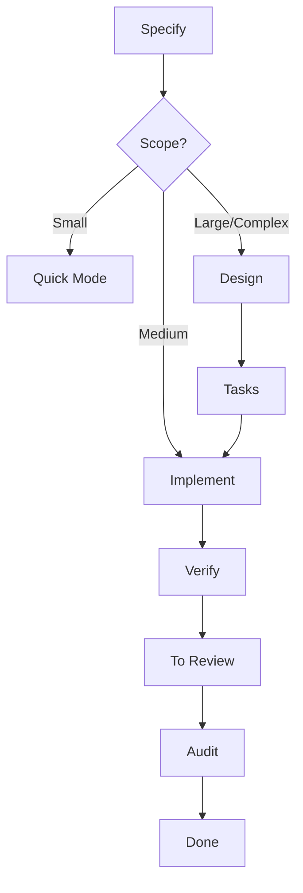

# Spec-Driven Development

Structured development workflow with adaptive depth. Right ceremony for the right scope.

## What It Does

Adaptive workflow for building software with clarity and traceability.
Complexity determines depth — small changes skip ceremony, large
features get full planning.



| Phase | Purpose | Required |
| ----- | ------- | -------- |
| **Specify** | Define requirements (greenfield or brownfield) | Always |
| **Discuss** | Resolve gray areas and ambiguities | When triggered |
| **Design** | Technical architecture, codebase exploration, research | Large/Complex |
| **Tasks** | Granular, atomic tasks with dependencies | Large/Complex |
| **Implement** | Implement tasks with quality gates | Always |
| **Verify** | Check code against design, patterns, visual references; mark AC `[x]` | After every task/range |
| **Audit** | Validate Goals and Success Criteria against evidence; mark their `[x]`; transition `done` | Before `done` (all scopes except Quick) |
| **Validate** | Interactive UAT with manual testing; may reprove any `[x]` | On-demand |
| **Quick Mode** | Express lane for small fixes (no audit) | Small scope |

### Auto-Sizing

| Scope | Pipeline |
|-------|----------|
| **Small** (≤3 files) | Quick mode — no pipeline |
| **Medium** (<10 tasks) | Specify → Implement |
| **Large** (multi-component) | Specify → Design → Tasks → Implement |
| **Complex** (ambiguity) | Specify (+ Discuss) → Design → Tasks → Implement → Verify |

## Usage

```
# Create a feature (greenfield)
create new feature for user authentication
new feature: payment processing

# Create a feature from a PRD
from PRD @docs/payment-prd.md
use this PRD to plan the feature
here's the PRD, extract the spec

# Create a feature (brownfield)
modify existing auth flow
improve cache performance

# Development workflow
create technical design
create tasks
implement
verify implementation

# Close the feature
audit feature
validate goals

# Manual testing
validate
run UAT

# Quick mode
quick fix: update env variable
quick task: fix login redirect

# Discuss gray areas
discuss auth feature
how should session timeout work?
```

### New Feature (Greenfield)

```
create new feature for user authentication
# Agent assesses scope, asks for requirements
# Creates: .artifacts/features/001-user-auth/spec.md

create technical design             # Large/Complex only
create tasks                        # Large/Complex only
implement
```

### Brownfield Feature

```
# Optionally index the codebase first
initialize the codebase index

# Then create feature that modifies existing code
modify existing auth flow to add 2FA
# Creates .artifacts/features/001-add-2fa/spec.md with Baseline section
```

## Output

```
.agents/
└── knowledge.md                   # Cross-feature decisions and gotchas

.artifacts/
├── .session-dump.md               # Cumulative phase log (ephemeral, optional)
├── features/
│   └── 001-feature/
│       ├── spec.md                # Requirements (WHAT)
│       ├── decisions.md           # Gray area decisions (WHY, optional)
│       ├── design.md              # Architecture (HOW, Large/Complex only)
│       ├── tasks.md               # Implementation tasks (WHEN, Large/Complex only)
│       └── designs/               # Screenshots, mockups (optional)
├── quick/
│   └── 001-fix-redirect/
│       ├── task.md                # Quick mode task record
│       └── summary.md             # Post-execution summary
└── research/
    └── {topic}.md                 # Research cache (reusable)
```

### Status Tracking

Features track status in spec.md frontmatter:

- **draft**: Created, may have open questions
- **ready**: Spec complete, design done (or skipped for Medium)
- **in-progress**: Execution started
- **to-review**: Implementation complete, awaiting Goals/Success audit
- **done**: Audit passed, feature closed

Each acceptance criterion tracks its own status inline in spec.md:

- **`pending`**: Created in specify
- **`in-design`**: Mapped to a component in design
- **`in-tasks`**: Assigned to a task in tasks
- **`verified`**: Confirmed by verify after implementation

## Requirements

- Existing project directory
- No external dependencies

## FAQ

**Q: What's the difference between `.artifacts/` and `.agents/`?**

A: `.artifacts/` is the working directory for features. `.agents/` is
project-level context — codebase docs are generated by the
codebase-indexing workflow, `knowledge.md` is accumulated by the
spec-driven workflow.

**Q: Do I need to index the codebase first?**

A: No, but brownfield features benefit from having `.agents/codebase/`
available for context.

**Q: How does research caching work?**

A: Research is saved to `.artifacts/research/{topic}.md` and reused
across features.

**Q: What happens to artifacts after the feature is done?**

A: Artifacts are disposable — they exist during development and can be
safely deleted when the feature is complete.

**Q: What is `.session-dump.md`?**

A: An optional cumulative log that records decisions, discoveries, and
blockers as phases complete. Each phase appends to it, building a
running record of the session. The end-of-session wrap-up reads it to
compose notes. The file is ephemeral and can be deleted after the
session ends.

**Q: When should I use quick mode vs full pipeline?**

A: Quick mode for ≤3 file changes with no ambiguity (bug fixes, config
changes). The agent auto-detects scope and suggests the right mode.

**Q: What's the difference between verify, validate, and audit?**

A: Verify runs continuously during implement (after each task or range)
— code adherence to design and patterns, marks AC `[x]` on pass.
Validate is on-demand UAT at any scope — user manually walks scenarios
and may reprove any `[x]`. Audit is the terminal gate before `done` —
evidence-based check of Goals and Success Criteria, marks their `[x]`,
transitions status. Validate may run before or after audit; a reproved
`[x]` forces verify or audit to re-run.

**Q: How does sub-agent dispatch work?**

A: Auto-Sizing decides depth. When activities run in full form
(Large/Complex), they may dispatch to sub-agents for context isolation:

- **Research sub-agents** — one per unknown topic, write to
  `.artifacts/research/{topic}.md`
- **Codebase exploration sub-agent** — one per design phase, runs the
  full multi-phase exploration, writes to disk
- **Design Plan sub-agent** — one per design phase, owns architectural
  reasoning (data model with file:line cites, dependency inversion,
  decisions, traceability); read-only by harness contract, returns
  structured slot fillers that the main agent composes into `design.md`
  via the canonical template
- **Tasks Plan sub-agent** — one per tasks phase, owns decomposition
  reasoning; read-only, returns slot fillers
- **Implement sub-agent** — one per user invocation (T-1, range, S-1,
  --all), owns the per-task implement and verify cycle

Discovery sub-agents (research, exploration) hand off via disk
artifacts. Plan sub-agents hand off via structured chunks because the
harness blocks Edit/Write for the built-in Plan agent. Inline forms
(Quick mode, Medium scope) run without dispatch.
