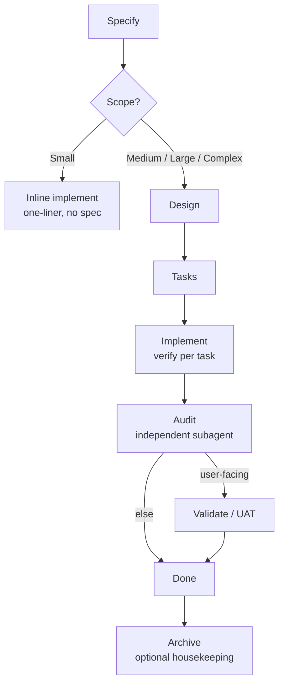

# Spec-Driven Development

Spec-driven feature development. Light by default; weight only where the scope pays for it.

## What It Does

Builds features in phases sized to the change. A mechanical fix is a one-liner; anything larger runs a full pipeline whose rigor concentrates in a final, independent audit rather than heavy intermediate gates.



| Phase | Output |
|-------|--------|
| **Specify** | `spec.md` — WHAT + WHY (Medium+) |
| **Design** | `design.md` — HOW: architecture, components, decisions |
| **Tasks** | `tasks.md` — WHEN: atomic steps, tests, gates, coverage |
| **Implement** | code + commits + updated `tasks.md` (verify per task) |
| **Audit** | `validation.md` — Goals, ACs, discrimination sensor |
| **Validate / UAT** | `## Visual Evidence` appended to `validation.md` (user-facing) |
| **Archive** | spec moved to `.artifacts/archive/{created}-{slug}/` (optional, manual, done specs only) |

### Auto-Sizing

| Scope | Nature of change | Pipeline |
|-------|------------------|----------|
| **Small** | Mechanical, zero decisions | one-liner → inline implement |
| **Medium** | Canonical pattern reapplied | Specify → Design → Tasks → Implement → Audit |
| **Large** | ≥1 load-bearing decision new to the codebase | + fresh-eyes, research |
| **Complex** | Ambiguity in the problem itself | + discuss, approaches |

## Usage

```text
# Specify a feature (greenfield or brownfield)
plan a feature for user authentication
from PRD @docs/payment-prd.md
modify the existing auth flow to add 2FA

# Move through the pipeline
design this feature
create tasks
implement T-1 to T-4
implement S-1
implement everything

# Close it out
audit feature
run UAT                 # user-facing only

# Lessons layer
python3 ${CLAUDE_SKILL_DIR}/scripts/lessons.py list --status confirmed
```

## Output

```text
.artifacts/
├── CONTEXT.md                     # cross-feature decisions, gotchas, conventions
├── STATE.md                       # active-feature progress pointer
├── lessons.json                   # canonical lessons state (machine-owned)
├── LESSONS.md                     # rendered lessons (never hand-edit)
├── specs/
│   └── {slug}/                    # active feature; slug only, no date prefix
│       ├── spec.md                # WHAT + WHY
│       ├── discuss.md             # gray-area decisions (Complex)
│       ├── design.md              # HOW
│       ├── tasks.md               # WHEN
│       ├── validation.md          # audit report + visual evidence
│       └── evidences/             # UAT screenshots (user-facing only)
├── research/
│   └── {topic}.md                 # research cache (reusable)
└── archive/
    └── {created}-{slug}/          # closed features; date from `created:`, added at archive; never read during discovery
```

## Requirements

- An existing project directory.
- `python3` (standard library only) for `scripts/lessons.py`.
- Optional: a browser-automation MCP (e.g. Playwright) for Validate/UAT screenshots — falls back to user-guided capture when absent.
- Optional: a docs MCP (e.g. Context7) for design research — the knowledge chain falls through to web search when absent.

## FAQ

**Q: What does spec-driven persist across features?**

A: `.artifacts/CONTEXT.md` accumulates cross-feature decisions, gotchas, and conventions; the lessons layer (`lessons.json` / `LESSONS.md`) records audit failures that recur into confirmed lessons. Both are read at the start of new features; `archive/` is never foraged.

**Q: When does a change skip the pipeline?**

A: When it is Small — mechanical, with zero load-bearing decisions. It runs as a one-liner straight to inline implement, with no `spec.md` and no audit. If it turns out to carry a real decision, the safety valve raises it to Medium and the full pipeline applies.

**Q: What is the difference between verify, audit, and validate?**

A: Verify is mental and internal to implement — it runs after each task and never appears as a user phase. Audit is the independent final check: a fresh subagent (author ≠ auditor) verifies Goals and ACs against the diff and tests and writes `validation.md`. Validate is UAT — required before `done` only for user-facing features, appending visual evidence to the same `validation.md`.

**Q: How does the lessons layer work?**

A: After an audit FAIL worth recording, `scripts/lessons.py add` stores a candidate. When the same lesson recurs on a second feature it becomes confirmed, and confirmed lessons load into future specify and design. The skill never changes — the project's lesson set does.

**Q: What happens to a feature after it is done?**

A: Reaching `status: done` (audit PASS, or UAT approval for user-facing features) clears the `STATE.md` progress — the feature is no longer active. Pull request and merge happen outside this skill. The optional archive command — manual, never suggested, housekeeping for done specs — moves the spec from `.artifacts/specs/{slug}/` to `.artifacts/archive/{created}-{slug}/` (the date comes from the spec's `created:`, added only at archive). The agent never reads `archive/` when creating a new spec.
