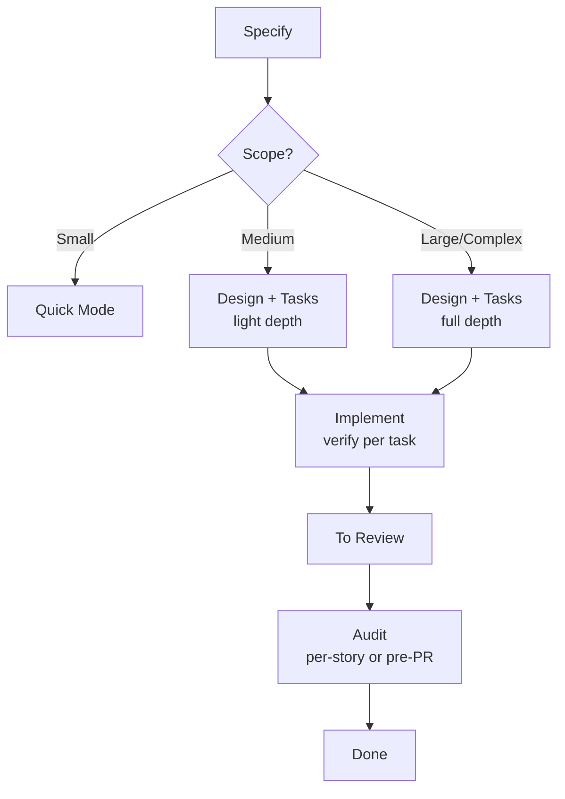

# Spec-Driven Development

Structured development workflow with adaptive depth. Right ceremony for the right scope.

## What It Does

Adaptive workflow for building software with clarity and traceability.
Complexity determines depth — small changes skip ceremony, large
features get full planning.



| Phase          | Purpose                                                                                             | Required                        |
| -------------- | --------------------------------------------------------------------------------------------------- | ------------------------------- |
| **Specify**    | Define requirements (greenfield or brownfield)                                                      | Always                          |
| **Discuss**    | Resolve gray areas and ambiguities                                                                  | When triggered                  |
| **Design**     | Grounding + architecture (light at Medium, full at Large/Complex)                                   | Medium+                         |
| **Tasks**      | Implementation steps (flat at Medium, full breakdown at Large/Complex)                              | Medium+                         |
| **Implement**  | Implement tasks with quality gates; runs verify internally after each task (marks AC `[x]`)         | Always                          |
| **Audit**      | Validate Goals and Success Criteria against evidence; mark their `[x]`; transition `done`; gates PR | At commit boundary or before PR |
| **Validate**   | Interactive UAT with manual testing; may reprove any `[x]`                                          | On-demand                       |
| **Quick Mode** | Express lane for small fixes (no audit)                                                             | Small scope                     |

### Auto-Sizing

Sizing follows the **nature of the change**, not file or task counts. The
question is how many load-bearing decisions the change requires, and
whether any are novel to the codebase.

| Scope       | Nature of change                             | Pipeline                                             |
| ----------- | -------------------------------------------- | ---------------------------------------------------- |
| **Small**   | Mechanical, zero decisions                   | Quick mode — no pipeline                             |
| **Medium**  | Canonical pattern reapplied                  | Specify → Design (light) → Tasks (light) → Implement |
| **Large**   | ≥1 load-bearing decision new to the codebase | Specify → Design → Tasks → Implement                 |
| **Complex** | Ambiguity in the problem itself              | Specify (+ Discuss) → Design → Tasks → Implement     |

## Usage

```text
# Create a feature (greenfield)
create new feature for user authentication
new feature: payment processing

# Create a feature from a PRD
from PRD @docs/payment-prd.md
use this PRD to plan the feature
here's the PRD, extract the spec

# Create a feature (brownfield)
modify existing auth flow
improve cache performance

# Development workflow
create technical design
create tasks
implement

# Close the feature (per-story commit boundary OR end-of-spec, always before PR)
audit feature
validate goals

# Manual testing
validate
run UAT

# Quick mode
quick fix: update env variable
quick task: fix login redirect

# Discuss gray areas
discuss auth feature
how should session timeout work?
```

### New Feature (Greenfield)

```text
create new feature for user authentication
# Agent assesses scope, asks for requirements
# Creates: .artifacts/specs/{date}-user-auth/spec.md

create technical design             # Medium and up
create tasks                        # Medium and up
implement
```

### Brownfield Feature

```text
# Create a feature that modifies existing code
modify existing auth flow to add 2FA
# Creates .artifacts/specs/{date}-add-2fa/spec.md with Baseline section
```

## Output

```text
.artifacts/
├── knowledge.md                   # Cross-feature decisions, gotchas, conventions
├── codebase/
│   └── {area}.md                  # Area exploration cache (reusable)
├── specs/                         # Active work (features and quick tasks)
│   ├── {date}-feature/
│   │   ├── spec.md                # Requirements (WHAT)
│   │   ├── decisions.md           # Gray area decisions (WHY, optional)
│   │   ├── design.md              # Architecture (HOW)
│   │   ├── tasks.md               # Implementation tasks (WHEN)
│   │   └── designs/               # Screenshots, mockups (optional)
│   └── {date}-fix-redirect/
│       └── task.md                # Quick mode task record
├── archive/                       # Closed work; never read during discovery
│   └── {date}-feature/            # Moved here at done / on quick completion
└── research/
    └── {topic}.md                 # Research cache (reusable)
```

### Status Tracking

Features track status in spec.md frontmatter:

- **draft**: Created, may have open questions
- **ready**: Spec complete, design and tasks done
- **in-progress**: Execution started
- **to-review**: Implementation complete, awaiting Goals/Success audit
- **done**: Audit passed, feature closed

Each acceptance criterion tracks its own status inline in spec.md:

- **`pending`**: Created in specify
- **`in-design`**: Mapped to a component in design
- **`in-tasks`**: Assigned to a task in tasks
- **`verified`**: Confirmed by verify after implementation

## Requirements

- Existing project directory
- No external dependencies

## FAQ

**Q: What does spec-driven persist across features?**

A: `.artifacts/knowledge.md` accumulates cross-feature decisions,
gotchas, and conventions. `.artifacts/codebase/{area}.md` caches area
exploration so the next feature in that area reuses it. Both are
written by the spec-driven workflow.

**Q: Do I need to explore the codebase first?**

A: No — spec-driven explores the relevant area on demand during specify
and design, and caches it at `.artifacts/codebase/{area}.md` for reuse.

**Q: How does research caching work?**

A: Research is saved to `.artifacts/research/{topic}.md` and reused
across features.

**Q: What happens to artifacts after the feature is done?**

A: A spec is transitory — it does its job during construction. At `done`
it moves to `.artifacts/archive/` (not deleted): out of the working set
so a new spec never forages a stale one, but kept for re-audit, UAT, or
history. The durable knowledge worth carrying forward already lives in
`.artifacts/knowledge.md`, which is never archived.

**Q: When should I use quick mode vs full pipeline?**

A: Quick mode for mechanical changes with no decisions or ambiguity
(bug fixes, config swaps, mechanical renames). The agent auto-detects
scope from the nature of the change — not file count — and suggests
the right mode.

**Q: What's the difference between verify, validate, and audit?**

A: Verify is internal to implement — it runs automatically after each
task or range, checks code against design and patterns, and marks AC
`[x]` on pass. It is never user-invoked. Validate is on-demand UAT at
any scope — the user walks scenarios and may reprove any `[x]`. Audit
is the gate before `done` and before any PR — evidence-based check of
Goals and Success Criteria; marks their `[x]` and transitions status.
Audit may run per-story at the commit boundary or once at end-of-spec.
A reproved `[x]` from validate forces the next implement loop or audit
to re-run.

**Q: How does subagent dispatch work?**

A: Auto-Sizing decides depth. When activities run in full form
(Large/Complex), they may dispatch to subagents for context isolation:

- **Research subagents** — one per unknown topic, write to
  `.artifacts/research/{topic}.md`
- **Codebase exploration subagent** — one per design phase, runs the
  full multi-phase exploration, writes to disk
- **Design Plan subagent** — one per design phase, owns architectural
  reasoning (data model with file:line cites, dependency inversion,
  decisions, traceability); read-only by harness contract, returns
  structured slot fillers that the main agent composes into `design.md`
  via the canonical template
- **Tasks Plan subagent** — one per tasks phase, owns decomposition
  reasoning; read-only, returns slot fillers
- **Implement subagent** — one per user invocation (T-1, range, US-1,
  --all), owns the per-task implement and verify cycle

Discovery subagents (research, exploration) hand off via disk
artifacts. Plan subagents hand off via structured chunks because the
harness blocks Edit/Write for the built-in Plan agent. At Medium, planning
(research, exploration, Plan) runs inline without dispatch; the implement
subagent still dispatches. Quick mode runs entirely without dispatch.
