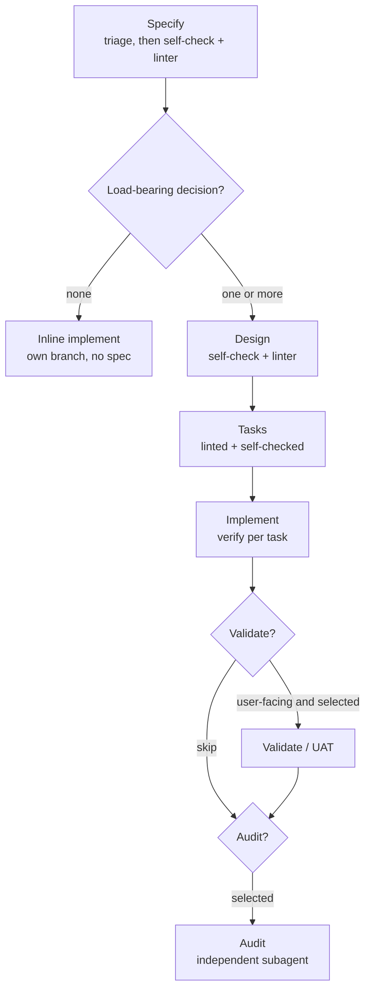

# Spec-Driven Development

Spec-driven feature development. Light by default; weight only where the change pays for it.

## What It Does

Builds features in phases. A mechanical fix is a one-liner; anything larger runs a full pipeline where each artifact closes on its own self-check plus a linter, and the delivery answers to a final independent audit that reads the diff and the tests against the contract.


```mermaid
flowchart TD
    A[Specify<br/>triage, then self-check + linter] --> B{Load-bearing decision?}
    B -->|none| S[Inline implement<br/>own branch, no spec]
    B -->|one or more| D[Design<br/>self-check + linter]
    D --> T[Tasks<br/>linted + self-checked]
    T --> I[Implement<br/>verify per task]
    I --> V{Validate?}
    V -->|user-facing and selected| VA[Validate / UAT]
    V -->|skip| AD{Audit?}
    VA --> AD
    AD -->|selected| AU[Audit<br/>independent subagent]
```

| Phase | Output |
|-------|--------|
| **Specify** | `spec.md` — WHAT + WHY |
| **Design** | `design.md` — HOW: architecture, components, decisions |
| **Tasks** | `tasks.md` — WHEN: atomic steps, tests, gates, coverage |
| **Implement** | code + commits + updated `tasks.md` (verify per task) |
| **Validate / UAT** | `validate.md` — per-criterion browser verdicts, accessibility, and responsiveness on a user-facing feature |
| **Audit** | `audit.md` — Goals, ACs, discrimination sensor, spec-defect findings |
| **Archive** | feature moved to `.artifacts/archive/<created>-<slug>/` (optional and manual, any state) |

### Triage

| Change | Pipeline |
|--------|----------|
| Mechanical, zero load-bearing decisions | one-liner → branch → inline implement |
| Everything else | Specify → Design → Tasks → Implement → [Validate] → [Audit] |

Depth inside the phases follows what the change needs — how far discovery probes, whether design has to research. The agent judges that depth as the work runs; nothing fixes it in advance.

## Usage

```text
# Specify a feature (greenfield or brownfield)
plan a feature for user authentication
from PRD @docs/payment-prd.md
modify the existing auth flow to add 2FA

# Move through the pipeline
design this feature
create tasks
implement T-1 to T-4
implement S-1
implement W-1
implement W-1..W-3 in parallel
implement everything

# Close it out
audit feature
run UAT                 # user-facing only

```

## Output

```text
PROJECT.md                         # committed codebase knowledge
.artifacts/
├── LESSONS.md                     # local lessons state (machine-owned)
├── specs/
│   └── <slug>/                    # one folder per feature
│       ├── spec.md                # WHAT + WHY
│       ├── STATE.md               # feature state and report routing
│       ├── SIGNALS.md             # feature-local verified signals
│       ├── design.md              # HOW
│       ├── tasks.md               # WHEN
│       ├── audit.md               # independent audit report
│       ├── validate.md            # optional user-facing validation report
│       └── evidences/             # UAT screenshots (user-facing only)
├── research/
│   └── <topic>.md                 # research cache (reusable)
└── archive/
    └── <created>-<slug>/          # closed features; date from `created:`, added at archive; never read during discovery
```

## Requirements

- An existing project directory.
- `python3` (standard library only) for `scripts/signals.py`, `scripts/lessons.py`, `scripts/lint_artifact.py`, and `scripts/select_tasks.py`.
- Optional: a browser-automation MCP (e.g. Playwright) for Validate/UAT screenshots — falls back to user-guided capture when absent.
- Optional: a docs MCP (e.g. Context7) for design research — the knowledge chain falls through to web search when absent.

## FAQ

**Q: What does spec-driven persist across features?**

A: `PROJECT.md` at the project root accumulates cross-feature stakes, conventions, decisions, and gotchas; feature-local `SIGNALS.md` records verified failures; the local lessons layer (`.artifacts/LESSONS.md`) records rules that recur into confirmed lessons. These layers are not interchangeable: `PROJECT.md` is shared codebase knowledge, a signal is a verified feature-local failure, and a lesson is a recurring rule. `archive/` is never foraged.

**Q: When does a change skip the pipeline?**

A: When it is mechanical, with zero load-bearing decisions. It runs as a one-liner straight to inline implement on its own branch, with no `spec.md` and no audit. If it turns out to carry a real decision, it routes back to specify and the full pipeline applies.

**Q: What is the difference between self-check, verify, audit, and validate?**

A: Self-check closes each artifact before its approval gate: the phase reads its own output for what no script can settle, then runs the linter over the text that reading produced, and an error keeps the artifact at `draft`. No artifact gets a second subagent over the same text — that reads the same rules twice and buys a second pass rather than a second view. Verify is mental and internal to implement — it runs after each task and never appears as a user phase. Validate is an optional user-facing check: it exercises every acceptance criterion a running application can settle, checks accessibility and responsiveness on the screens it visits, and writes `validate.md`. It writes no signal — it never opens code, so it sees that an outcome diverged and never why. Audit is an optional independent check: a fresh subagent (author ≠ auditor) verifies Goals and ACs against the diff and tests, writes `audit.md`, adds eligible signals, and promotes lessons. A criterion no reading of code or test can settle takes the verdict `validate.md` recorded for it, and fails the run where that report carries none. When both phases run, validate runs first. A failed report sets the feature's `STATE.md` routing field, and `Phase` names who reads it: `tasks` turns verified findings into correction tasks that `implement` executes, and `specify` takes back what needs the contract itself corrected.

**Q: How are tasks ordered and dispatched?**

A: `Depends on` is the only ordering source. An edge exists where the dependent task cannot leave the tree green without the other, and where two tasks write the same file — those never run in parallel. `Sequence` derives graph waves and lists every task once. Implement accepts task, slice, and wave selectors; sequential mode is the default and uses the current worktree. Parallel mode is optional and creates one worktree per dispatch unit, not per task. A wave can always run sequentially without a worktree.

**Q: How does the lessons layer work?**

A: Each lesson is grounded in a row of the feature's `SIGNALS.md`, and `scripts/lessons.py add` refuses one without that grounding. It enters as a candidate, becomes confirmed when the same lesson recurs on a second feature, and only confirmed lessons load into future specify and design. When a confirmed lesson was loaded and the failure it warned about happened anyway, `penalize` records it, and two penalties quarantine it for good. The skill never changes — the project's local lessons set does.

**Q: What happens after implementation and optional checks?**

A: Pull request and merge happen outside this skill. The optional archive command is manual and accepts a feature in any state; it moves the feature from `.artifacts/specs/<slug>/` to `.artifacts/archive/<created>-<slug>/` (the date comes from the spec's `created:`, added only at archive). The agent never reads `archive/` when creating a new spec.
