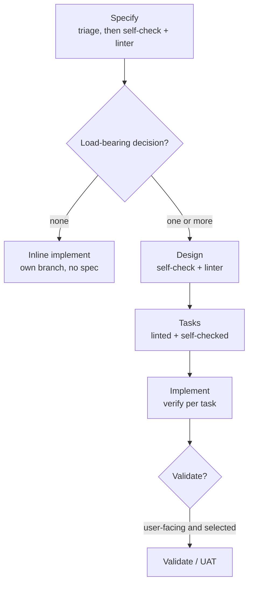

# Spec-Driven

Feature work with traceable requirements, design, tasks, and UAT. Light by default; weight only where the change pays for it.

## What It Does


```mermaid
flowchart TD
    A[Specify<br/>triage, then self-check + linter] --> B{Load-bearing decision?}
    B -->|none| S[Inline implement<br/>own branch, no spec]
    B -->|one or more| D[Design<br/>self-check + linter]
    D --> T[Tasks<br/>linted + self-checked]
    T --> I[Implement<br/>verify per task]
    I --> V{Validate?}
    V -->|user-facing and selected| VA[Validate / UAT]
```

| Phase | Output |
|-------|--------|
| **Specify** | `spec.md` — WHAT + WHY; a mechanical change with zero load-bearing decisions skips it and runs as a one-liner straight to inline implement on its own branch |
| **Design** | `design.md` — HOW: architecture, components, decisions |
| **Tasks** | `tasks.md` — WHEN: atomic steps, tests, gates, coverage |
| **Implement** | code + commits + updated `tasks.md` (verify per task) |
| **Validate / UAT** | `validate.md` — per-criterion browser verdicts, accessibility, and responsiveness on a user-facing feature |
| **Archive** | feature moved to `.artifacts/archive/specs/<created>-<slug>/` (optional and manual, any state) |

## Usage

```text
plan a feature for user authentication
plan a feature from the PRD at @docs/payment-prd.md
modify the existing auth flow to add 2FA
design this feature
create tasks for this feature
implement T-1 to T-4
implement slice S-1
implement everything
run UAT on this feature
archive this feature
```

UAT runs only on a user-facing feature.

## Output

```text
PROJECT.md                         # committed codebase knowledge
.artifacts/
├── specs/
│   └── <slug>/                    # one folder per feature
│       ├── spec.md                # WHAT + WHY
│       ├── STATE.md               # feature state
│       ├── design.md              # HOW
│       ├── tasks.md               # WHEN
│       ├── validate.md            # optional user-facing validation report
│       └── evidences/             # UAT screenshots (user-facing only)
├── research/
│   └── <topic>.md                 # research cache (reusable)
└── archive/
    └── specs/
        └── <created>-<slug>/      # closed specs; date from `created:`, added at archive; never read during discovery
```

## Requirements

- An existing project directory.
- `python3` (standard library only) for `scripts/lint_artifact.py` and `scripts/select_tasks.py`.
- Optional: a browser-automation MCP (e.g. Playwright) for Validate/UAT screenshots — falls back to user-guided capture when absent.
- Optional: a docs MCP (e.g. Context7) for design research — the knowledge chain falls through to web search when absent.

## FAQ

**Q: What does spec-driven persist across features?** A: `PROJECT.md` at the project root accumulates cross-feature conventions, decisions, and gotchas. `archive/` is never foraged.

**Q: When does a change skip the pipeline?** A: When it is mechanical, with zero load-bearing decisions. It runs as a one-liner straight to inline implement on its own branch, with no `spec.md`. If it turns out to carry a real decision, it routes back to specify and the full pipeline applies.

**Q: What is the difference between self-check, verify, and validate?** A: Self-check closes each artifact before its approval gate: the phase reads its own output for what no script can settle, then runs the linter over the text that reading produced, and an error keeps the artifact at `draft`. No artifact gets a second subagent over the same text — that reads the same rules twice and buys a second pass rather than a second view. Verify is mental and internal to implement — it runs after each task and never appears as a user phase. Validate is an optional user-facing check: it exercises every acceptance criterion a running application can settle, checks accessibility and responsiveness on the screens it visits, and writes `validate.md`. A failed report points the feature's `STATE.md` at `tasks`, which turns its verified findings into correction tasks that `implement` executes.

**Q: How are tasks ordered and dispatched?** A: `Depends on` is the only dependency source. An edge exists where the dependent task cannot leave the tree green without the other. Among tasks the graph leaves free, the task that restores what another task leaves worse in the product comes directly after it. Implement accepts task and slice selectors and dispatches one unit per slice. Units with no dependency path between them that write no file in common may run in parallel; the agent decides how to isolate each one.

**Q: What happens after implementation and optional checks?** A: Pull request and merge happen outside this skill. The optional archive command is manual and accepts a feature in any state; it moves the feature from `.artifacts/specs/<slug>/` to `.artifacts/archive/specs/<created>-<slug>/` (the date comes from the spec's `created:`, added only at archive). The agent never reads `archive/specs/` when creating a new spec.

**Q: How deep does each phase go?** A: As deep as the change needs: how far discovery probes, whether design has to research. The agent judges that depth as the work runs; nothing fixes it in advance.
