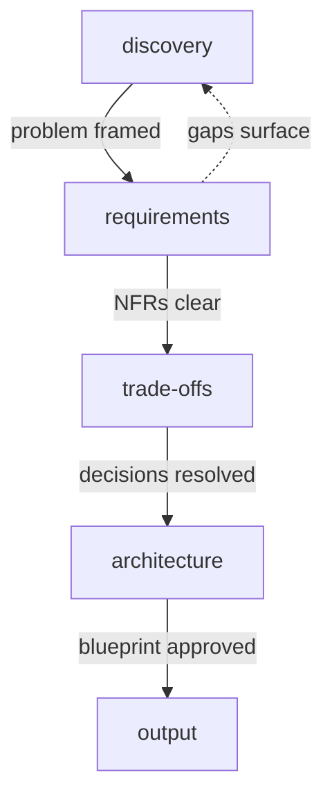

# System Design

Guided system design from problem to architecture blueprint.

## What It Does



Dashed arrow: requirements may surface unanswered framing questions and
loop back to discovery.

| Phase | Output |
|-------|--------|
| Discovery | Problem framing, scope, constraints |
| Requirements | Functional + non-functional requirements |
| Trade-offs | Visual comparison tables with recommendations |
| Architecture | Component diagram, data flow, patterns |
| Output | `system-brief.md` in `.artifacts/docs/` |

## Usage

```
design a notification system for a web app with 50k users
architecture for image upload and processing with AI moderation
how should I structure an API that needs to scale from 100 to 10,000 req/s
my monolith is struggling under load — help me plan the migration
```

## Output

```
.artifacts/docs/system-brief.md
```
