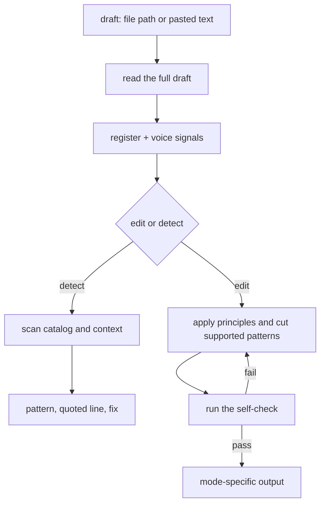

# Anti Slop

Edits drafts into sharper, more human prose — or names AI-writing patterns without touching a word.

## What It Does



| Mode | Output |
|------|--------|
| edit | The full edited pasted draft plus What changed; file mode writes the file and reports the summary |
| detect | One line per pattern found: name, quoted line, fix — nothing rewritten |
| embedded | Final edited text only, ready to drop into another workflow |

## Usage

```text
Clean up this draft, keep it sounding like me
Make this post less AI-sounding
Edit docs/notes/launch.md
Does this read as AI slop?
Scan this for AI tells, do not rewrite it
```

## Output

Pasted text comes back in the reply. A file path is edited in place, with What changed reported in the reply. Embedded text comes back without a preamble or change log.

The draft's language sets the output language — the skill's word lists are English, and against a draft in another language it matches the shape and cuts the equivalent word. File mode changes prose only and preserves code, data, frontmatter, links, identifiers, and document structure.

## FAQ

**Does detect tell me whether AI wrote the piece?** No. It names patterns and quotes the lines that carry them. Detectors guess; named patterns are evidence you can check yourself.

**Will it flatten my voice?** The edit keeps distinctive vocabulary, cadence, bluntness, humor, and digressions. Cutting is proportional to the actual slop, so a rough draft with a real voice still sounds like the same person.

**Does it add opinions or personality?** Not by default. Technical, reference, legal, and factual prose stays neutral and precise. Personal and editorial prose can keep personality when the source supports it.

**Does one word or dash prove AI writing?** No. Findings require context or a pattern cluster.
