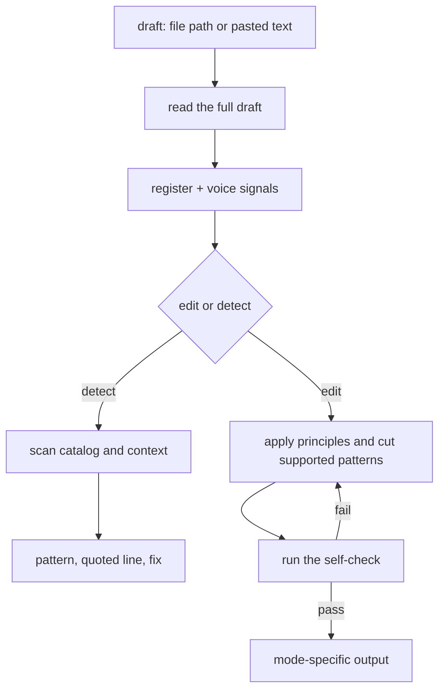

# Anti-Slop

Edits drafts into clear, natural prose, or names AI-writing patterns without changing the draft.

## What It Does



| Mode | Output |
|------|--------|
| edit | The full edited pasted draft plus What changed; file mode writes the file and reports the changes |
| detect | One line per pattern found: name, quoted line, fix — nothing rewritten |
| embedded | Final edited text only, ready for another workflow |

## Usage

```text
Clean up this draft, keep it sounding like me
Make this post less AI-sounding
Edit docs/notes/launch.md
Does this read as AI slop?
Scan this for AI tells, do not rewrite it
```

## Output

Pasted text comes back in the reply. A file path is edited in place, with What changed reported in the reply. Embedded text comes back without a preamble or change log.

Write in the draft's language. The word lists are English, but the skill matches the same patterns in other languages. File mode changes prose only and preserves code, data, frontmatter, links, identifiers, and document structure.

## FAQ

**Does detect tell me whether AI wrote the piece?** No. It names patterns and quotes the lines that carry them. It does not identify the author.

**Will it flatten my voice?** The edit keeps distinctive words, rhythm, bluntness, humor, and digressions. It cuts only what the draft needs, so the result still sounds like the same person.

**Does it add opinions or personality?** Not by default. Technical, reference, legal, and factual prose stays neutral and precise. Personal and editorial prose can keep personality when the source supports it.

**Does one word or dash prove AI writing?** No. Findings require context or a pattern cluster.
